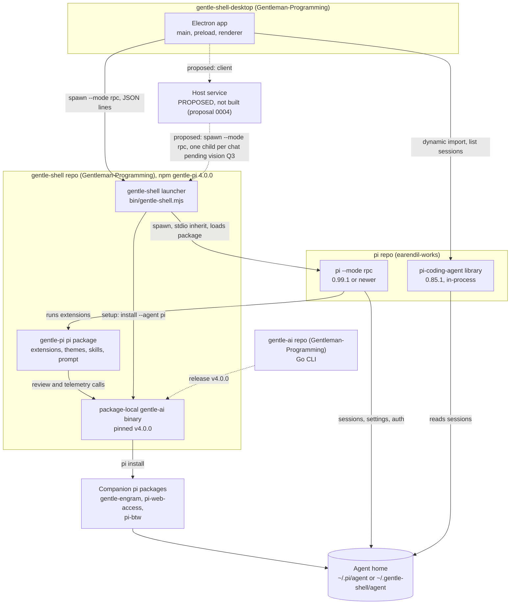

> Traducción al español de `docs/02-ecosystem.md` (árbol de trabajo tras la actualización del 2026-10-03). Documento de lectura; la versión de referencia es la inglesa.

# Ecosistema

> Estado: borrador (draft).

Gentle Desktop se asienta sobre otras cuatro piezas: **pi**, el runtime del agente; **gentle-shell**, el lanzador (launcher) más el paquete de pi `gentle-pi`; **gentle-ai**, la CLI en Go que fija gentle-shell; y los **paquetes complementarios** (companion packages) que instala gentle-ai. Esta página muestra cómo se conectan, quién es responsable de cada una, qué versiones encajan entre sí, qué toma el escritorio de cada una y en qué repositorio corresponde cada cambio. Los términos se definen en el [glosario](01-glossary.md).

## De un vistazo

| Pregunta | Respuesta | Evidencia |
|---|---|---|
| ¿Son gentle-pi y gentle-shell piezas distintas? | No. Son un único repositorio y un único paquete npm: `gentle-pi` es el nombre del paquete, `gentle-shell` el binario y el producto. | `gentle-shell@ac67159:package.json:2-9` |
| ¿Con qué se comunica el escritorio? | Con el lanzador `gentle-shell` sobre RPC, que ejecuta pi ≥ 0.99.1 (gentle-shell se desarrolla contra ≥ 1.0.0). También importa pi 0.85.1 en el mismo proceso para listar sesiones. | [current.md §Caminos de datos hacia pi](03-architecture/current.md#caminos-de-datos-hacia-pi) |
| ¿Negocia algo las versiones? | No. No hay handshake; solo el lanzador impone una versión mínima de pi. | [04 §Versionado y compatibilidad](04-rpc-contract.md#versionado-y-compatibilidad) |
| ¿Dónde va un comando RPC nuevo? | En pi (`earendil-works/pi`), que es responsable de la unión `RpcCommand`. | [Dónde corresponde cada cambio](#dónde-corresponde-cada-cambio) |

**Cómo leer las citas.** Las mismas claves que en el [glosario](01-glossary.md#cómo-leer-las-citas), actualizadas el 2026-10-03: `D:` = `gentle-shell-desktop@5ab4a00:src/`, `GS:` = `gentle-shell@ac67159:` (`main` de gentle-shell, versión de paquete 4.0.0), `GA:` = `gentle-ai@ff77164:` (v4.0.0), `PI:` = `pi@a13d35a:packages/coding-agent/` (1.0.0). `gentle-shell@1162ce9` (3.7.0) y `gentle-ai@6dee8f8` (v3.7.0) aparecen solo en comparaciones de versiones. Cuando la plataforma importa, ver [10-platforms.md](10-platforms.md). `Inference:` marca razonamiento; `UNVERIFIED:` marca afirmaciones comprobadas pero no confirmadas.

## Mapa de piezas

| Arista | Evidencia |
|---|---|
| El escritorio lanza el lanzador con `--mode rpc` | `D:main/domain/session/PiSession.ts:127-134` |
| El lanzador lanza pi con stdio heredado y carga gentle-pi con `-e <package root>` | `GS:bin/gentle-shell.mjs:1396`; [inventory L8](05-capability-inventory.md#lanzador-y-homes) |
| gentle-pi llama a su gentle-ai local al paquete para la revisión y la telemetría | `GS:scripts/install-gentle-ai.mjs:12` ("native review operations will fail with package-local-binary-missing"); `GS:docs/readme-reference.md:1038` |
| La configuración ejecuta gentle-ai `install --agent pi --scope global` | `GS:bin/gentle-shell.mjs:819-821` |
| El binario fijado es la release v4.0.0 de gentle-ai (gentle-shell 3.7.0 fijaba v3.7.0) | `GS:scripts/gentle-ai-installer.mjs:39-40`, `:48-50`; `gentle-shell@1162ce9:scripts/gentle-ai-installer.mjs:39` |
| gentle-ai ejecuta `pi install <source>` para cada paquete gestionado | `GA:internal/agents/pi/adapter.go:285-294` |
| El escritorio importa pi 0.85.1 para listar sesiones | `D:main/adapters/piSessionStore.ts:30-35` |

## Piezas

| Pieza | Qué es | Distribución | Evidencia |
|---|---|---|---|
| **pi** | "A minimal, extensible AI agent for the terminal." Es responsable del runtime, las sesiones, los proveedores, los paquetes y el protocolo RPC. | npm `@earendil-works/pi-coding-agent`, bin `pi` | `PI:README.md:15`; `PI:package.json:2`, `:9-11` |
| **gentle-shell / gentle-pi** | Un lanzador (homes, configuración, carga de paquetes) más un paquete de pi: 18 puntos de entrada de extensión, 3 temas, 12 skills, 1 plantilla de prompt (en `ac67159`; 4.0.0 añadió `extensions/gentle-stats.ts`). | npm `gentle-pi`, bin `gentle-shell` | `GS:package.json:2-9`, `:59-73`; recuentos en [05 §De un vistazo (gentle-shell y gentle-ai)](05-capability-inventory.md#de-un-vistazo-gentle-shell-y-gentle-ai) |
| **gentle-ai** | Una CLI en Go que configura agentes de IA, incluido pi. Es responsable de la revisión nativa (RDD) y de la telemetría. gentle-shell instala una copia local al paquete en el postinstall. | Releases de GitHub; módulo Go `github.com/gentleman-programming/gentle-ai/v4` desde v4.0.0 (`/v3` en v3.7.0) | `GA:README.md:10`; `GA:go.mod:1`; `GS:package.json:46`; `GS:scripts/gentle-ai-installer.mjs:40`, `:45-46`, `:51` |
| **Paquetes complementarios** | Paquetes de pi que gentle-ai instala en un home. Ver [Paquetes complementarios](#paquetes-complementarios). | npm | `GA:internal/agents/pi/adapter.go:65-70` |
| **Dependencia incluida** | `@heyhuynhgiabuu/pi-pretty` 0.6.27, una dependencia de runtime de gentle-pi, cargada mediante `extensions/pi-pretty.ts`. `UNVERIFIED:` qué registra (el paquete no está instalado en el checkout de referencia). | npm, instalado con gentle-pi | `GS:package.json:74-76`; [inventory V15](05-capability-inventory.md#experiencia-del-shell) |
| **Gentle Desktop** | Una aplicación Electron: "Desktop chat window for Gentle Shell / pi." | Solo código fuente; builds locales sin firmar | `gentle-shell-desktop@5ab4a00:package.json:7`; `gentle-shell-desktop@5ab4a00:README.md:7` |
| **Servicio host** (host service; propuesto, no construido) | **[community]** Un único proceso local entre cada UI de Gentle Shell (Electron, navegador, una futura app móvil) y `gentle-shell --mode rpc`; sería dueño de las sesiones que hoy mantiene el proceso principal de Electron. Discontinuo en el mapa de arriba. Ver [Propuesto: servicio host](#propuesto-servicio-host). | No existe | [propuesta 0004](07-proposals/0004-host-service.md#propuesta) |
### Paquetes complementarios

gentle-shell no mantiene una lista propia. Su documentación dice "the companion list above is not maintained in gentle-shell itself — it is the managed Pi stack of the pinned package-local gentle-ai" (`GS:docs/readme-reference.md:304`). En la versión fijada gentle-ai v4.0.0:

| Paquete | Qué ocurre durante la configuración | Evidencia |
|---|---|---|
| `npm:gentle-pi` | Lo instala gentle-ai y gentle-shell lo **elimina** justo después, porque el lanzador siempre carga su propia copia. | `GA:internal/agents/pi/adapter.go:66`; `GS:lib/gentle-shell-launcher.ts:551-565` |
| `npm:gentle-engram` | Se instala, seguido de `npm exec --yes --package gentle-engram@latest -- pi-engram init`. Memoria persistente (Engram). | `GA:internal/agents/pi/adapter.go:32`, `:67`, `:289-290`, `:297`; `GA:TRADEMARKS.md:9` |
| `npm:pi-mcp-adapter` | **Retirado** por gentle-ai v4.0.0: "Pi >= 0.99.0 ships built-in MCP support … Gentle AI therefore never installs the adapter and removes it wherever it finds it". En v3.7.0 se instalaba, y el init de engram se ejecutaba después. | `GA:internal/agents/pi/adapter.go:22-29`; `gentle-ai@6dee8f8:internal/agents/pi/adapter.go:60`, `:268-269` |
| `npm:pi-web-access` | Se instala. | `GA:internal/agents/pi/adapter.go:68` |
| `npm:pi-btw` | Se instala. | `GA:internal/agents/pi/adapter.go:69` |
| `npm:@juicesharp/rpiv-ask-user-question` | **Retirado** por gentle-ai (v3.7.0 y v4.0.0), y eliminado por gentle-shell si está declarado. Entra en conflicto con la herramienta `ask_user_question` propia de gentle-pi. | `GA:internal/agents/pi/adapter.go:55-63`; `gentle-ai@6dee8f8:internal/agents/pi/adapter.go:47-55` (entrada en `:54`); `GS:lib/gentle-shell-launcher.ts:563` |

**Evidencia de exhaustividad.** El adaptador de pi de gentle-ai construye sus comandos de instalación solo a partir de `managedPackageSources`: un `pi install <source>` por entrada, más el init de engram tras `npm:gentle-engram` (`GA:internal/agents/pi/adapter.go:285-294`). Ese slice tiene 4 entradas en v4.0.0 (`:65-70`; 5 en v3.7.0, `gentle-ai@6dee8f8:internal/agents/pi/adapter.go:57-63`). Cuando gentle-ai termina, gentle-shell elimina los paquetes de su tabla de eliminación de 2 filas (`GS:lib/gentle-shell-launcher.ts:562-565`) y vuelve a aplicar su tema por defecto si la instalación de gentle-ai escribió un tema distinto en un home que no tenía ninguno (`GS:docs/readme-reference.md:350`). Además de las instalaciones de paquetes, el código leído muestra que estos archivos del home se ven afectados cuando se ejecuta el componente Engram de gentle-ai:

- `settings.json` (quita `npm:pi-mcp-adapter` y los paquetes retirados de `packages`) y `<agentDir>/npm/package.json` (quita la dependencia `pi-mcp-adapter`), ambos reescritos solo cuando hay algo que eliminar, por `ProvisionEngramMCP` de gentle-ai, llamado desde el inyector del componente Engram (`GA:internal/agents/pi/adapter.go:435-480`, `:485-521`; `GA:internal/components/engram/inject.go:693-694`). En v3.7.0 la misma función añadía en su lugar el adaptador y `pi-mcp-adapter: ^2.6.0` (`gentle-ai@6dee8f8:internal/agents/pi/adapter.go:400-412`);
- `mcp.json`, creado por `ProvisionEngramMCP` solo para contener servidores fusionados desde un `mcp-adapter.json` antiguo (legacy); nunca añade un servidor de Engram propio, aunque una entrada `engram` que el usuario haya mantenido en `mcp-adapter.json` se migra como cualquier otra (`GA:internal/agents/pi/adapter.go:435-449`, `:523-529`, `:525-526`). En `engram@3951380`, `pi-engram init` solo declara `gentle-engram` en `settings.json` y no crea ni modifica `mcp.json` (`engram@3951380:plugin/pi/cli.js:16-23`, `:85-97`); `UNVERIFIED:` que el `latest` de npm que descarga el init coincida con ese commit.

gentle-ai también escribe los archivos compartidos `~/.pi/gentle-ai/persona.json` y `~/.gentle-ai/state.json`, de los que gentle-shell guarda una instantánea y que luego restaura (`GS:docs/readme-reference.md:300`). `UNVERIFIED:` si otros componentes de gentle-ai (por ejemplo, el archivo de prompt de sistema `APPEND_SYSTEM.md` que nombra el adaptador de pi en `GA:internal/agents/pi/adapter.go:33`, `:310-311`) escriben más archivos durante `install --agent pi`; solo se leyeron el adaptador de pi y el punto de entrada del inyector de Engram.

**Desfase conocido en la documentación (gentle-shell).** `GS:docs/readme-reference.md:286` todavía incluye `npm:pi-mcp-adapter` y `npm:@juicesharp/rpiv-ask-user-question` entre los paquetes que instala la configuración, y un comentario del lanzador dice que "gentle-ai's own managed Pi stack still installs" el segundo (`GS:lib/gentle-shell-launcher.ts:542-543`), pero gentle-ai v4.0.0 retira ambos (`GA:internal/agents/pi/adapter.go:22-29`, `:59-63`).

Los homes aprovisionados por gentle-shell 3.7.0 (gentle-ai v3.7.0) recibieron `pi-mcp-adapter`. Un home aislado o `--home` vuelve a ejecutar la configuración en su siguiente arranque cuando ha cambiado la versión fijada de gentle-ai; un home `--link` nunca se aprovisiona automáticamente (`GS:docs/readme-reference.md:352`). La documentación de gentle-shell dice "gentle-ai prunes the retired package from the home" (`GS:docs/readme-reference.md:304`), pero en gentle-ai v4.0.0 solo `ProvisionEngramMCP` (componente Engram) y la desinstalación eliminan el adaptador (`GA:internal/components/engram/inject.go:693-694`; `GA:internal/components/uninstall/service.go:800`). `UNVERIFIED:` si el `install --agent pi --scope global` de la configuración, sin indicadores de componente (`GS:bin/gentle-shell.mjs:821`), ejecuta el componente Engram ([inventory E8](05-capability-inventory.md#extensiones-paquetes-skills-prompts-temas-y-mcp), [inventory GA1](05-capability-inventory.md#gentle-ai-fuera-de-la-sesión)).

## Responsables

Solo se indican nombres donde los archivos del repositorio los mencionan.

| Pieza | Repositorio | Responsable o autor según los archivos del repositorio | Evidencia |
|---|---|---|---|
| pi | `earendil-works/pi` | `author` del paquete: Mario Zechner. LICENSE: "Copyright (c) 2025 Mario Zechner". | `PI:package.json:99`, `:103`; `pi@a13d35a:LICENSE:3` |
| gentle-shell / gentle-pi | `Gentleman-Programming/gentle-shell` | README: "built by Alan Buscaglia". TRADEMARKS: Alan Buscaglia es titular de las marcas gentle-shell y gentle-pi. La línea de LICENSE dice "Copyright (c) 2025 Mario Zechner"; no se extrae ninguna inferencia de ello. | `GS:package.json:25`; `GS:README.md:351`; `GS:TRADEMARKS.md:7`; `GS:LICENSE:3` |
| gentle-ai | `Gentleman-Programming/gentle-ai` | README: "Built by Alan Buscaglia (Gentleman Programming)". Aparece bajo "Maintainer" en CONTRIBUTORS. LICENSE: "Copyright (c) 2025 Gentleman Programming". | `GS:scripts/gentle-ai-installer.mjs:40`; `GA:README.md:306`; `GA:CONTRIBUTORS.md:5-9`; `GA:LICENSE:3` |
| Engram (`gentle-engram`) | `Gentleman-Programming/engram`; el paquete npm `gentle-engram` (bin `pi-engram`) vive bajo `plugin/pi` | `author` del paquete: "Gentleman Programming". LICENSE: "Copyright (c) 2026 Alan Buscaglia". TRADEMARKS: Alan Buscaglia es titular de la marca Engram. | `engram@3951380:plugin/pi/package.json:2`, `:7-12`, `:14-16`; `engram@3951380:LICENSE:3`; `GA:TRADEMARKS.md:9` |
| `pi-mcp-adapter` (retirado por gentle-ai v4.0.0), `pi-web-access`, `pi-btw`, `@heyhuynhgiabuu/pi-pretty` | `UNVERIFIED:` paquetes npm de terceros; ninguno está descargado en las referencias | — | — |
| Gentle Desktop | `Gentleman-Programming/gentle-shell-desktop` | `author` del paquete: "Gentleman-Programming". LICENSE: "Copyright (c) 2026 Gentleman Programming". Los archivos del repositorio no nombran a ningún mantenedor; ver [08-team.md](08-team.md). | `gentle-shell-desktop@5ab4a00:README.md:35`; `gentle-shell-desktop@5ab4a00:package.json:8`; `gentle-shell-desktop@5ab4a00:LICENSE:3` |

## Versiones y compatibilidad

| Relación | Restricción | ¿Se impone? | Evidencia |
|---|---|---|---|
| Escritorio → biblioteca de pi | `^0.85.1`, bloqueada en `0.85.1` | Solo el lockfile | `gentle-shell-desktop@5ab4a00:package.json:42`; `gentle-shell-desktop@5ab4a00:pnpm-lock.yaml:323` |
| Escritorio → gentle-pi | "gentle-pi 3.7.0 or newer" (también necesario para la pestaña Helpers) | No. Solo está documentado y se muestra en un mensaje de error. | `gentle-shell-desktop@5ab4a00:README.md:12`, `:89-91`; `D:main/adapters/launcherLocator.ts:26-28` |
| gentle-pi → pi | Peer `>=0.99.1`; rango de desarrollo `>=1.0.0` (3.7.0 se desarrollaba contra `0.99.1`) | **Sí.** El lanzador termina si pi es anterior a `MIN_PI_VERSION = "0.99.1"`, sin cambios en 4.0.0. | `GS:package.json:78`, `:95`; `GS:lib/gentle-shell-launcher.ts:392`; `gentle-shell@1162ce9:package.json:95` |
| gentle-pi → gentle-ai | Fija `INSTALLER_VERSION = "4.0.0"`; la etiqueta `v4.0.0` se resuelve al commit `ff77164`; ruta de módulo Go `/v4`. gentle-shell 3.7.0 fijaba `3.7.0` (commit `6dee8f8`). | En parte. Se instala en el postinstall. Los archivos de release de Darwin/Linux se comprueban contra digests SHA-256 fijados; Windows no tiene archivo firmado y usa un build desde código fuente Go con la etiqueta exacta, que también se comprueba para la versión exacta (`GENTLE_AI_VERSION_MISMATCH`); ver [10-platforms.md](10-platforms.md). `GENTLE_PI_SKIP_GENTLE_AI_INSTALL=1` omite la instalación. | `GS:package.json:46`; `GS:scripts/gentle-ai-installer.mjs:39`, `:45-52`, `:58`, `:68-75`, `:112-116`, `:393-397`; `GS:scripts/install-gentle-ai.mjs:11-12` |
| Configuración de gentle-pi → gentle-ai | La versión fijada debe ser 3.6.0 o posterior | Sí. La configuración se niega en caso contrario. | `GS:lib/gentle-shell-launcher.ts:428`; `GS:bin/gentle-shell.mjs:811` |
| gentle-ai v4.0.0 → complementarios | Las fuentes no tienen versión (`npm:pi-web-access`); el init de engram usa `gentle-engram@latest`. La dependencia `pi-mcp-adapter: ^2.6.0` de v3.7.0 y su constante `2.6.0` han desaparecido; `ProvisionEngramMCP` ahora elimina esa dependencia. | Ninguna restricción de versión | `GA:internal/agents/pi/adapter.go:65-70`, `:297`, `:504-521`; `GA:internal/components/engram/inject.go:694`; `gentle-ai@6dee8f8:internal/agents/pi/adapter.go:25-26`, `:400-412` |
| Node.js | `>=22.19.0` para gentle-pi; "Node.js 22.19 or newer" para el escritorio | No por el código de gentle-pi. Declarado en los `engines` de gentle-pi, que npm notifica por defecto como advertencia en lugar de imponerlo (comportamiento general de npm, no un hecho del repositorio). No se encontró ninguna comprobación de la versión de Node en el lanzador (`bin/`, `lib/`). | `GS:package.json:101-103`; `gentle-shell-desktop@5ab4a00:README.md:11`; rutas de instalación por plataforma en [10-platforms.md](10-platforms.md#cómo-se-instala-y-se-ejecuta-cada-pieza) |
| Handshake entre el escritorio y el runtime | Ninguno. La única carga versionada es `gentle-agents.activity/v1`. | — | [04 §Versionado y compatibilidad](04-rpc-contract.md#versionado-y-compatibilidad) |

La consecuencia que importa al escritorio: la lista de chats se ejecuta sobre pi 0.85.1 mientras que el propio chat se ejecuta sobre pi ≥ 0.99.1, desarrollado contra ≥ 1.0.0 ([audit A2](03-architecture/audit.md#a2-desfase-de-versión-de-pi-entre-los-dos-caminos)). Las diferencias de RPC entre esas dos versiones están en [04](04-rpc-contract.md#diferencias-entre-pi-0851-y-0991-comandos).

## Qué consume el escritorio de cada pieza

| Pieza | Qué usa el escritorio | Cómo | Evidencia |
|---|---|---|---|
| Lanzador gentle-shell | Arranque, selección del home, resolución de pi y control de versión, aprovisionamiento del primer arranque | Lanza `gentle-shell [--link\|--isolated\|--home <dir>] --mode rpc [--session <path>]` con `GENTLE_SHELL_INTERACTIVE_HOST=1` | [04 §Cadena de procesos](04-rpc-contract.md#cadena-de-procesos); `D:main/domain/session/PiSession.ts:127-134` |
| pi, sobre RPC | 3 comandos (`prompt`, `abort`, `get_messages`), respuestas a diálogos, 13 tipos de registro de stdout | Líneas JSON en stdin/stdout | [04 §De un vistazo](04-rpc-contract.md#de-un-vistazo) |
| pi, en el mismo proceso (0.85.1) | `SessionManager.listAll()` para la barra lateral | Import dinámico, con `PI_CODING_AGENT_DIR` establecido temporalmente | `D:main/adapters/piSessionStore.ts:30-39`; [audit A1](03-architecture/audit.md#a1-dos-caminos-de-datos-hacia-pi-y-una-mutación-global-de-pi_coding_agent_dir) |
| Extensiones de gentle-pi | Diálogos `ask_user_question` / `ask_user_choice`, actividad de los helpers (`gentle-agents.activity/v1`), comandos `/gentle:*` escritos como texto | `extension_ui_request` y `prompt` | [04 §Añadidos de gentle-shell sobre RPC](04-rpc-contract.md#añadidos-de-gentle-shell-sobre-rpc) |
| Tema de gentle-pi | Una copia de los tokens de Gentleman-Cute | Fija en el código del renderer | `D:renderer/shared/theme/theme.ts:1-8`; [ADR 0009](03-architecture/adr/0009-hardcoded-gentleman-cute-theme.md) |
| Home del agente en disco | Si existe `~/.pi/agent` (o `PI_CODING_AGENT_DIR`), y si existen `auth.json` y `models.json` | Comprobaciones de archivos en el primer arranque | `D:main/domain/home/home.ts:84-87` |
| gentle-ai | Nada directamente. Se ejecuta dentro de los comandos de gentle-shell y del aprovisionamiento del lanzador. | — | [inventory GA1–GA5](05-capability-inventory.md#gentle-ai-fuera-de-la-sesión) |
| Paquetes complementarios | Nada directamente. `Inference:` sus herramientas de modelo llegan al escritorio solo como eventos `tool_execution_*`, que este no renderiza ([inventory C17](05-capability-inventory.md#conversación-y-entrada)). | — | La búsqueda inventory Q33 no encuentra ningún tratamiento de Engram ([05](05-capability-inventory.md#búsquedas-en-el-escritorio-parte-de-gentle-shell)) |

## Dónde corresponde cada cambio

`Inference:` esta tabla se deriva del análisis por capas de [04](04-rpc-contract.md#carencias-que-necesita-el-escritorio) (párrafo final de §Gaps, etiquetado allí a su vez como `Inference`) y de las reglas de contribución de cada repositorio en [04 §Cómo proponer cambios del contrato en upstream](04-rpc-contract.md#cómo-proponer-cambios-del-contrato-en-upstream).

| Si el cambio… | Corresponde a | Por qué | Evidencia | Ejemplos |
|---|---|---|---|---|
| Añade o modifica un comando RPC, un evento o la forma de una respuesta | **pi** (`earendil-works/pi`), mediante un issue de Contribution Proposal; las PR necesitan la aprobación previa del mantenedor | pi es responsable de la unión `RpcCommand`; gentle-shell no añade ningún comando ni tipo de evento | `pi@a13d35a:packages/coding-agent/src/modes/rpc/rpc-types.ts:20-74`; `pi@a13d35a:.github/ISSUE_TEMPLATE/contribution.yml:1` (Contribution Proposal); `pi@a13d35a:CONTRIBUTING.md:31-34`, `:58` (`lgtm`) | gap G3 inicio de sesión, gap G4 modelo por defecto, gap G5 paquetes, gap G10 handshake de versión |
| Publica datos nuevos de una funcionalidad de gentle-shell | **gentle-shell**, como una carga `setWidget` `string[]` con un esquema documentado, como el esquema de actividad, o como un mensaje personalizado o una entrada de sesión ([04 §Canales del host y de las extensiones](04-rpc-contract.md#canales-del-host-y-de-las-extensiones)) | No necesita ningún cambio en pi | `GS:docs/gentle-agents-activity.md:13`; [04 §Carencias que necesita el escritorio](04-rpc-contract.md#carencias-que-necesita-el-escritorio) | gap G2 estado de ODD, gap G6 perfil, gap G7 campos de la barra de estado, gap G8 resultado del helper |
| Permite al host actuar sobre una funcionalidad de gentle-shell | **gentle-shell**, a través de un canal de entrada. pi ya encamina el texto del host hacia el código de las extensiones, principalmente mediante comandos de extensión y manejadores `input` (`prompt`), manejadores `input` (`steer`, `follow_up`), `user_bash` (`bash`) y respuestas a diálogos. `Inference:` un comando de gentle-shell o un manejador `input` no necesita ningún cambio en pi; un tipo de comando RPC nuevo necesitaría a pi. Qué canal usar está abierto ([ADR: Sin decidir](03-architecture/adr/README.md#sin-decidir--no-registrado)). | Ningún tipo de comando RPC lo define una extensión; a los manejadores de las extensiones se llega a través de esas entradas, entre otras (lista completa en 04) | [04 §Canales del host y de las extensiones](04-rpc-contract.md#canales-del-host-y-de-las-extensiones); [04 §Carencias que necesita el escritorio](04-rpc-contract.md#carencias-que-necesita-el-escritorio) | gap G1 detener un helper |
| Hace que un comando de gentle-shell funcione bajo RPC | **gentle-shell** | El comando usa `ctx.ui.custom()` o un control exclusivo de la TUI | [inventory P1, P3, Y4, R3](05-capability-inventory.md#perfiles-modelos-y-persona) | `/gentle:profiles`, `/gentle:models`, YOLO |
| Cambia el comportamiento del lanzador (progreso de la configuración, semántica del home, salida de versión) | Lanzador de **gentle-shell** | El lanzador es responsable de los homes, la configuración y el control de versión de pi | [inventory L5, L12](05-capability-inventory.md#lanzador-y-homes) | Progreso de la configuración legible por máquina |
| Cambia qué paquetes complementarios recibe un home | Pila de pi gestionada por **gentle-ai**, y después una subida de la versión fijada en gentle-pi | gentle-shell no mantiene una lista propia | `GS:docs/readme-reference.md:304` | Retirar un plugin (como hizo v4.0.0 con `pi-mcp-adapter`) |
| Renderiza o actúa sobre datos que ya circulan por el canal, o cambia el proceso, el IPC o el empaquetado del escritorio | **Gentle Desktop** | Sin dependencia de upstream | Filas de [05](05-capability-inventory.md) con upstream "none"; [auditoría](03-architecture/audit.md) | Notificaciones `notify` (inventory C20), tarjetas de herramientas (inventory C17), redirección (steering) (inventory C4), varios chats (audit A3), lanzamiento en Windows (audit A4; [10-platforms.md](10-platforms.md#lanzamiento-de-shims-por-lotes)) |

## Propuesto: servicio host

**[community]** La [propuesta 0004](07-proposals/0004-host-service.md) añade una pieza al mapa: un servicio host local que es dueño del registro de sesiones, lanza procesos hijo `gentle-shell --mode rpc` y sirve a la ventana de Electron, a una pestaña del navegador y a una futura app móvil mediante un único protocolo WebSocket versionado. El contrato con gentle-shell no cambia ([04](04-rpc-contract.md)). No está construido ni decidido. Detalles: [arquitectura](11-host-service.md), [protocolo](12-host-protocol.md), [clientes y topologías](13-clients-and-topologies.md).

## Proyectos de la comunidad fuera de alcance

[gentle-mesh](01-glossary.md#términos-de-la-comunidad-fuera-de-alcance) (una propuesta de protocolo de agente a agente) y las herramientas relacionadas con Herdr aparecen en el hilo de la comunidad. No forman parte del ecosistema fijado, y esta página no los describe.

La propuesta 0004 evaluó estos proyectos como precedentes, alternativas o contraejemplos; ninguno es una dependencia. Sus commits están fijados en [0004, Fuentes](07-proposals/0004-host-service.md#fuentes).

- **T3 Code** (`pingdotgg/t3code`): un servidor con clientes móvil, web y Electron (`t3code@eac52f0:README.md:3`); su proveedor Pi lanza `pi --mode rpc`, solo en las builds nightly ([0004, Precedentes](07-proposals/0004-host-service.md#precedentes-en-el-ecosistema)). Se planteó en el hilo (Discord, vudumstead, 2026-10-03 00:39).
- **Paseo** (`getpaseo/paseo`): "a local server called the daemon that manages your coding agents" (`paseo@485221b:README.md:60`); precedente en [0004](07-proposals/0004-host-service.md#precedentes-en-el-ecosistema).
- **pi-web-ui** (`xing-shuyin/pi-web-ui`): "the pi SDK runs in-process" (README `:70`, https://github.com/xing-shuyin/pi-web-ui/blob/eb49d432ebd69b83fa2593695f586cfe569e7097/README.md, consultado el 2026-10-05); descartado como base en [0004](07-proposals/0004-host-service.md#alternativas-consideradas-y-descartadas).
- **Clientes web de herdr**: `kcosr/herdr-web`, "not associated with ... the official Herdr project" (`herdr-web@f1312e2:README.md:3`), y `devswha/herdr-web-ui`, un plugin de Herdr (`herdr-web-ui@7c5fe4e:README.md:98`) enlazado en el hilo (Discord, Rafael The Hutt, 2026-09-30 09:27); descartados como base en [0004](07-proposals/0004-host-service.md#alternativas-consideradas-y-descartadas).
- **open-pi-viewer** (`gonzalez962/open-pi-viewer`): sugerido como conector web (Discord, bojack7080, 2026-10-04 09:00); su servidor escucha en `0.0.0.0` (`open-pi-viewer@908245a:vite.config.ts:71`), y [0004](07-proposals/0004-host-service.md#alternativas-consideradas-y-descartadas) lo registra como contraejemplo de seguridad.

## Preguntas abiertas

- `UNVERIFIED:` los repositorios y responsables de `pi-mcp-adapter`, `pi-web-access`, `pi-btw` y `@heyhuynhgiabuu/pi-pretty`.
- `UNVERIFIED:` si `gentle-ai install --agent pi` escribe archivos más allá de la lista de paquetes, persona, estado, `settings.json`, `npm/package.json` y `mcp.json` (ver [Paquetes complementarios](#paquetes-complementarios)), y si ese comando, sin indicadores de componente, ejecuta el componente Engram, la única vía en tiempo de instalación que elimina `pi-mcp-adapter` de un home aprovisionado con 3.7.0 (ver [Paquetes complementarios](#paquetes-complementarios)).
