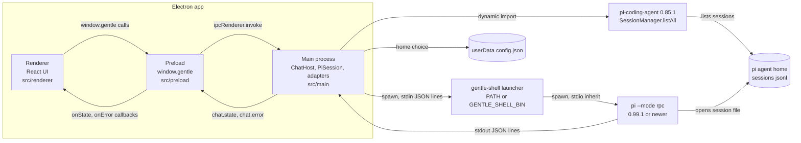
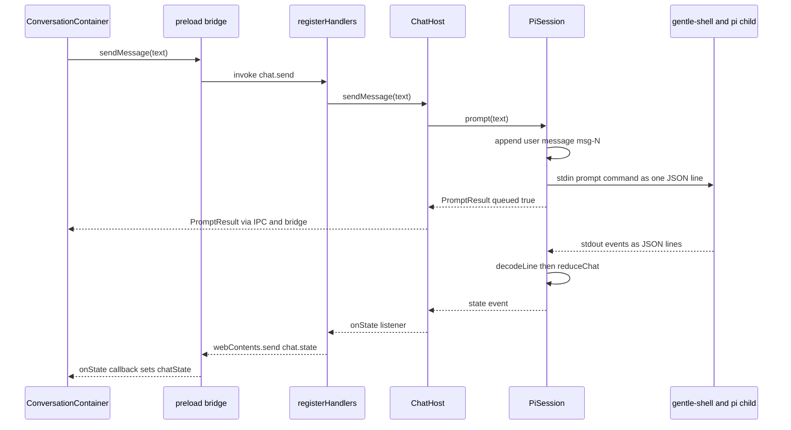

> Traducción al español de `docs/03-architecture/current.md` (árbol de trabajo tras la actualización del 2026-10-03). Documento de lectura; la versión de referencia es la inglesa.

# Arquitectura: estado actual

> Estado: borrador (draft).

Gentle Desktop es una aplicación Electron con una ventana y un único chat abierto a la vez. El proceso principal lanza `gentle-shell --mode rpc` como proceso hijo para la conversación. También importa pi en el mismo proceso para listar los chats existentes. Esta página describe esa arquitectura tal como está en `gentle-shell-desktop@5ab4a00`. Los hallazgos y riesgos están en [audit.md](audit.md). Las decisiones registradas están en [adr/](adr/README.md). El protocolo de comunicación está en [04-rpc-contract.md](../04-rpc-contract.md).

**Cómo leer las citas.** Las rutas sin prefijo de repositorio están en `gentle-shell-desktop@5ab4a00`. Los demás repositorios usan `repo@shortsha:path:line`. Los SHAs fijados (actualizados el 2026-10-03; el código fuente del escritorio no ha cambiado) son `gentle-shell@ac67159` (`main` de gentle-shell, paquete npm `gentle-pi` versión 4.0.0), `pi@d981de1` (pi 0.85.1, la copia del escritorio en el mismo proceso) y `pi@a13d35a` (pi 1.0.0). `pi@d86654a` (pi 0.99.1, el mínimo del lanzador) aparece solo en comparaciones de versiones. Las líneas etiquetadas como `Inference:` son razonamiento, no comportamiento verificado. Las líneas etiquetadas como `UNVERIFIED:` se comprobaron pero no pudieron confirmarse. Los IDs de otras páginas llevan calificador (`audit A3`, `gap G9`); M1–M6 sin calificador son los hitos del mantenedor, y los números T son tareas dentro de ellos.

## De un vistazo

| Pregunta | Respuesta | Evidencia |
|---|---|---|
| ¿Qué se ejecuta dónde? | El proceso principal de Electron (Node), el preload (puente (bridge)), el renderer (UI en React), más un hijo `gentle-shell --mode rpc`, que ejecuta pi. | `src/README.md:7-10`; `src/main/domain/session/PiSession.ts:119-151` |
| ¿Cuántos chats pueden ejecutarse a la vez? | Uno. `ChatHost` mantiene una única sesión `current` y la detiene antes de iniciar la siguiente. | `src/main/domain/session/ChatHost.ts:61-70`, `:156-157` |
| ¿Cómo se comunica la UI con el proceso principal? | 8 canales de petición `ipcRenderer.invoke` y 2 canales de envío `webContents.send`, expuestos como `window.gentle`. | `src/shared/ipc-channels.ts:8-23`; `src/preload/index.ts:4` |
| ¿Cuántos caminos llegan a pi? | Dos. El chat va sobre RPC a pi ≥ 0.99.1. La lista de chats usa pi 0.85.1 importado en el mismo proceso. | [Caminos de datos hacia pi](#caminos-de-datos-hacia-pi) |
| ¿Qué muestra la vista de chat? | Texto del usuario y del asistente, un indicador de trabajo en curso, diálogos y la actividad de los helpers. La salida de las herramientas y el razonamiento solo incrementan un contador. | `src/main/domain/rpc/chatReducer.ts:52-79` |
| ¿Cómo se prueba? | Vitest (Node por defecto, jsdom por archivo) y un script de smoke de Electron con Playwright. 39 archivos de test. | [Tests](#tests) |

## Visión general y diagrama

Cada caja y cada flecha de abajo corresponden al código citado en [Modelo de procesos](#modelo-de-procesos) y [Caminos de datos hacia pi](#caminos-de-datos-hacia-pi).

## Modelo de procesos

| Proceso | Rol | Ajustes clave | Evidencia |
|---|---|---|---|
| Principal | Es responsable de los procesos hijo, la lista de chats, la elección de home persistida y el IPC. Raíz de composición: construye todos los adaptadores y el `ChatHost`. | Un `BrowserWindow`, 1280×820. Carga la URL de desarrollo de Vite en desarrollo y `out/renderer/index.html` en los builds. | `src/main/index.ts:52-67`, `:74-114` |
| Preload | Expone el `GentleBridge` tipado como `window.gentle` mediante `contextBridge`. | `contextIsolation: true`, `nodeIntegration: false`, `sandbox: false`. | `src/preload/index.ts:1-4`; `src/main/index.ts:81-86` |
| Renderer | UI en React 19. Recurre a un puente simulado en memoria cuando `window.gentle` no está presente (`pnpm dev:web`). | CSP en `index.html`. Los enlaces externos se abren en el navegador del sistema operativo; se deniegan todas las ventanas nuevas. | `src/renderer/shared/bridge/useBridge.ts:10-12`; `src/renderer/index.html:5-8`; `src/main/index.ts:97-102` |
| Hijo `gentle-shell` | Lanzador que resuelve pi, exige pi ≥ 0.99.1 y después lanza `pi --mode rpc` con stdio heredado. | Se lanza con `GENTLE_SHELL_INTERACTIVE_HOST=1`. No se pasa ningún `cwd` (ver la [auditoría](audit.md#a10-los-chats-nuevos-se-ejecutan-en-el-directorio-de-trabajo-de-la-aplicación)). | `src/main/domain/session/PiSession.ts:67`, `:134-135`; `gentle-shell@ac67159:bin/gentle-shell.mjs:1396` |

**Ciclo de vida.** `ChatHost` mantiene vivo como máximo un hijo (`src/main/domain/session/ChatHost.ts:61-66`). Al salir, `before-quit` llama a `chatHost.stop()` con un límite de 4 s (`src/main/index.ts:28`, `:133-139`). `PiSession.stop()` cierra stdin, espera hasta 3 s y después mata al hijo (`src/main/domain/session/PiSession.ts:213-235`). En todas las plataformas salvo macOS, cerrar la ventana cierra la aplicación (`src/main/index.ts:124-126`).

## Proceso principal: dominio, puertos y adaptadores

`src/README.md:45-51` enuncia la regla: el dominio contiene tipos y lógica puros, los puertos son las interfaces de las que depende el dominio y los adaptadores son las implementaciones en Electron/Node. El barrel del dominio lo repite: "no Electron or Node imports allowed here" (`src/main/domain/index.ts:1-4`). Un módulo del dominio la incumple (ver la [auditoría](audit.md#a17-desviación-respecto-a-las-reglas-de-estructura-declaradas)).

### Estructura

| Carpeta | Contenido | Evidencia |
|---|---|---|
| `src/main/domain/rpc/` | Tipos del protocolo, códec de líneas, reducer del chat, mapeo del historial, parser de la actividad de los helpers, fixtures grabados (5 archivos `.jsonl`). | `types.ts:27-41`, `codec.ts:12`, `:22`, `:68`, `chatReducer.ts:52`, `history.ts:27`, `helpersActivity.ts:38` |
| `src/main/domain/session/` | `PiSession` (un hijo), `ChatHost` (responsable del único `PiSession` actual), `sessionList` (mapea sesiones de pi a `ChatSummary`). | `PiSession.ts:82`, `ChatHost.ts:68`, `sessionList.ts:24` |
| `src/main/domain/home/` | Resolución del modo de home, flags de home del lanzador, detección de pi. | `home.ts:17-89` |
| `src/main/domain/lifecycle/` | `boundedStop`, una carrera entre una promesa de parada y un timeout. | `boundedStop.ts:8-19` |
| `src/main/ports/` | Cinco puertos más el handle `SpawnedProcess` y la forma `SessionInfoLike`. | `ports/index.ts:15-97` |
| `src/main/adapters/` | Implementaciones Node/Electron de los puertos, más `AppConfigStore`. | `adapters/index.ts:5-10` |
| `src/main/ipc/` | `registerHandlers`: un paso directo fino desde los canales IPC a `ChatHost` y `SetupService`. | `ipc/registerHandlers.ts:27-46` |
| `src/shared/` | Tipos y constantes usados por dos o más procesos: `bridge-types.ts`, `ipc-channels.ts`, `chatGrouping.ts`. | `src/README.md:12-16`; `src/shared/ipc-channels.ts:1-7` |

### Puertos y adaptadores

| Puerto | Propósito | Adaptador | Evidencia |
|---|---|---|---|
| `ProcessSpawner` → `SpawnedProcess` | Lanzar un hijo; stdout/stderr orientados a líneas; promesa `exited` que también se resuelve si el lanzamiento falla. | `createNodeProcessSpawner`: `child_process.spawn` con stdio canalizado, líneas divididas por el `LineSplitter` del dominio. | `src/main/ports/index.ts:15-33`; `src/main/adapters/nodeProcessSpawner.ts:7-72` |
| `LauncherLocator` → `ResolvedLauncher` | Averiguar cómo ejecutar `gentle-shell`. | `createLauncherLocator`: primero `GENTLE_SHELL_BIN` (las entradas JS se ejecutan bajo `process.execPath` con `ELECTRON_RUN_AS_NODE=1`), después `gentle-shell` en el `PATH`; si no, lanza una excepción. | `src/main/ports/index.ts:35-52`; `src/main/adapters/launcherLocator.ts:16-42` |
| `SessionStore` | Listar las sesiones de pi como `SessionInfoLike`. | `createPiSessionStore` / `createDynamicPiSessionStore`: `SessionManager.listAll()` en el mismo proceso, resolviendo de nuevo el home en cada llamada. | `src/main/ports/index.ts:61-75`; `src/main/adapters/piSessionStore.ts:27-58` |
| `HomeSettings` | Flags de home del lanzador para el siguiente lanzamiento. | `createHomeSettings`: `resolveHomeArgs(configStore.read())` en cada llamada. | `src/main/ports/index.ts:85-87`; `src/main/adapters/homeSettings.ts:11-17` |
| `SetupService` | Estado del primer arranque y persistencia de la elección de home. | `createSetupService`: `detectPi` más `AppConfigStore`. | `src/main/ports/index.ts:94-97`; `src/main/adapters/setupService.ts:15-41` |
| (sin puerto) `AppConfigStore` | Leer/escribir `{home}` en `userData/config.json`; tolera archivos ausentes o no válidos. | `createAppConfigStore`. Solo lo usan otros adaptadores, por lo que no tiene puerto. | `src/main/adapters/appConfigStore.ts:6-42`; `src/main/index.ts:52` |

## Flujo de sesión y de chat

### Abrir o iniciar un chat

1. Al montarse, `ConversationContainer` llama a `bridge.openChat(id)` o a `bridge.newChat()`. `App` arranca con un chat nuevo seleccionado, así que se lanza un hijo en cuanto aparece la pantalla de chat (`src/renderer/app/App.tsx:9`, `:35`; `src/renderer/features/conversation/ConversationContainer.tsx:81-95`).
2. `ChatHost.openChat(id)` vuelve a ejecutar `listAll()` para encontrar la ruta del archivo de sesión de ese id (`src/main/domain/session/ChatHost.ts:103-108`).
3. `startSession` se encola tras cualquier arranque anterior (`startChain`), detiene la sesión actual y después construye un `PiSession` nuevo con flags de home recién resueltos (`src/main/domain/session/ChatHost.ts:144-170`).
4. `PiSession.start()` construye el argv `[...launcher.args, ...homeArgs, "--mode", "rpc", "--session", path?]` y el entorno, y después lanza el proceso (`src/main/domain/session/PiSession.ts:119-141`).
5. Al reabrir, envía `get_messages` con un id. `ChatHost` espera hasta 2 s esa respuesta antes de devolver el estado (`src/main/domain/session/PiSession.ts:147`, `:156-160`; `src/main/domain/session/ChatHost.ts:19`, `:172-177`). La respuesta sustituye a `messages` solo si no ha llegado antes ningún mensaje en vivo (`src/main/domain/session/PiSession.ts:272-284`).

### Enviar un mensaje y recibir la respuesta en streaming

| Paso | Qué ocurre | Evidencia |
|---|---|---|
| Enviar | El compositor ignora los envíos mientras está en `working`. El puente invoca `chat.send`. | `src/renderer/features/conversation/ConversationContainer.tsx:97-108`; `src/preload/bridge.ts:24` |
| Enrutar | `registerHandlers` reenvía a `ChatHost.sendMessage`, que llama a `PiSession.prompt`. | `src/main/ipc/registerHandlers.ts:31`; `src/main/domain/session/ChatHost.ts:119-121` |
| Prompt | Si está en `working`, el prompt se rechaza con `{queued:false, reason}` y no se escribe nada. En caso contrario, se añade un mensaje de usuario `msg-<length>` y se escribe `{type:"prompt", message}`. | `src/main/domain/session/PiSession.ts:168-186`, `:333-336` |
| Codificar | Un objeto JSON más `\n`. | `src/main/domain/rpc/codec.ts:12-14` |
| Decodificar | `LineSplitter` divide stdout por `\n`. `decodeLine` convierte cada línea en un `RpcEvent` tipado o en `{kind:"unknown"}`, que se descarta. | `src/main/adapters/nodeProcessSpawner.ts:74-88`; `src/main/domain/rpc/codec.ts:22`, `:68`; `src/main/domain/session/PiSession.ts:245-263` |
| Reducir | `reduceChat` incorpora el evento a `ChatState`: `agent_start`/`agent_end`/`agent_settled` controlan `working`; los eventos `message_*` del asistente construyen la respuesta; los eventos de herramientas y de razonamiento incrementan `activity`; los diálogos y el widget `gentle-agents` se incorporan al estado. | `src/main/domain/rpc/chatReducer.ts:52-79`, `:165-207` |
| Enviar al renderer | Cada evento `state` va a todos los listeners de estado de `ChatHost` y después al renderer por `chat.state`. | `src/main/domain/session/ChatHost.ts:167`, `:192-194`; `src/main/ipc/registerHandlers.ts:39` |
| Renderizar | `ConversationContainer` guarda el estado recibido y renderiza `MessageThread`, `HelpersStrip`, `Composer` y `StatusLine`. El texto del asistente pasa por `marked` y DOMPurify. | `src/renderer/features/conversation/ConversationContainer.tsx:60-67`, `:121-145`; `src/renderer/shared/markdown/renderMarkdown.ts:1-2`, `:67` |

La semántica de los eventos y lo que ignora el escritorio están en [04-rpc-contract.md: Eventos](../04-rpc-contract.md#eventos-runtime--escritorio).

### Diálogos, aborto y errores

- **Diálogos.** Las peticiones `select`, `confirm`, `input` y `editor` se añaden a `pendingDialogs` (`src/main/domain/rpc/chatReducer.ts:166-179`). `DialogCard` renderiza los cuatro, incluido `editor` (`src/renderer/features/conversation/components/DialogCard.tsx:45`). Una respuesta va renderer → `dialog.answer` → `ChatHost.answerDialog` → `PiSession.answerDialog`, que retira la tarjeta y escribe `extension_ui_response` (`src/renderer/features/conversation/ConversationContainer.tsx:114-116`; `src/main/domain/session/ChatHost.ts:127-129`; `src/main/domain/session/PiSession.ts:193-207`).
- **Aborto.** `chat.abort` → `PiSession.abort()` escribe `{type:"abort"}` (`src/main/domain/session/PiSession.ts:188-190`).
- **Errores.** `PiSession` nunca lanza excepciones desde sus métodos públicos. Los fallos establecen `lastError` y emiten `error`, que `ChatHost` reenvía por `chat.error` (`src/main/domain/session/PiSession.ts:77-81`, `:326-330`; `src/main/ipc/registerHandlers.ts:40`). El stderr del hijo se registra con un prefijo `[pi]` y nunca se interpreta (`src/main/domain/session/PiSession.ts:292-295`; `src/main/index.ts:42-44`). Cualquier salida no solicitada por `stop()` restablece `working` y descarta los diálogos pendientes (`src/main/domain/session/PiSession.ts:309-324`).

## IPC entre el proceso principal y el renderer

Todos los nombres de canal proceden de una constante compartida por el proceso principal y el preload (`src/shared/ipc-channels.ts:8-23`). Los handlers se vuelven a registrar por ventana, con `removeHandler` primero (`src/main/ipc/registerHandlers.ts:50-53`).

| Constante | Canal | Tipo | Handler en el proceso principal | Evidencia |
|---|---|---|---|---|
| `LIST_CHATS` | `sessions.list` | invoke | `ChatHost.listChats()` | `src/main/ipc/registerHandlers.ts:28` |
| `OPEN_CHAT` | `chat.open` | invoke | `ChatHost.openChat(id)` | `:29` |
| `NEW_CHAT` | `chat.new` | invoke | `ChatHost.newChat()` | `:30` |
| `SEND_MESSAGE` | `chat.send` | invoke | `ChatHost.sendMessage(text)` | `:31` |
| `ABORT` | `chat.abort` | invoke | `ChatHost.abort()` | `:32` |
| `ANSWER_DIALOG` | `dialog.answer` | invoke | `ChatHost.answerDialog(id, answer)` | `:33-35` |
| `SETUP_STATUS` | `setup.status` | invoke | `SetupService.status()` | `:36` |
| `CHOOSE_HOME` | `setup.chooseHome` | invoke | `SetupService.chooseHome(mode)` | `:37` |
| `STATE_PUSH` | `chat.state` | push | desde `ChatHost.onState` | `:39` |
| `ERROR_PUSH` | `chat.error` | push | desde `ChatHost.onError` | `:40` |

Los argumentos de los handlers se pasan sin validación en tiempo de ejecución, y los envíos no llevan id de chat (`src/main/ipc/registerHandlers.ts:28-40`). Ver [audit A3](audit.md#a3-host-de-sesión-única-con-ids-de-mensaje-posicionales) y [audit A14](audit.md#a14-endurecimiento-del-preload-y-del-ipc).

## Superficie del puente del preload

`createBridge(ipc)` implementa `GentleBridge` sobre un `RendererIpc` inyectado, de modo que se prueba unitariamente sin Electron (`src/preload/bridge.ts:10-19`). `src/preload/index.ts:4` lo expone como `window.gentle`.

| Método | Devuelve | Canal | Evidencia (`src/shared/bridge-types.ts`) |
|---|---|---|---|
| `listChats()` | `ChatSummary[]` | `sessions.list` | `:274` |
| `openChat(id)` | `ChatState` | `chat.open` | `:276` |
| `newChat()` | `ChatState` | `chat.new` | `:278` |
| `sendMessage(text)` | `PromptResult` (`{queued, reason?}`) | `chat.send` | `:282`, `:106-109` |
| `abort()` | `void` | `chat.abort` | `:283` |
| `answerDialog(id, answer)` | `void` | `dialog.answer` | `:284`, `:92` |
| `onState(cb)` | función para cancelar la suscripción | `chat.state` | `:286` |
| `onError(cb)` | función para cancelar la suscripción | `chat.error` | `:288` |
| `setupStatus()` | `SetupStatus` | `setup.status` | `:291`, `:261-264` |
| `chooseHome(mode)` | `void` | `setup.chooseHome` | `:294` |

`ChatState` es `{messages, working, pendingDialogs, lastError?, activity, helpers}` (`src/shared/bridge-types.ts:122-129`). No tiene id de sesión ni de chat.

## Estructura del renderer

Las reglas proceden de `src/README.md:21-43` y de las instrucciones del mantenedor registradas en `odd/tasks/desktop-m1-chat-core.md:29`:

- **Screaming Architecture:** las carpetas de funcionalidad se nombran según lo que hace la aplicación.
- **Scope Rule:** el código que usa una sola funcionalidad se queda local; el código que usan dos o más pasa a `shared/`.
- **Contenedor/presentacional:** un contenedor es responsable del estado y del puente; los componentes solo reciben props.
- **Diseño atómico:** los átomos reutilizables viven bajo `shared/ui`.

| Carpeta | Contenedor | Componentes presentacionales | Llamadas al puente | Evidencia |
|---|---|---|---|---|
| `app/` | `App` (cambio de pantalla: carga, primer arranque, chat; responsable de `activeChat`) | `ErrorBoundary` | `setupStatus` | `src/renderer/app/App.tsx:32-75`; `src/renderer/main.tsx:12-18` |
| `features/chats/` | `ChatsContainer` | `ChatList`, `ChatListItem` | `listChats` (una vez, al montarse) | `src/renderer/features/chats/ChatsContainer.tsx:24-60` |
| `features/conversation/` | `ConversationContainer` | `ConversationHeader`, `StatusLine`, `HelpersStrip`, `MessageThread`, `MessageBubble`, `DialogCard`, `Composer` | `onState`, `onError`, `openChat`, `newChat`, `sendMessage`, `abort`, `answerDialog` | `src/renderer/features/conversation/ConversationContainer.tsx:46-146` |
| `features/helpers/` | `HelpersContainer` (solo props, sin puente; solo lo abre `conversation`) | `HelperList`, `HelperListItem`, `HelperThread`, `HelperThreadItem`, `HelpersSummary`, `HelpersFooter`; `format.ts` | ninguna | `src/README.md:28-32`; `src/renderer/features/conversation/ConversationContainer.tsx:131-136` |
| `features/first-run/` | `FirstRunContainer` | `FirstRun` | `setupStatus`, `chooseHome` | `src/renderer/features/first-run/FirstRunContainer.tsx:24`, `:35` |
| `shared/bridge/` | — | `useBridge` (puente real o simulado), `mockBridge` (489 líneas) | — | `src/renderer/shared/bridge/useBridge.ts:10-12` |
| `shared/ui/atoms/` | — | `Button`, `Pill`, `TextField` | — | listado de archivos |
| `shared/theme/` | — | `gentleman-cute.json`, `tokens.css`, `theme.ts` (tema fijo en el código) | — | `odd/tasks/desktop-m1-chat-core.md:22` |
| `shared/markdown/` | — | `Markdown`, `renderMarkdown` | — | `src/renderer/shared/markdown/Markdown.tsx:8-18` |

No hay un store global. `App` mantiene la selección, y el `ChatState` recibido es la única fuente de verdad del hilo (`src/renderer/app/App.tsx:19-24`; `src/renderer/features/conversation/ConversationContainer.tsx:39-45`).

## Caminos de datos hacia pi

| | Hijo RPC (chat) | En el mismo proceso (lista de chats) |
|---|---|---|
| **Qué** | `gentle-shell --mode rpc` → `pi --mode rpc` | `import("@earendil-works/pi-coding-agent")` → `SessionManager.listAll()` |
| **Versión de pi** | ≥ 0.99.1, impuesta por el lanzador (`gentle-shell@ac67159:lib/gentle-shell-launcher.ts:392`; rango peer `gentle-shell@ac67159:package.json:78`); gentle-shell se desarrolla contra ≥ 1.0.0 (`:95`) | 0.85.1 (`package.json:42`; `pnpm-lock.yaml:323`) |
| **Runtime** | Una instalación en el `PATH` se ejecuta tal como se encuentra. Una entrada JS de `GENTLE_SHELL_BIN` se ejecuta bajo Electron como Node (`process.execPath` con `ELECTRON_RUN_AS_NODE=1`); cualquier otro `GENTLE_SHELL_BIN` se ejecuta directamente (`src/main/adapters/launcherLocator.ts:19-23`, `:34-41`) | Proceso principal de Electron |
| **Selección del home** | Flags del lanzador `--link`, `--isolated` o `--home <dir>`; el lanzador establece `PI_CODING_AGENT_DIR` para pi y, desde 4.0.0, también `GENTLE_SHELL_USER_PI_HOME` (un valor heredado; si no, `PI_CODING_AGENT_DIR`; si no, `~/.pi/agent`), que lee `/gentle:stats` (`src/main/domain/home/home.ts:33-37`; `gentle-shell@ac67159:lib/gentle-shell-launcher.ts:197-205`, `:960-962`) | Establece temporalmente la variable global del proceso `process.env.PI_CODING_AGENT_DIR` y después la restaura (`src/main/adapters/piSessionStore.ts:32-39`) |
| **Uso** | Prompt, aborto, respuestas a diálogos, historial (`get_messages`), actividad de los helpers | Lista de la barra lateral; mapear un id de chat a su archivo de sesión antes de `--session` (`src/main/domain/session/ChatHost.ts:95-108`) |
| **Contrato** | [04-rpc-contract.md](../04-rpc-contract.md) | Ninguno. Depende de la API de la biblioteca de pi y de la estructura de los archivos de sesión. |

La constante del formato de archivo de sesión es `CURRENT_SESSION_VERSION = 3` en pi 0.85.1, 0.99.1 y 1.0.0 (`pi@d981de1:packages/coding-agent/src/core/session-manager.ts:30`, `pi@a13d35a:packages/coding-agent/src/core/session-manager.ts:41`; el archivo es idéntico byte a byte en 0.99.1 y 1.0.0). `UNVERIFIED:` no se comprobó línea por línea si el parseo de `SessionInfo` difiere de formas relevantes. Los riesgos están en [audit A1 y A2](audit.md#a1-dos-caminos-de-datos-hacia-pi-y-una-mutación-global-de-pi_coding_agent_dir).

## Modos de home

| Modo | Cuándo | Flags del lanzador | Directorio que lista el escritorio | Evidencia |
|---|---|---|---|---|
| Sobrescritura `GENTLE_SHELL_HOME` | Variable de entorno establecida; prevalece sobre el modo guardado | `--home <dir>` | `<dir>` | `src/main/domain/home/home.ts:33-35`, `:61-62` |
| `link` | El usuario eligió "Use my pi setup" | `--link` | `PI_CODING_AGENT_DIR`; si no, `~/.pi/agent` | `src/main/domain/home/home.ts:36`, `:45-47`, `:64` |
| `isolated` | El usuario eligió "Keep it separate", o todavía no hay nada guardado | `--isolated` | `~/.gentle-shell/agent` | `src/main/domain/home/home.ts:17-19`, `:36`, `:66` |

La pantalla de primer arranque solo aparece cuando no hay ninguna elección guardada y existe un directorio de agente de pi (`src/main/adapters/setupService.ts:21-25`). La elección se guarda como `{home}` en `userData/config.json` (`src/main/index.ts:52`; `src/main/adapters/appConfigStore.ts:34-39`). Los flags de home y el directorio de listado se resuelven de nuevo en cada lanzamiento y en cada llamada de listado, así que una elección se aplica sin reiniciar (`src/main/ports/index.ts:77-84`; `src/main/adapters/piSessionStore.ts:44-58`). El lanzador resuelve los mismos directorios: `linkDir` es `PI_CODING_AGENT_DIR || ~/.pi/agent`, `isolatedDir` es `GENTLE_SHELL_HOME || ~/.gentle-shell/agent` (`gentle-shell@ac67159:lib/gentle-shell-launcher.ts:193-195`, `:207-209`).

## Build, empaquetado y tests

### Scripts

| Script | Comando | Evidencia |
|---|---|---|
| `dev` | `electron-vite dev` | `package.json:11` |
| `dev:web` | Solo el renderer sobre Vite, puerto 5173, puente simulado | `package.json:12`; `vite.web.config.ts:5-22` |
| `dev:local-pi` | `dev` con `GENTLE_SHELL_BIN` apuntando por defecto a un worktree local de gentle-pi (sintaxis de shell POSIX). La PR abierta #27 (sin fusionar a fecha de 2026-10-03) lo sustituye por `node scripts/dev-local-pi.mjs` ([audit A18](audit.md#a18-descubrimiento-del-lanzador-y-cobertura-de-plataformas)) | `package.json:23` |
| `build` / `preview` | `electron-vite build` / `preview` | `package.json:13-14` |
| `test` / `test:watch` | `vitest run` / `vitest` | `package.json:15-16` |
| `typecheck` | `tsc --build --force` | `package.json:17` |
| `package`, `package:mac`, `package:win`, `package:linux` | `electron-vite build && electron-builder [--mac/--win/--linux] --publish never` | `package.json:18-21` |
| `smoke:electron` | Build y después `scripts/smoke-electron.mjs` | `package.json:22` |

### Build y empaquetado

- **Build.** electron-vite construye tres bundles. El proceso principal y el preload externalizan las dependencias, así que `@earendil-works/pi-coding-agent` sigue siendo un import real de `node_modules` (`electron.vite.config.ts:5-40`; `electron-builder.yml:11-17`).
- **Empaquetado.** electron-builder, `appId: dev.gentleman.gentle-shell`, `productName: gentle shell`, salida `release/`, `asar: true`. Incluye `out/**` y `package.json`. Destinos: mac `dmg` + `zip` con `identity: null` (sin firmar), win `nsis`, linux `AppImage` (`electron-builder.yml:7-38`).
- **Scripts de instalación.** `pnpm-workspace.yaml` tiene un único mapa `allowBuilds`: `@google/genai`, `esbuild` y `protobufjs` están a `true`, `electron-winstaller` a `false` (`pnpm-workspace.yaml:1-10`). Su comentario solo nombra `@google/genai` y `protobufjs`, como dependencias transitivas de `@earendil-works/pi-coding-agent` (`pnpm-workspace.yaml:2-6`). `esbuild` y `electron-winstaller` no llevan comentario. En el lockfile, a `esbuild` se llega a través de `@earendil-works/chord@0.85.1` de pi (`pnpm-lock.yaml:3196-3198`, `:3239`) y también a través de `vite` y `electron-vite` (`pnpm-lock.yaml:4343`, `:5433`).
- **Plataformas.** Probada solo en macOS con Apple silicon. Los builds de Windows y Linux están configurados pero no probados. Sin firma, notarización ni actualización automática (`README.md:7`, `:64`). Soporte por plataforma de las piezas upstream y lo que debe resolver el escritorio: [10-platforms.md](../10-platforms.md).

### Tests

Recuentos medidos con `fd` y `rg` sobre el árbol de trabajo (código fuente sin cambios respecto a `5ab4a00`). No se ejecutó ningún test.

| Área | Archivos de test | Archivos `.ts`/`.tsx` que no son de test |
|---|---|---|
| `src/main/index.ts` (raíz de composición) | 0 | 1 |
| `src/main/domain` | 9 | 11 |
| `src/main/adapters` | 5 | 7 |
| `src/main/ipc` | 1 | 2 |
| `src/main/ports` | 0 | 1 |
| `src/preload` | 1 | 2 |
| `src/renderer` | 22 | 32 |
| `src/shared` | 1 | 3 |
| **Total** | **39** | **59** |

- **Runner.** Vitest con Node como entorno por defecto. Los archivos del renderer optan por jsdom con un comentario `// @vitest-environment jsdom` (19 archivos). `globals: false`. `test/setup.ts` registra el `cleanup` de Testing Library y simula `scrollIntoView` (`vitest.config.ts:5-24`; `test/setup.ts:1-27`).
- **Tamaño.** 339 líneas coinciden con `^\s*(it|test)\(`. Es un recuento de texto, no un recuento del runner. El documento de M2 registró 348 tests en la rama de seguimiento (commit `2bdd92a`) (`odd/tasks/desktop-m2-helpers.md:63`).
- **Fixtures.** Cinco fixtures JSONL grabados en `src/main/domain/rpc/__fixtures__/`.
- **Proceso hijo real.** `PiSession.test.ts` ejecuta el `createNodeProcessSpawner` real contra un script falso, así que el adaptador de lanzamiento queda cubierto sin un archivo de test propio (`src/main/domain/session/PiSession.test.ts:130-140`).
- **Smoke de Electron.** `scripts/smoke-electron.mjs` lanza la entrada principal construida mediante Playwright, con un `userData` desechable. Comprueba el título de la ventana y que el body contenga "Welcome to gentle shell" o "Chats". Se añadió en M1 T6 (`scripts/smoke-electron.mjs:19-67`; `odd/tasks/desktop-m1-chat-core.md:61`).
- **CI.** Ninguna. `.github/` solo contiene `ISSUE_TEMPLATE/bug_report.yml` y `feature_request.yml` (listado de archivos).

## Documentos relacionados

- [audit.md](audit.md): hallazgos, gravedad y orden recomendado.
- [adr/README.md](adr/README.md): decisiones registradas y abiertas.
- [04-rpc-contract.md](../04-rpc-contract.md): protocolo, versiones y carencias.
- [05-capability-inventory.md](../05-capability-inventory.md): qué pueden hacer gentle-shell y pi, y qué expone el escritorio.
