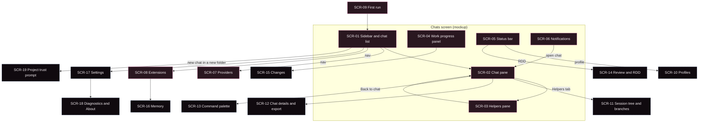

> Traducción al español de `docs/06-ux/screens.md` (árbol de trabajo tras la actualización del 2026-10-03). Documento de lectura; la versión de referencia es la inglesa.

# Pantallas

> Estado: borrador (draft).

El escritorio necesita **19 superficies**. **9** proceden de la maqueta conceptual (mockup): sus cuatro pantallas (Chats, Providers, Extensions, First run; `gs-mockup.html:462`), con la pantalla Chats dividida en seis regiones. **10** no tienen maqueta y se derivan del [inventario de capacidades](../05-capability-inventory.md). Hoy la aplicación tiene tres pantallas: carga, primer arranque y chat (`D:renderer/app/App.tsx:11-15`).

La maqueta es **intención, no especificación**: sus datos de ejemplo (nombres de proveedores, recuentos, "212 / 400") nunca se convierten en un requisito. Toda idea de "Superficie" que aparece a continuación es `Inference:` salvo que cite la maqueta.

**Claves de cita.** `D:` es `gentle-shell-desktop@5ab4a00:src/`. `gs-mockup.html:<line>` es el DOM guardado de https://claude.ai/artifact/CCpKaRTkrnDrWoErY27KEL. Los ID se repiten entre documentos (inventory A1–A12 y U1–U8, audit A1–A21, UX U1–U12), así que todo ID de otro documento va cualificado: `inventory S1` es una fila del [inventario de capacidades](../05-capability-inventory.md), `inventory Q6` una de sus [búsquedas en el escritorio](../05-capability-inventory.md#búsquedas-en-el-escritorio), `gap G1` una [carencia (gap) del RPC](../04-rpc-contract.md#carencias-que-necesita-el-escritorio), `audit A5` un [hallazgo de la auditoría](../03-architecture/audit.md#hallazgos), `UX U3` un [principio de UX](principles.md), `vision Q5` una [pregunta abierta](../00-vision.md#preguntas-abiertas-para-el-mantenedor). Un cualificador abarca los ID que se enumeran tras él (`audit A3, A11`). La línea "Filas del inventario" de cada pantalla enumera solo filas del inventario. Los ID SCR pertenecen a esta página.

## Mapa de pantallas

Borde continuo: aparece en la maqueta. Borde discontinuo: sin maqueta, derivada del inventario. Las aristas son navegación `Inference:`, no una arquitectura de la información decidida.

## De un vistazo

| ID | Superficie | Origen | Existe hoy | Bloqueos principales |
|---|---|---|---|---|
| SCR-01 | Barra lateral y lista de chats | mockup | partial | audit A3, A11, A10, A1 |
| SCR-02 | Panel de chat | mockup | partial | audit A7, A6; inventory C17, C20 |
| SCR-03 | Panel de helpers | mockup | partial | gap G1, G8; audit A5 |
| SCR-04 | Panel de progreso del trabajo (ODD) | mockup | no | gap G2 |
| SCR-05 | Barra de estado | mockup | no | gap G6, G7 |
| SCR-06 | Notificaciones | mockup | no | audit A3; gap G9; inventory C20 |
| SCR-07 | Proveedores | mockup | no | gap G3, G4 |
| SCR-08 | Extensiones | mockup | no | gap G5; inventory E6, E7 |
| SCR-09 | Primer arranque | mockup | yes, partly | audit A9, A19, A4 |
| SCR-10 | Perfiles | inventory | no | gap G6 |
| SCR-11 | Árbol de la sesión y ramas | inventory | no | inventory S8; efecto secundario de gap G1 |
| SCR-12 | Detalles del chat y exportación | inventory | no | inventory S6, S13 |
| SCR-13 | Paleta de comandos | inventory | no | inventory C12 |
| SCR-14 | Revisión y RDD | inventory | no | inventory R3, R4; audit A6 |
| SCR-15 | Cambios | inventory | no | inventory V5 (solo TUI) |
| SCR-16 | Memoria | inventory | no | inventory I4 (solo herramientas) |
| SCR-17 | Configuración | inventory | no | inventory V8, Y4, C20 |
| SCR-18 | Diagnóstico y Acerca de | inventory | no | gap G10; audit A8 |
| SCR-19 | Solicitud de confianza del proyecto | inventory | no | inventory T1 |

## Pantallas de la maqueta

### SCR-01. Barra lateral y lista de chats

| Aspecto | Detalle |
|---|---|
| Propósito | Encontrar, iniciar y cambiar de chat; ver de un vistazo el estado de cada chat (UX U3). Llegar a Proveedores y Extensiones. |
| Filas del inventario | S1, S2, S3, S4, S5, S6, S16, S17 |
| Estados | Lista vacía. Cargando. Chats agrupados por día. Por chat: idle, working, needs you. Error de la lista. |
| Interacciones | Nuevo chat; seleccionar un chat; (`Inference:`) buscar, renombrar, eliminar, "Continue last chat" por proyecto (inventory S2, S4–S6). |
| Hoy | Chats agrupados por día (`D:renderer/features/chats/components/ChatList.tsx:19-25`); píldora de estado por chat (`D:renderer/features/chats/components/ChatListItem.tsx:5-15`, `:39`), pero el proceso principal siempre envía `idle` (`D:main/domain/session/sessionList.ts:35`). La lista procede de pi 0.85.1 en el mismo proceso (inventory S3; audit A1, A2). Nuevo chat lanza un proceso sin `new_session` y sin carpeta de proyecto (inventory S1; audit A10). Sin búsqueda, renombrado ni eliminación (inventory Q6, Q25). |
| Intención de la maqueta | Botón de nuevo chat (`gs-mockup.html:476`); grupos Today y Yesterday (`:478`, `:495`); por chat, un título, un estado ("working", "needs you", una hora) y una vista previa de una línea (`:479-505`); navegación por secciones con recuentos (`:507-511`); línea de la cuenta (`:512`). |
| Bloqueos | Audit A3 y gap G9 (una sesión cada vez, así que no hay "working" ni "needs you" reales para otros chats); audit A11 (ciclo de vida de la lista); audit A10 (sin carpeta por chat); inventory S17 (la lista lee solo el directorio de sesiones por defecto; `Inference:` las sesiones guardadas en un directorio personalizado no aparecen); salvedad de inventory S3 (un cwd almacenado que ya no existe hace que pi termine con código 1); inventory S6 (sin comando de eliminación sobre RPC). |

### SCR-02. Panel de chat

| Aspecto | Detalle |
|---|---|
| Propósito | Hablar con Gentle, responder a sus preguntas, ver los helpers que ha iniciado, detenerlo o redirigirlo (UX U1, U4, U5). |
| Filas del inventario | C1–C6, C8–C11, C14, C17–C21, S19, K1, A5, A7, A9, R2, V1, V13, V14, V15, V16–V18, I5, I10, Y1, Y2 |
| Estados | Vacío ("Start a conversation"). Inactivo. Trabajando (en streaming). Esperando la respuesta a un diálogo. Mensaje en cola (inventory C4–C6, no construido). Reintentando (inventory K5, no construido). Compactando (inventory K1, K2, no construido). Error. |
| Interacciones | Enviar, nueva línea, detener (Esc); responder a tarjetas select/confirm/input/editor; abrir el panel de Helpers. `Inference:` redirigir o poner en cola mientras trabaja, adjuntar imágenes, referencias a archivos con `@`, copiar un mensaje, desplegar los bloques de herramientas y de razonamiento (tarjetas de herramienta: inventory V15, I5), compactar ahora con instrucciones opcionales (inventory K1). |
| Hoy | Cabecera con título, píldora Working y pestañas Chat/Helpers (`D:renderer/features/conversation/components/ConversationHeader.tsx:23-37`); línea de error (`D:renderer/features/conversation/components/StatusLine.tsx:10-17`); franja de helpers (`D:renderer/features/conversation/components/HelpersStrip.tsx:17-27`); hilo en Markdown (inventory C21); tarjetas de diálogo para cuatro tipos (`D:renderer/features/conversation/components/DialogCard.tsx:39-45`); compositor de solo lectura mientras trabaja, con Enter, Shift+Enter y Esc (`D:renderer/features/conversation/components/Composer.tsx:30-37`, `:53`, `:61`). |
| Intención de la maqueta | Título más la píldora "Working on task 3" y pestañas (`gs-mockup.html:517-523`); mensajes con marca de tiempo (`:527-544`); helpers bajo el mensaje que los inició (`:545-550`); tarjeta de pregunta con una opción principal y "Let me explain" (`:553-558`); compositor y tres indicaciones (`:563-568`). |
| Bloqueos | Audit A7 / inventory C4 (redirigir y el mensaje de seguimiento se rechazan mientras trabaja; pregunta abierta [vision Q5](../00-vision.md#preguntas-abiertas-para-el-mantenedor)); audit A6 (se descartan los mensajes que no son del asistente, así que los resultados de inventory A7, los recordatorios de R2 y las tarjetas de V17 nunca se muestran; desde gentle-shell 4.0.0, un padre inactivo también se despierta con un mensaje con rol de usuario, que `Inference:` (no ejecutado) también se descarta en vivo, inventory A7); inventory C17, C18 (las partes de herramienta y el razonamiento no se representan, así que las tarjetas de herramienta de inventory V15 e I5 no tienen nada que mostrar); inventory C20 (`notify` ignorado, así que se pierde la mayor parte de la salida de `/gentle:*`, inventory V18); inventory I10 (las descripciones de las opciones se pierden sobre RPC); inventory K1 (`compact` existe sobre RPC; sin acción en el escritorio, inventory Q4); audit A12 (tiempos de espera de los diálogos); audit A13 (el hilo anterior sigue visible al cambiar de chat). Los helpers no pueden ir bajo su mensaje: la carga de actividad no tiene vínculo con el mensaje (`D:renderer/features/conversation/components/HelpersStrip.tsx:9-16`). |

### SCR-03. Panel de helpers

| Aspecto | Detalle |
|---|---|
| Propósito | Ver qué está haciendo cada helper de este chat, seguir uno en directo y detenerlo (UX U4, U5). |
| Filas del inventario | A1, A2, A3, A4, A5, A6, A12 |
| Estados | Por helper: queued, running, waiting, done, failed, cancelled (conjunto del escritorio, `gentle-shell-desktop@5ab4a00:src/shared/bridge-types.ts:131-138`). Helpers terminados anteriormente, plegados. Vacío. |
| Interacciones | Seleccionar un helper; Follow live; Show tool details; Back to chat; Stop (deshabilitado). `Inference:` cuadro de mensaje para redirigir (inventory A6), responder a la pregunta del helper en su hilo (inventory A5). |
| Hoy | Lista, hilo y pie (`D:renderer/features/helpers/HelpersContainer.tsx`); grupo "Earlier · N finished" (`D:renderer/features/helpers/components/HelperList.tsx:23`, `:53`); Stop deshabilitado con una descripción emergente (`D:renderer/features/helpers/components/HelpersFooter.tsx:36-38`). |
| Intención de la maqueta | Recuentos de resumen (`gs-mockup.html:573`); lista con tiempo transcurrido y pasos (`:574-577`); cabecera del hilo con el modelo y el mensaje desde el que se inició (`:581-585`); elementos Task, Plan, Step, Update y Note (`:587-596`); pie con Follow live, Show tool details, Back to chat, Stop (`:598-604`). |
| Bloqueos | Gap G1 (sin comando de detención; `Inference:` los helpers en segundo plano no pueden detenerse sobre RPC); audit A5 (gentle-shell publica `completed` y `timed_out`, que el escritorio no mapea; los elementos de herramienta de gentle-shell no llevan `callId`, que el escritorio exige, así que `Inference:` (no ejecutado) se descarta todo elemento de herramienta); gap G8 e inventory A2 (sin modelo, tokens, coste ni transcripción en la carga); el ámbito "All sessions" de la superposición de inventory A3 choca con UX U4. |

### SCR-04. Panel de progreso del trabajo (ODD)

| Aspecto | Detalle |
|---|---|
| Propósito | Mostrar la funcionalidad en la que se trabaja, la fase, las tareas con sus evidencias y las comprobaciones (UX U6). |
| Filas del inventario | O2, O3, O4, R5 |
| Estados | Sin funcionalidad (`Inference:` el trabajo pequeño no crea documento de funcionalidad (feature document) en ODD, según el prompt del harness en inventory O1). Funcionalidad con fase. Tarea en curso, terminada con evidencia, pendiente. Comprobaciones pendientes, superadas, con advertencia. |
| Interacciones | `Inference:` abrir el documento de funcionalidad; abrir la evidencia de commit o de prueba de una tarea; saltar a Cambios (SCR-15) o a Revisión (SCR-14). |
| Hoy | Ninguna (inventory Q30, Q32). |
| Intención de la maqueta | "Working on" con la ruta del documento de funcionalidad y la rama (`gs-mockup.html:612-613`); cinco pasos Explore, Plan, Build, Verify, Deliver (`:617-624`); tareas con evidencia de commit y de pruebas (`:628-635`); comprobaciones Tests, Types, Review, Changed lines (`:639-645`). |
| Bloqueos | Gap G2 (sin estado estructurado de ODD; solo las llamadas explícitas a `gentle_odd_phase` llegan al host, como eventos de herramienta que el escritorio no representa, inventory C17); inventory O2 (`Inference:` los cinco pasos de la maqueta necesitan una correspondencia con las ocho fases de gentle-shell); inventory O3 (formato del documento de funcionalidad sin especificar); inventory O4 (estado de las tareas solo dentro de los resultados de la herramienta `todo`); audit A3. |

### SCR-05. Barra de estado

| Aspecto | Detalle |
|---|---|
| Propósito | Mostrar el contexto del chat actual en el borde de la ventana: carpeta, rama, modelo, esfuerzo, perfil, contexto, coste, estado del flujo de trabajo (UX U2). |
| Filas del inventario | V2, V3, V4, K3, K4, M1, M3, M5, P1, R1, O2 |
| Estados | Por chat. Valor desconocido (datos aún no disponibles). Advertencia (por ejemplo, uso de contexto elevado). |
| Interacciones | `Inference:` clic en el modelo para elegirlo (inventory M1), en el esfuerzo para cambiarlo (inventory M5), en el perfil para abrir Perfiles (SCR-10), en RDD para abrir Revisión (SCR-14). |
| Hoy | Ninguna (inventory Q11, Q27, Q31). |
| Intención de la maqueta | Marca, carpeta, rama con marca de cambios sin confirmar, modelo, esfuerzo, perfil, % de contexto, coste, `ODD · RDD on` (`gs-mockup.html:813-823`). |
| Bloqueos | Gap G7 (modelo y esfuerzo mediante `get_state`; coste y contexto solo por consulta mediante `get_session_stats`; cwd y rama ausentes); gap G6 (perfil); inventory R1 (estado de RDD solo como `notify`); audit A3 (debe seguir al chat seleccionado). |

### SCR-06. Notificaciones

| Aspecto | Detalle |
|---|---|
| Propósito | Avisar al usuario cuando otro chat necesita una decisión o un helper ha terminado, sin abrir cada chat (UX U3). |
| Filas del inventario | C20, V16, V18, A7 |
| Estados | Ninguna. Una o más notificaciones. Recuento de no leídas en la campana. |
| Interacciones | Descartar; `Inference:` clic para abrir el chat. |
| Hoy | Ninguna: `notify` y otras solicitudes de tipo dispara y olvida se ignoran (`D:main/domain/rpc/chatReducer.ts:180-184`). |
| Intención de la maqueta | Campana con un punto (`gs-mockup.html:470`); notificaciones "Helper finished" y "Gentle needs a decision · waiting 4 min" (`:825-836`); botón de descartar (`:829`, script `:841-843`). |
| Bloqueos | Audit A3, gap G9 (los otros chats no se están ejecutando); inventory C20. |

### SCR-07. Proveedores

| Aspecto | Detalle |
|---|---|
| Propósito | Iniciar sesión en suscripciones, añadir claves de API y modelos locales, elegir el modelo por defecto para los chats nuevos (UX U7, U8). |
| Filas del inventario | M1, M2, M4, M7, M8, M9, M10, M11, M12, I6, V4, V19 |
| Estados | Proveedores conectados. Proveedores por añadir. Iniciando sesión (OAuth en curso). Error. Uso por suscripción (inventory V4, no está en la maqueta). `Inference:` historial de uso entre chats, por modelo (inventory V19, `/gentle:stats`, no está en la maqueta; también podría situarse junto a las estadísticas del chat de SCR-12). |
| Interacciones | Iniciar sesión, cerrar sesión, añadir clave, añadir servidor local, gestionar, cambiar el modelo por defecto. `Inference:` marcar modelos como favoritos para la rotación (inventory M4). |
| Hoy | Ninguna. El primer arranque solo comprueba que existen `auth.json` y `models.json` (inventory M7, M9). |
| Intención de la maqueta | Lista de conectados con cerrar sesión y gestionar (`gs-mockup.html:698-712`); lista "Add a provider" (`:714-726`); modelo por defecto con esfuerzo y perfil (`:729-731`); "Where this lives" con rutas de archivo y "Your vanilla pi untouched" (`:733-739`). |
| Bloqueos | Gap G3 (sin comando de inicio de sesión; desde pi 1.0.0, el `/login` interactivo termina con "Sign in with Radius" y después ofrece añadir el servidor MCP de Radius, inventory M7, lo cual es información de entrada para esta pantalla, no un requisito); gap G4 (sin valor por defecto persistido); inventory V19 (el panel de `/gentle:stats` es solo de la TUI y bajo RPC solo envía un `notify`; `Inference:` el escritorio podría agregar los archivos de sesión que lee el panel); inventory M4 (ningún comando RPC fija los modelos usados en la rotación; `cycle_model` solo informa de `isScoped`); la elección entre solo RPC y en el mismo proceso ([vision Q4](../00-vision.md#preguntas-abiertas-para-el-mantenedor), audit A1, A2). |

### SCR-08. Extensiones

| Aspecto | Detalle |
|---|---|
| Propósito | Instalar, actualizar, eliminar, habilitar y delimitar el ámbito de los paquetes; ver qué incluye gentle-pi (UX U8, U7). |
| Filas del inventario | E1, E2, E4, E5, E6, E7, E8, E9, I1, I2, I3, A11, L4, L7, V10, H3 |
| Estados | Instalado, actualización disponible, deshabilitado, local (git o carpeta). Instalando. Necesita recarga (`Inference:` "Changes apply to new chats", `gs-mockup.html:748`). |
| Interacciones | Instalar desde npm, git o carpeta; actualizar; actualizar todo; eliminar; activar o desactivar; elegir tema; ámbito global o por proyecto. |
| Hoy | Ninguna (inventory Q20). |
| Intención de la maqueta | Campo y botones para añadir (`gs-mockup.html:751-758`); lista de instalados con distintivos de versión e interruptores (`:760-789`); "Inside gentle-pi": comandos y helpers, temas, skills, prompts (`:792-799`); ámbito con configuración global y por proyecto (`:801-807`). |
| Bloqueos | Gap G5 (sin comando de paquetes); inventory E6 (los temas no están disponibles sobre RPC); inventory E7 (sin comando de recarga); inventory E8 (estado de MCP solo mediante `notify`). |

### SCR-09. Primer arranque

| Aspecto | Detalle |
|---|---|
| Propósito | Elegir entre la configuración de pi del usuario y un espacio separado, antes del primer chat (UX U7). |
| Filas del inventario | L1, L2, L5, U7, M7, M9 |
| Estados | pi encontrado. pi no encontrado (se omite la pantalla). Guardando la elección. Error con Retry. Aprovisionamiento en curso (inventory L5, no construido). |
| Interacciones | Use my pi setup; Keep it separate; Retry. |
| Hoy | Título, entradilla, tarjeta de detección, dos opciones, letra pequeña, Retry ante error (`D:renderer/features/first-run/components/FirstRun.tsx:29-75`). La aplicación elige esta pantalla a partir de `setupStatus()` (`D:renderer/app/App.tsx:37-48`). |
| Intención de la maqueta | La misma estructura (`gs-mockup.html:651-689`). La maqueta añade "the app runs its own copy of pi, so nothing else has to be installed" (`:687`), que el escritorio omite (`D:renderer/features/first-run/components/FirstRun.tsx:73-75`); esto es solo intención ([vision Q2](../00-vision.md#preguntas-abiertas-para-el-mantenedor)). |
| Bloqueos | Audit A9 / inventory L5 (el primer chat en un home aislado nuevo espera al aprovisionamiento sin mostrar progreso); audit A19 e inventory L2 (dos elecciones de home persistidas); salvedad de inventory L1 (tratamiento de `GENTLE_SHELL_HOME`); audit A4 (en Windows falla el lanzamiento del lanzador, según informa un tester en el issue #23 del escritorio; la PR #26, abierta y sin fusionar a fecha de 2026-10-03, deja las rutas sin entrecomillar, PLAT-02 en [10-platforms](../10-platforms.md#riesgos)). |

## Pantallas derivadas del inventario

Ninguna de estas tiene maqueta. Existen porque el inventario enumera capacidades sin superficie. Su contenido es `Inference:`; un diseñador debería tratarlas como candidatas.

### SCR-10. Perfiles

| Aspecto | Detalle |
|---|---|
| Propósito | Ver, cambiar, crear y fijar perfiles de agente y modelo; fijar el modelo y el esfuerzo por helper. |
| Filas del inventario | P1, P2, P3 |
| Estados | Perfil activo; fijado localmente o por el repositorio (`name (local)`, `name (repo)`, inventory P2). Todavía sin archivo de perfiles. |
| Interacciones | Aplicar, crear, capturar, duplicar, renombrar, eliminar, exportar, importar, fijar (a partir de las teclas del panel `/gentle:profiles`, inventory P1). |
| Hoy | Ninguna (inventory Q27). |
| Intención de la maqueta | **Sin maqueta; derivada del inventario.** La maqueta muestra un perfil solo en la barra de estado y en el modelo por defecto (`gs-mockup.html:819`, `:731`). |
| Bloqueos | Gap G6 (sin estado de perfil sobre RPC); inventory P1, P3: `Inference:` (no ejecutado) probablemente ambos paneles lanzan un `TypeError` bajo RPC (`ctx.ui.custom()` devuelve `undefined`); [vision Q8](../00-vision.md#preguntas-abiertas-para-el-mantenedor). Los archivos de fijación de inventory P2 tienen una forma JSON documentada (`Inference:` legibles en el lado del host). |

### SCR-11. Árbol de la sesión y ramas

| Aspecto | Detalle |
|---|---|
| Propósito | Ver un chat como un árbol, ramificar desde un mensaje anterior, duplicar un chat. |
| Filas del inventario | S8, S9, S10, S11, S12 |
| Estados | Chat lineal. Chat ramificado con una hoja activa. |
| Interacciones | Ramificar desde aquí (inventory S11); duplicar (inventory S12); pasar a otra rama (inventory S8); etiquetar un mensaje (inventory S9); resumir la rama que se deja atrás (inventory S10). |
| Hoy | Ninguna (inventory Q5, Q23). |
| Intención de la maqueta | **Sin maqueta; derivada del inventario.** |
| Bloqueos | Inventory S8 (el árbol se puede leer con `get_tree`, pero ningún comando mueve la hoja activa); inventory S9, S10 (sin comando); inventory S11, S12: `fork` y `clone` cancelan todos los helpers como efecto secundario (gap G1). |

### SCR-12. Detalles del chat y exportación

| Aspecto | Detalle |
|---|---|
| Propósito | Nombrar, inspeccionar, exportar, compartir, eliminar o copiar desde un chat. |
| Filas del inventario | S5, S6, S7, S13, S14, S15, S16, S19, K6 |
| Estados | Chat guardado. Chat privado (no guardado, inventory S16). |
| Interacciones | Renombrar; eliminar; exportar HTML o JSONL; abrir un archivo de sesión; compartir enlace; copiar el último mensaje; ver los archivos de instrucciones cargados (inventory K6). |
| Hoy | Ninguna (inventory Q6, Q7, Q11, Q17). La barra lateral muestra un nombre cuando existe (inventory S5). |
| Intención de la maqueta | **Sin maqueta; derivada del inventario.** |
| Bloqueos | Inventory S6 (sin comando de eliminación); inventory S13 (solo HTML sobre RPC); inventory S14, S15 (sin comando); inventory S5 (solo se puede renombrar la sesión cargada); inventory K6 (ningún comando enumera los archivos de contexto). |

### SCR-13. Paleta de comandos

| Aspecto | Detalle |
|---|---|
| Propósito | Descubrir y ejecutar comandos, skills y plantillas de prompt sin recordar los nombres. |
| Filas del inventario | C11, C12, V7, E4, E5, I2, I3 |
| Estados | Abierta con búsqueda; resultados agrupados; sin coincidencias. |
| Interacciones | Buscar, ejecutar; `Inference:` reutilizar los grupos seleccionados de gentle-shell Configuration, Session, Diagnostics, Skills (inventory V7). |
| Hoy | Ninguna; cualquier texto que empiece por `/` se envía como prompt (inventory C11). |
| Intención de la maqueta | **Sin maqueta; derivada del inventario.** |
| Bloqueos | Inventory C12 (los comandos de barra integrados no existen sobre RPC; `get_commands` enumera solo comandos de extensión, plantillas y skills); inventory C20 (los resultados de la mayoría de los comandos llegan como `notify`). |

### SCR-14. Revisión y RDD

| Aspecto | Detalle |
|---|---|
| Propósito | Mostrar si el desarrollo dirigido por recibos (receipt-driven development) está activado, responder al consentimiento de revisión y seguir una revisión. |
| Filas del inventario | R1, R2, R3, R4, R5, GA2 |
| Estados | RDD activado o desactivado (con el ámbito que lo decide). Revisión pendiente. Consentimiento solicitado. Revisión en curso, aprobada, con corrección requerida. |
| Interacciones | Activar o desactivar RDD; conceder o rechazar el consentimiento; `Inference:` `review status` de solo lectura para la barra de estado (inventory GA2). |
| Hoy | Ninguna (inventory Q29). |
| Intención de la maqueta | **Sin maqueta; derivada del inventario.** La maqueta muestra solo `ODD · RDD on` (`gs-mockup.html:822`) y "Review · after task 5" (`:643`). |
| Bloqueos | Inventory R1 (estado solo como `notify`); inventory R2 (el recordatorio es un mensaje personalizado que el escritorio descarta, audit A6); inventory R3 ("Allow for this session" no disponible sobre RPC; `UNVERIFIED:` el consentimiento en el lado del host se omite); inventory R4 (requiere la TUI); inventory R5 (faltan las tarjetas de herramienta, inventory C17). |

### SCR-15. Cambios

| Aspecto | Detalle |
|---|---|
| Propósito | Ver qué ha cambiado el agente, por worktree, con diffs. |
| Filas del inventario | V5, V6 |
| Estados | Sin cambios. Cambios por worktree. |
| Interacciones | Abrir un diff; cambiar de worktree. |
| Hoy | Ninguna (inventory Q34). |
| Intención de la maqueta | **Sin maqueta; derivada del inventario.** |
| Bloqueos | Inventory V5 (la superposición y el widget son solo de la TUI; `Inference:` la evidencia en bruto se puede leer con `get_entries`, pero el esquema de las entradas no está documentado); inventory V6 (eventos de herramienta no representados, inventory C17). |

### SCR-16. Memoria

| Aspecto | Detalle |
|---|---|
| Propósito | Mostrar si la memoria está activa para un chat y, `Inference:`, qué se ha recordado. |
| Filas del inventario | I4, GA1 |
| Estados | Paquete de memoria ausente, instalado, activo. |
| Interacciones | `Inference:` abrir el estado de la memoria; enlazar con el paquete en Extensiones. |
| Hoy | Ninguna (inventory Q33). |
| Intención de la maqueta | **Sin maqueta; derivada del inventario.** La pantalla Extensiones de la maqueta enumera `gentle-engram` como "memory that survives between chats" (`gs-mockup.html:770`). |
| Bloqueos | Inventory I4 (la memoria son herramientas ordinarias del modelo; el estado de Engram aparece solo en la salida de `/gentle:doctor`, que es `notify`, inventory I7). `UNVERIFIED:` el modelo de datos propio de Engram; no está inventariado. |

### SCR-17. Configuración

| Aspecto | Detalle |
|---|---|
| Propósito | Un único lugar para las preferencias que hoy viven en la configuración de pi y en los archivos de configuración de gentle-shell. |
| Filas del inventario | C7, K2, K5, M6, M13, U4, U8, I8, I9, GA3, V8, V9, V12, V13, V14, A8, P4, Y4, E6, V10 |
| Estados | Por ajuste: valor y la fuente que lo decide (global, proyecto, entorno), como informa gentle-shell para inventory A8. |
| Interacciones | Activar o desactivar y elegir valores: modo de cola, autocompactación, reintento, esfuerzo por defecto, red, apariencia y tema, movimiento reducido (inventory V9), modo Vim, comportamiento de Esc, historial de prompts, helpers en segundo plano, persona, YOLO, telemetría. |
| Hoy | Ninguna (inventory Q21). |
| Intención de la maqueta | **Sin maqueta; derivada del inventario.** |
| Bloqueos | Inventory V8 (`/gentle:customize` se niega a funcionar fuera de la TUI); inventory Y4 (YOLO no puede activarse sobre RPC); inventory C20 (la mayoría de los conmutadores informan mediante `notify`); `Inference:` la configuración de gentle-shell vive bajo `GENTLE_PI_CONFIG_HOME` y se comparte entre homes, a diferencia de la configuración de pi ([inventario, configuración propia de gentle-shell](../05-capability-inventory.md#ajustes-de-los-que-es-responsable-gentle-shell)). |

### SCR-18. Diagnóstico y Acerca de

| Aspecto | Detalle |
|---|---|
| Propósito | Mostrar versiones, runtime y salud; informar de un problema; copiar el diagnóstico; conocer las actualizaciones. |
| Filas del inventario | H1, H2, H3, H4, L3, L9, L12, I7, GA5 |
| Estados | Correcto. Por debajo de la versión mínima. Actualización disponible. Hallazgos de doctor. |
| Interacciones | Copiar el diagnóstico; informar de un problema (ámbito por decidir: pi, gentle-shell o escritorio, inventory H1); ejecutar doctor. |
| Hoy | Ninguna. |
| Intención de la maqueta | **Sin maqueta; derivada del inventario.** |
| Bloqueos | Gap G10 y audit A8 (sin handshake de versión; `gentle-shell --version` solo por fuera del canal); inventory I7 (solo `notify`); inventory L12 (sin fuente de versión con la que comparar). |

### SCR-19. Solicitud de confianza del proyecto

| Aspecto | Detalle |
|---|---|
| Propósito | Preguntar si se confía en una carpeta de proyecto antes de que se carguen sus paquetes y su configuración de proyecto. |
| Filas del inventario | T1, Y5 |
| Estados | Sin decidir, de confianza, no de confianza. |
| Interacciones | Confiar; no confiar; `Inference:` recordar la decisión. |
| Hoy | Ninguna (inventory Q14). |
| Intención de la maqueta | **Sin maqueta; derivada del inventario.** |
| Bloqueos | Inventory T1 (bajo RPC, un proyecto sin decidir se resuelve en silencio como no de confianza salvo que `--approve`/`--no-approve` lo anule, el proyecto no tenga recursos que requieran confianza (entonces se confía en él directamente), una extensión responda a `project_trust`, haya una decisión almacenada o el valor por defecto sea `always`; sin comando de confianza); inventory Y5 (gentle-shell no añade ningún manejador de `project_trust`). |

## Filas sin pantalla

Toda fila del inventario está en una de las pantallas anteriores o se enumera aquí (comprobado comparando los ID de fila del [inventario de capacidades](../05-capability-inventory.md) con esta página).

- Mecánica de la terminal sin significado en una GUI, o trabajo que ocurre dentro de gentle-shell: inventory C15 (cerrar la ventana lo cubre), C16, U1, U3, U6, L6, L8 (como mucho, opción para desarrolladores), L10, L11, O1, Y3, Y6 (una instrucción del prompt, que no se impone; `Inference:` como mucho, se muestra como orientación), E3 (indicadores `--extension` solo al lanzar; como mucho, opción para desarrolladores), S18 (`--session-id` solo al lanzar; como mucho, enlaces profundos), V11 (banner de arranque; como mucho, pantalla de bienvenida).
- Cubiertas por otras filas: inventory GA4 (el skill-registry de gentle-ai y la CLI de CodeGraph; el inventario indica que lo cubren inventory I3, en SCR-08 y SCR-13, e inventory I5, en SCR-02).
- Pequeñas adiciones a SCR-02: inventory C13, U2 y U5 (editor externo, buscar en el chat, hoja de atajos).
- Integradas en otras pantallas: inventory L5 y U7 se integran en SCR-09; inventory A10 y el consentimiento de inventory A9 se integran en SCR-02 como tarjetas de diálogo.

## Preguntas abiertas

- ¿Qué pantallas derivadas están dentro del alcance y en qué orden? Depende de [vision Q1](../00-vision.md#preguntas-abiertas-para-el-mantenedor) (accesible frente a completo).
- ¿El panel de progreso del trabajo está siempre visible o solo cuando existe un documento de funcionalidad?
- ¿Configuración debería ser una sola pantalla o repartirse entre Proveedores, Extensiones y Perfiles, como sugiere la navegación de la maqueta?

## Fuentes leídas

`gs-mockup.html` L459–909; `gentle-shell-desktop@5ab4a00:src/renderer/**`, `src/shared/bridge-types.ts`, `src/main/domain/session/sessionList.ts`, `src/main/domain/rpc/chatReducer.ts` (a través de 04); `docs/04-rpc-contract.md`, `docs/05-capability-inventory.md`, `docs/03-architecture/audit.md`, `docs/00-vision.md`, `docs/10-platforms.md` (actualizados a pi 1.0.0 y al `main` de gentle-shell en `ac67159`, versión de paquete 4.0.0, el 2026-10-03).
