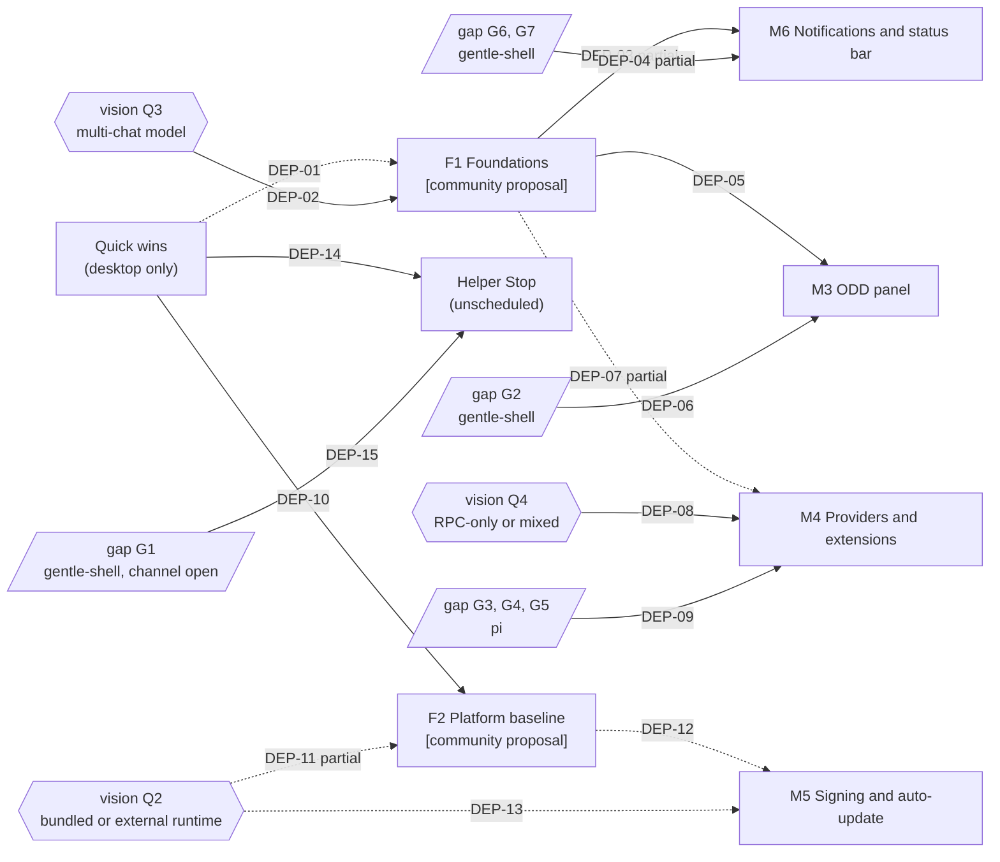

> Traducción al español de `docs/09-roadmap.md` (árbol de trabajo tras la actualización del 2026-10-03). Documento de lectura; la versión de referencia es la inglesa.

# Hoja de ruta

> Estado: borrador, propuesta de la comunidad pendiente de validación del mantenedor (draft (community proposal, awaiting maintainer validation)).

> **Propuesta de la comunidad derivada del corpus.** El mantenedor pidió a la comunidad que presentara una hoja de ruta, se repartiera las tareas y presentara PR **[maintainer]** (Discord, Alan Buscaglia, 2026-09-27). Esta página es esa hoja de ruta, derivada de las otras páginas del corpus. Los nombres de hito M1 a M6 del mantenedor se mantienen tal como él los escribió. Todo hito nuevo, toda ordenación y todo criterio de salida de esta página son **[community proposal]**: la ordenación y el alcance necesitan la validación del mantenedor.

**En un párrafo.** El mantenedor entregó M1 (núcleo del chat) y M2 (helpers por chat) y nombró cuatro hitos más: M3 panel de ODD, M4 pantallas de proveedores y extensiones, M5 firma y actualización automática, M6 notificaciones y barra de estado (`gentle-shell-desktop@5ab4a00:odd/tasks/desktop-m1-chat-core.md:22`; `gentle-shell-desktop@5ab4a00:README.md:3`, `:63-64`). El corpus añade dos hitos previos, **F1 Fundamentos** (varios chats a la vez) y **F2 Base de plataforma** (Windows, Linux y CI). La tabla de riesgos de la auditoría vincula el host de una sola sesión (audit A3) con M3 y bloquea las versiones para Windows y Linux por audit A4, A16, A18 ([audit §Riesgos para escalar la UI](03-architecture/audit.md#riesgos-para-escalar-la-ui), `03-architecture/audit.md:383`, `:386`); las notificaciones de M6 sobre otros chats también necesitan varios chats en ejecución (bloqueos de SCR-06, `06-ux/screens.md:148`). M4 está vinculado a audit A2 y A8, no a audit A3 (`03-architecture/audit.md:385`). También enumera **quick wins (mejoras rápidas)**: pequeñas correcciones solo del escritorio que no necesitan ningún cambio upstream (repositorio de origen) ni ninguna decisión abierta.

## Cómo leer esta página

| Etiqueta | Significado |
|---|---|
| **[maintainer]** | Declarado en los documentos del repositorio o en los mensajes de Discord del mantenedor. |
| **[community proposal]** | Propuesto por el corpus. No decidido. |
| `Inference:` | Razonamiento a partir de evidencias citadas, no un hecho declarado. |
| `UNVERIFIED:` | Comprobado pero no confirmado. |

- **Claves de cita.** `gentle-shell-desktop@5ab4a00:` es la rama `main` del repositorio del escritorio; `gentle-shell@ac67159:` es el `main` de gentle-shell en `ac67159` (versión de paquete 4.0.0); `pi@a13d35a:` es pi 1.0.0. Actualizado el 2026-10-03 a partir de `gentle-shell@1162ce9` (3.7.0) y `pi@d86654a` (0.99.1); los issues #23–#25 del escritorio y las PR abiertas #26 y #27 se leyeron en GitHub ese día. `desktop-m1-chat-core.md` y `desktop-m2-helpers.md` abrevian `gentle-shell-desktop@5ab4a00:odd/tasks/<file>`. En [Quick wins](#quick-wins), las rutas que empiezan por `src/`, `scripts/` o `.github/` están en `gentle-shell-desktop@5ab4a00`. Las rutas como `03-architecture/audit.md:384` son páginas del corpus en `docs/`. `roadmap.txt:<line>` es la hoja de ruta anterior de memoTux (copia guardada, no está en el repositorio).
- **ID cualificados.** Los ID de otras páginas llevan su página: `audit A4`, `gap G2`, `inventory S1`, `vision Q3`, `UX U3`, `ADR 0007`, `SCR-04`. Un cualificador abarca los ID que le siguen (`audit A3, A11`). **M1–M6** sin cualificar son los hitos del mantenedor, no las filas M1–M13 del inventario. **F1**, **F2**, `QW-##` y `DEP-##` pertenecen a esta página; `PLAT-##` son los riesgos de [10-platforms.md](10-platforms.md#riesgos).
- **Comprobaciones del repositorio.** "Las comprobaciones del repositorio" son `pnpm test`, `pnpm typecheck`, `pnpm build` y `pnpm smoke:electron`, las comprobaciones que M2 usó como criterios de aceptación (`gentle-shell-desktop@5ab4a00:odd/tasks/desktop-m2-helpers.md:43`; scripts en `gentle-shell-desktop@5ab4a00:package.json:13-22`).
- **Sin fechas ni estimaciones de esfuerzo.** Ninguna fuente del corpus las da.

## De un vistazo

| Hito | Origen de la etiqueta | Estado | Condicionado por upstream | Condicionado por una decisión |
|---|---|---|---|---|
| M1 Núcleo del chat | maintainer | delivered | — | — |
| M2 Helpers por chat | maintainer | delivered | — | — |
| [Quick wins](#quick-wins) | community proposal | proposed | no | no |
| [F1 Fundamentos](#f1-fundamentos-varios-chats-a-la-vez-community-proposal) | community proposal | proposed | no | vision Q3 |
| [F2 Base de plataforma](#f2-base-de-plataforma-community-proposal) | community proposal | proposed | no (señal opcional de gentle-shell) | vision Q2 |
| [M3 Panel de ODD](#m3-panel-de-progreso-de-odd) | maintainer | planned | gap G2 (gentle-shell, `Inference:`) | — |
| [M4 Proveedores y extensiones](#m4-pantallas-de-proveedores-y-extensiones) | maintainer | planned | gap G3, G4, G5 (pi, `Inference:`) | vision Q4 |
| [M5 Firma y actualización automática](#m5-firma-y-actualización-automática) | maintainer | planned | — | vision Q2 |
| [M6 Notificaciones y barra de estado](#m6-notificaciones-y-barra-de-estado) | maintainer | planned | gap G6, G7 para una parte (gentle-shell, `Inference:`) | vision Q3 (a través de F1, para una parte) |

El orden sugerido es **quick wins → F1 y F2 en paralelo → M6, M3, M4 y M5 a medida que se despejen sus condiciones** ([ruta crítica](#ruta-crítica)). Este orden es una **[community proposal]**; no renumera M3–M6.

## Hitos

Cada hito enumera los mismos campos. Las filas del inventario remiten al [inventario de capacidades](05-capability-inventory.md), las pantallas a [06-ux/screens.md](06-ux/screens.md), las carencias (gaps) a [04 §Carencias que necesita el escritorio](04-rpc-contract.md#carencias-que-necesita-el-escritorio), las áreas a [08-team.md](08-team.md#áreas-de-responsabilidad). El responsable upstream de cada carencia sigue [02 §Dónde corresponde cada cambio](02-ecosystem.md#dónde-corresponde-cada-cambio), que es a su vez `Inference:`. Los criterios de salida son **[community proposal]** salvo que citen al mantenedor.

### Entregados: M1 y M2

| | M1 Núcleo del chat **[maintainer]** | M2 Helpers por chat **[maintainer]** |
|---|---|---|
| Objetivo | Enumerar los chats de pi, iniciar uno, mantener una conversación en texto plano mediante `gentle-shell --mode rpc`, responder a los diálogos en línea (`gentle-shell-desktop@5ab4a00:odd/tasks/desktop-m1-chat-core.md:7`). | Una pestaña Helpers por chat con los subagentes que ese chat inició; nunca una lista global (`gentle-shell-desktop@5ab4a00:odd/tasks/desktop-m2-helpers.md:7`). |
| Filas del inventario completadas | inventory S3, C1, C2, C3, C15, C19, L1, Y1 (todas las filas marcadas done en el [resumen de cobertura](05-capability-inventory.md#resumen-de-cobertura)) | inventory A1, A2, A3, A5 (partial) |
| Pantallas | SCR-01, SCR-02, SCR-09 (parcial) | SCR-03 (parcial) |
| Evidencia de la entrega | Cerrado el 2026-09-22 con 218 pruebas, typecheck, build, `pnpm package:mac` y `pnpm smoke:electron` (`desktop-m1-chat-core.md:61`, `:65`); fusionado en `main` como `874f30e` (`:71`). | 286 pruebas, typecheck y build en verde; ejecución de extremo a extremo contra un pi real (`desktop-m2-helpers.md:57-59`); el README lo enumera como hecho (`gentle-shell-desktop@5ab4a00:README.md:3`). |
| Dejado abierto por el mantenedor | Seguimientos recomendados (`desktop-m1-chat-core.md:67`). | Stop del helper (`desktop-m2-helpers.md:22`); seguimientos abiertos (`:65`). Ver [quick wins](#quick-wins) y [elementos sin programar](#elementos-del-mantenedor-sin-programar). |

### F1 Fundamentos: varios chats a la vez [community proposal]

| Campo | Contenido |
|---|---|
| Objetivo | Ejecutar varios chats a la vez, cada uno con su propio estado, una identidad de mensaje estable y una carpeta de proyecto, e indicar al usuario qué versiones del runtime están en uso. |
| Por qué un hito nuevo | Audit A3 es el único hallazgo Alta que bloquea varias superficies: los estados "working" y "needs you" de la barra lateral de la maqueta y las notificaciones sobre otros chats no pueden construirse ([audit A3](03-architecture/audit.md#a3-host-de-sesión-única-con-ids-de-mensaje-posicionales)). La tabla de riesgos de la auditoría vincula audit A3 con varios chats a la vez y con M3, y vincula audit A8 con M3 y M4 (`03-architecture/audit.md:382-385`). Gap G9 es trabajo del escritorio, no un cambio upstream (`04-rpc-contract.md:294`). La hoja de ruta de memoTux ya lo llamaba la "gate" (`roadmap.txt:90`). |
| Filas del inventario | inventory S1, S2, S3, S17, L3 |
| Pantallas | SCR-01, SCR-02, SCR-18 (solo versiones) |
| Hallazgos de la auditoría resueltos | audit A3, A11 (la parte que no está en [QW-03](#qw-03-refresco-de-la-barra-lateral-y-nuevo-chat-audit-a11-a1)), audit A1, en el orden de la auditoría (`03-architecture/audit.md:394-396`); después, en el orden de corrección de la auditoría, audit A10 (`:403`), A8 (`:404`; solo "read and show versions", ya que "warn below minimums" necesita vision Q6) y A6 (`:406`). El reinicio del hilo de audit A13 (`:406`) es [QW-07](#qw-07-el-hilo-sigue-visible-al-cambiar-de-chat-audit-a13), no F1. |
| Carencias y responsable upstream | gap G9: escritorio (`04-rpc-contract.md:294`). gap G10 (handshake): pi (`Inference:`, 02); F1 solo necesita `gentle-shell --version` por fuera del canal (`gentle-shell@ac67159:bin/gentle-shell.mjs:1217-1219`). |
| Áreas que lideran | Núcleo y contrato RPC (lidera); Frontend (estados por chat en la barra lateral y la solicitud de carpeta de proyecto; las partes del renderer de audit A11 y A13 son QW-03 y QW-07); QA (fixtures). 08 señala que la secuencia audit A3 → A11 → A1 es en serie (`08-team.md:77`). |
| Criterios de salida | 1. Las comprobaciones del repositorio pasan. 2. Dos chats se ejecutan a la vez: el chat A sigue trabajando mientras se abre el chat B y se le envía un prompt, y cada entrada de la barra lateral muestra su propio estado (estados de SCR-01). 3. Cada envío y cada comando llevan un ID de chat (recomendación 2 de audit A3), cubierto por pruebas de contrato del IPC. 4. Los ID de mensaje proceden de pi, no de posiciones en un array, y sobreviven a una recarga (recomendación 4 de audit A3). 5. La lista de sesiones nunca modifica `PI_CODING_AGENT_DIR` (audit A1), cubierto por una prueba con llamadas de listado solapadas. 6. "New chat" pide una carpeta de proyecto y la pasa como `cwd` (audit A10). 7. La aplicación muestra las versiones de gentle-shell y de pi a partir de `gentle-shell --version` (audit A8). 8. Un chat nuevo lanza su hijo en el primer envío, "instead of on mount" (recomendación de audit A11, `03-architecture/audit.md:243`). |
| Preguntas abiertas que bloquean | **vision Q3** (un hijo por chat o un host compartido; [ADR undecided](03-architecture/adr/README.md#sin-decidir--no-registrado)). vision Q6 decide qué ocurre por debajo de una versión mínima; mostrar las versiones no lo necesita. audit A3 recomienda un `PiSession` por chat abierto (`03-architecture/audit.md:114`); es una recomendación, no una decisión. |

### F2 Base de plataforma [community proposal]

| Campo | Contenido |
|---|---|
| Objetivo | La aplicación arranca con un lanzamiento normal en macOS, Windows y Linux, y la CI demuestra las comprobaciones del repositorio en cada plataforma. |
| Por qué un hito nuevo | Las versiones para Windows y Linux están bloqueadas por audit A4, A16, A18 (`03-architecture/audit.md:386`). Solo se ha probado macOS Apple silicon (`gentle-shell-desktop@5ab4a00:README.md:7`). Los riesgos de plataforma PLAT-01, PLAT-04, PLAT-05, PLAT-09 y PLAT-10 nombran F2 como su hito de referencia ([10-platforms §Riesgos](10-platforms.md#riesgos)). `Inference:` M5 firma las compilaciones; firmar una compilación que no puede arrancar en una plataforma tiene poco valor. |
| Filas del inventario | inventory L5, U7 |
| Pantallas | SCR-09 |
| Hallazgos de la auditoría resueltos | audit A4 y A16 empiezan como quick wins ([QW-01](#qw-01-lanzamiento-de-cmd-en-windows-audit-a4), [QW-04](#qw-04-flujo-de-trabajo-de-ci-audit-a16)); F2 añade el trabajo de CI de Windows "once A4 lands", después audit A9 y A18 (`03-architecture/audit.md:408-413`). Para la parte de scripts de audit A18, la PR abierta #27 (sin fusionar a fecha de 2026-10-03) sustituye el script POSIX `dev:local-pi` por `node scripts/dev-local-pi.mjs` (`03-architecture/audit.md:353`). |
| Carencias y responsable upstream | Ninguna obligatoria. Opcional: una señal de progreso de la configuración legible por máquina desde el lanzador (launcher), responsabilidad de gentle-shell (tabla de 02, `02-ecosystem.md:146`; inventory L5). Sin ella, la opción solo de escritorio de la auditoría es mostrar las líneas de stderr del lanzador (audit A9). |
| Áreas que lideran | Plataforma y distribución (lidera); QA (reproducción en Windows, CI); Integración upstream (solo para la señal opcional de configuración). |
| Criterios de salida | 1. La CI ejecuta las comprobaciones del repositorio en Linux (con xvfb) y en Windows (audit A16). 2. En Windows, con un lanzador instalado mediante npm, un chat se inicia sin `spawn EINVAL` ni `spawn EFTYPE` (issue #23 del escritorio), reproducido antes y después de la corrección, también con una ruta del lanzador o de la sesión que contenga espacios (audit A4; PLAT-01, PLAT-02). 3. Una aplicación de macOS empaquetada encuentra el lanzador cuando se abre desde Finder, sin `GENTLE_SHELL_BIN` (audit A18; la solución provisional actual en `gentle-shell-desktop@5ab4a00:README.md:52-58`; PLAT-09). 4. Un usuario nuevo sin pi ve el progreso del aprovisionamiento en lugar de un chat inactivo (audit A9). 5. `dev:local-pi` funciona en Windows (audit A18; la PR abierta #27 lo propone). 6. En Windows, el primer arranque explica que falta la cadena de herramientas de Go para gentle-ai (PLAT-04) y que falta Bash para pi (PLAT-05) en lugar de fallar en silencio, según las mitigaciones de [10-platforms §Riesgos](10-platforms.md#riesgos). |
| Preguntas abiertas que bloquean | **vision Q2** (runtime incluido o externo; [ADR undecided](03-architecture/adr/README.md#sin-decidir--no-registrado)). `Inference:` un runtime incluido cambiaría cómo se resuelven audit A18 y A9; 08 asigna a Plataforma la tarea de preparar las evidencias para esa decisión (`08-team.md:192`). audit A19 (dos elecciones de home, también en SCR-09) espera a vision Q7 y no forma parte de F2. También está abierta la cuestión de qué topología de Windows es el objetivo (nativa, o el runtime en WSL) ([10-platforms §Preguntas abiertas](10-platforms.md#preguntas-abiertas-para-el-mantenedor), pregunta 1). |

### M3 Panel de progreso de ODD

| Campo | Contenido |
|---|---|
| Objetivo | **[maintainer]** "ODD progress" forma parte de la aplicación planificada (`gentle-shell-desktop@5ab4a00:README.md:3`, `:63`); M3 "needs the structured ODD document format" (`desktop-m2-helpers.md:69`). El contenido del panel (funcionalidad, fase, tareas con evidencias, comprobaciones) sigue la intención de la maqueta descrita en SCR-04. |
| Filas del inventario | inventory O2, O3, O4, R5 |
| Pantallas | SCR-04 (los enlaces a SCR-14 y SCR-15 son navegación `Inference:`) |
| Hallazgos de la auditoría resueltos | Ninguno directamente. Depende de audit A3 y A8 a través de F1 (`03-architecture/audit.md:383`). |
| Carencias y responsable upstream | **gap G2** (estado estructurado de ODD): gentle-shell, como una carga de `setWidget`, un mensaje personalizado o una entrada de sesión con un esquema documentado; el canal forma parte de una pregunta abierta ([ADR: Sin decidir](03-architecture/adr/README.md#sin-decidir--no-registrado)) (`Inference:`, `02-ecosystem.md:143`; `04-rpc-contract.md:299`). Hoy solo las llamadas explícitas a la herramienta `gentle_odd_phase` llegan al host (`04-rpc-contract.md:287`). |
| Áreas que lideran | Integración upstream (gap G2); Frontend; UX y diseño. |
| Criterios de salida | 1. Las comprobaciones del repositorio pasan. 2. Con un gentle-shell que publique el estado estructurado de ODD, el panel del chat abierto muestra la funcionalidad, su fase, las tareas con evidencias de commit y de pruebas, y las comprobaciones, a partir de un fixture real grabado (audit A16 pide fixtures reales). 3. Con un gentle-shell que no lo publique, el panel muestra un estado explícito de "no disponible" en lugar de quedarse vacío (`Inference:` a partir del impacto de degradación silenciosa de audit A8). |
| Preguntas abiertas que bloquean | El propio formato de gap G2 (diseño upstream). `Inference:` los cinco pasos de la maqueta necesitan una correspondencia con las ocho fases de gentle-shell (inventory O2). Pregunta abierta de las pantallas: ¿el panel está siempre visible o solo cuando existe un documento de funcionalidad (feature document) (`06-ux/screens.md:322`)? |

### M4 Pantallas de proveedores y extensiones

| Campo | Contenido |
|---|---|
| Objetivo | **[maintainer]** Pantallas de proveedores y extensiones dentro de la aplicación; hasta entonces los usuarios "sign in and manage packages through `gentle-shell` in the terminal" (`gentle-shell-desktop@5ab4a00:README.md:63`). |
| Filas del inventario | inventory M1, M2, M4, M7, M8, M9, M10, M11, M12, I6, V4, V19 (SCR-07); inventory E1, E2, E4, E5, E6, E7, E8, E9, I1, I2, I3, A11, L4, L7, V10, H3 (SCR-08) |
| Pantallas | SCR-07, SCR-08 |
| Hallazgos de la auditoría resueltos | audit A2, una vez decidida vision Q4 (eliminar la vía de pi en el mismo proceso, o fijarla a la versión mínima de pi de gentle-shell; audit A2). La tabla de riesgos también vincula M4 con audit A8 (`03-architecture/audit.md:385`); F1 cubre solo la visualización de versiones, y la advertencia por debajo de un mínimo espera a vision Q6. |
| Carencias y responsable upstream | **gap G3** (inicio de sesión), **gap G4** (modelo por defecto persistido), **gap G5** (paquetes): pi, mediante una issue de Contribution Proposal (`pi@a13d35a:.github/ISSUE_TEMPLATE/contribution.yml:1`); las PR de pi necesitan la aprobación previa del mantenedor (`Inference:` en cuanto a la responsabilidad, `02-ecosystem.md:142`; `pi@a13d35a:CONTRIBUTING.md:31-34`). La ausencia de estos comandos en pi 1.0.0 está verificada (`04-rpc-contract.md:288-290`); pi 1.0.0 lleva el inicio de sesión con Radius al nivel superior del `/login` interactivo, sin equivalente en RPC (gap G3; inventory M7). |
| Áreas que lideran | Integración upstream (gap G3–G5); Núcleo (vía de datos según vision Q4); Frontend; UX y diseño. |
| Criterios de salida | 1. Las comprobaciones del repositorio pasan. 2. Un usuario inicia sesión en un proveedor desde la aplicación sin abrir la terminal (gap G3). 3. Un modelo por defecto elegido en la aplicación se aplica al siguiente chat nuevo (gap G4). 4. Un paquete se instala, se deshabilita y se elimina desde la aplicación, y el cambio se ve en el siguiente chat nuevo (gap G5; "Changes apply to new chats" es intención de la maqueta, SCR-08). 5. El `settings.json` de pi del usuario nunca se edita (vision P3; `00-vision.md:74`). |
| Preguntas abiertas que bloquean | **vision Q4** (solo RPC o mixto; "decides version coupling and how providers and extensions screens are built", `00-vision.md:130`; [ADR undecided](03-architecture/adr/README.md#sin-decidir--no-registrado)). vision Q8 (cómo aparecen los perfiles; la maqueta muestra un perfil junto al modelo por defecto, SCR-07). vision Q1 (cuán completas deben ser estas pantallas). |

### M5 Firma y actualización automática

| Campo | Contenido |
|---|---|
| Objetivo | **[maintainer]** "signing and auto-update (M5)" (`desktop-m1-chat-core.md:22`); "No signing, notarization or auto-update yet (M5)" (`gentle-shell-desktop@5ab4a00:README.md:64`). |
| Filas del inventario | Ninguna. `Inference:` inventory L12 y H3 cubren la actualización de gentle-shell y de pi, no de la aplicación. |
| Pantallas | SCR-18 (aviso de actualización, `Inference:`) |
| Hallazgos de la auditoría resueltos | La parte de firma de audit A18 (`gentle-shell-desktop@5ab4a00:electron-builder.yml:30`). `Inference:` depende de F2 para cualquier compilación de Windows o Linux: la tabla de riesgos bloquea "Windows and Linux releases" por audit A4, A16, A18 (`03-architecture/audit.md:386`), pero no nombra M5, y qué plataformas cubre M5 es `UNVERIFIED` (criterios de salida más abajo). |
| Carencias y responsable upstream | Ninguna. |
| Áreas que lideran | Plataforma y distribución. |
| Criterios de salida | 1. Las comprobaciones del repositorio pasan en la CI. 2. Una compilación de macOS firmada y notarizada se abre sin la solución provisional del clic derecho (`gentle-shell-desktop@5ab4a00:README.md:58`). 3. Una compilación instalada se actualiza a sí misma a una versión más reciente. `UNVERIFIED:` qué plataformas cubre M5 y qué mecanismo de actualización; ninguna fuente indica ninguna de las dos cosas. [10-platforms](10-platforms.md#preguntas-abiertas-para-el-mantenedor) plantea al mantenedor la pregunta de plataformas (pregunta 4), y su riesgo PLAT-08 (compilaciones sin firmar bloqueadas o marcadas) nombra M5. |
| Preguntas abiertas que bloquean | **vision Q2** (lo que contiene el paquete firmado depende de si incluye su propio runtime; `Inference:`). vision Q10 (nombre del producto; `Inference:` un paquete firmado fija el nombre de la aplicación). |

### M6 Notificaciones y barra de estado

| Campo | Contenido |
|---|---|
| Objetivo | **[maintainer]** "notifications and status bar (M6)" (`desktop-m1-chat-core.md:22`). No consta más detalle. El contenido sigue la intención de la maqueta descrita en SCR-05 y SCR-06. |
| Filas del inventario | inventory V2, V3, V4, K3, K4, M1, M3, M5, P1, R1, O2 (SCR-05); inventory C20, V16, V18, A7 (SCR-06) |
| Pantallas | SCR-05, SCR-06 |
| Hallazgos de la auditoría resueltos | Ninguno directamente. Depende en parte de audit A3 a través de F1: las notificaciones sobre otros chats necesitan varios chats en ejecución (bloqueos de SCR-06, `06-ux/screens.md:148`), y la barra de estado "must follow the selected chat" (bloqueos de SCR-05, `06-ux/screens.md:136`). `Inference:` las notificaciones de `notify` (criterio de salida 3) proceden del chat abierto y no necesitan F1. |
| Carencias y responsable upstream | gap G9: escritorio (F1). **gap G7**: el modelo, el nivel de razonamiento, el coste y el contexto están disponibles hoy sobre RPC; cwd, rama y `ODD · RDD on` no lo están (`04-rpc-contract.md:292`); los campos que faltan corresponden a gentle-shell (`Inference:`, `02-ecosystem.md:143`). **gap G6** (perfil): gentle-shell (`Inference:`). |
| Áreas que lideran | Frontend; Núcleo; Integración upstream (gap G6, G7); UX y diseño. |
| Criterios de salida | 1. Las comprobaciones del repositorio pasan. 2. Cuando otro chat hace una pregunta, una notificación nombra ese chat y lo abre al hacer clic (SCR-06; necesita F1). 3. Las solicitudes `notify` aparecen como notificaciones en lugar de descartarse (inventory C20; `gentle-shell-desktop@5ab4a00:src/main/domain/rpc/chatReducer.ts:180-184`). 4. La barra de estado sigue al chat seleccionado y muestra el modelo, el esfuerzo, el contexto y el coste a partir de `get_state` y `get_session_stats` (gap G7, parte disponible). 5. El perfil y el estado de RDD aparecen una vez que gentle-shell los publique (gap G6, G7); hasta entonces están ausentes, no se suponen. |
| Preguntas abiertas que bloquean | vision Q3 (a través de F1, para los criterios de salida 2 y 4). vision Q8 (perfiles). |

### Elementos del mantenedor sin programar

Elementos que el mantenedor registró sin número de hito.

| Elemento | Fuente | Dependencia | Responsable de la dependencia |
|---|---|---|---|
| **Stop del helper** (inventory A4, SCR-03) | Stop "is a no-op until gentle-agents exposes a stop command over RPC" (`desktop-m2-helpers.md:18`, `:22`; `gentle-shell-desktop@5ab4a00:README.md:62`) | gap G1; primero audit A5 ("The desktop parser must be correct first", `03-architecture/audit.md:384`) | gentle-shell; el canal (las entradas de extensión existentes de pi, un tipo de comando nuevo de pi o un canal propio de gentle-shell) está abierto (`Inference:`, `02-ecosystem.md:144`; [ADR: Sin decidir](03-architecture/adr/README.md#sin-decidir--no-registrado)) |
| **Leer el tema de pi activo** (inventory E6, V10) | Fuera del alcance de M1: "reading the active pi theme (hardcode Gentleman-Cute tokens now)" (`desktop-m1-chat-core.md:22`; ADR 0009) | Datos del tema sobre RPC (inventory E6: pi), o leer directamente los archivos JSON del tema (`Inference:`, inventory V10) | pi, o ninguno |

### Sin programar [community proposal]

Estos elementos necesitan una decisión del mantenedor antes de poder entrar en la hoja de ruta.

| Elemento | Condición | Evidencia |
|---|---|---|
| Redirección y mensajes de seguimiento mientras el agente trabaja (inventory C4, C5, C6, C7; audit A7) | vision Q5 (poner en cola, redirigir o rechazar) | [ADR undecided: prompt while working](03-architecture/adr/README.md#sin-decidir--no-registrado) |
| Pantallas derivadas del inventario SCR-10 a SCR-19 | vision Q1 (accesible o completo); pregunta abierta de las pantallas sobre alcance y orden | `06-ux/screens.md:321` |
| Propuestas 0001 a 0003 (vista de grafo, interactuar con un nodo en ejecución, auditoría a posteriori de helpers que han terminado) | Estado `proposed`; solo el mantenedor pasa una propuesta a `accepted` (`07-proposals/README.md:22`) | Necesitan gap G8, G1 e inventory C4, A6, A12 (`07-proposals/README.md:11-13`) |

## Dependencias y ruta crítica

Los hexágonos son decisiones del mantenedor; las cajas inclinadas son carencias upstream (responsables según 02, `Inference:`). Las aristas continuas se apoyan en evidencias citadas; las aristas discontinuas son `Inference:`. Las aristas etiquetadas "partial" condicionan solo parte del hito de destino; la tabla indica qué parte. La pregunta sobre la topología de Windows (nativa, o el runtime en WSL; [10-platforms §Preguntas abiertas](10-platforms.md#preguntas-abiertas-para-el-mantenedor), pregunta 1) también condiciona F2, pero aquí no tiene nodo ni arista; ver las [preguntas que bloquean F2](#f2-base-de-plataforma-community-proposal).

| Arista | De → a | Evidencia |
|---|---|---|
| DEP-01 | Quick wins → F1 | `Inference:` F1 reescribe el host de sesión; la CI ([QW-04](#qw-04-flujo-de-trabajo-de-ci-audit-a16)) protege esa refactorización, ya que hoy "Regressions reach `main` unchecked" (audit A16). [QW-03](#qw-03-refresco-de-la-barra-lateral-y-nuevo-chat-audit-a11-a1) entrega pronto la parte del renderer de audit A11. |
| DEP-02 | vision Q3 → F1 | "Several chats at once: one child process per chat, or a shared host?" (`00-vision.md:129`); ningún documento lo decide ([ADR undecided](03-architecture/adr/README.md#sin-decidir--no-registrado)). |
| DEP-03 | F1 → M6 (parcial: criterios de salida 2 y 4) | Las notificaciones sobre otros chats no pueden construirse con una sola sesión (impacto de audit A3); los bloqueos de SCR-06 son audit A3 y gap G9 (`06-ux/screens.md:148`); la barra de estado "must follow the selected chat" (bloqueos de SCR-05, `06-ux/screens.md:136`). El criterio de salida 3 (notificaciones de `notify`) no necesita F1 (`Inference:`, ver M6). |
| DEP-04 | gap G6, G7 → M6 (parcial: criterio de salida 5) | El modelo, el esfuerzo, el coste y el contexto están disponibles; cwd, rama, perfil y estado de RDD no lo están (`04-rpc-contract.md:291-292`). |
| DEP-05 | F1 → M3 | Tabla de riesgos: "ODD panel (M3) \| A3, A8" (`03-architecture/audit.md:383`); los bloqueos de SCR-04 incluyen audit A3. |
| DEP-06 | gap G2 → M3 | "plan M3 (ODD panel, needs the structured ODD document format)" (`desktop-m2-helpers.md:69`); gap G2 (`04-rpc-contract.md:287`). |
| DEP-07 | F1 → M4 (parcial: visualización de versiones) | Tabla de riesgos: "Providers and extensions screens (M4) \| A2, A8" (`03-architecture/audit.md:385`). `Inference:` F1 cubre solo la mitad "read and show versions" de audit A8 (criterio de salida 7 de F1); "warn below minimums" (`03-architecture/audit.md:404`) necesita vision Q6 (`00-vision.md:132`), y nada en M4 necesita varios chats a la vez. |
| DEP-08 | vision Q4 → M4 | M4 necesita "either more in-process pi (which makes A1 and A2 worse) or new RPC commands" (`03-architecture/audit.md:385`); vision Q4 (`00-vision.md:130`). |
| DEP-09 | gap G3, G4, G5 → M4 | No hay comando de autenticación, de modelo por defecto ni de paquetes en el RPC de pi (`04-rpc-contract.md:288-290`); bloqueos de SCR-07 y SCR-08. |
| DEP-10 | Quick wins → F2 | El orden de plataforma de la auditoría empieza por audit A4, después A16, y añade un trabajo de CI de Windows "once A4 lands" (`03-architecture/audit.md:410-411`). |
| DEP-11 | vision Q2 → F2 (parcial: audit A18 y A9) | `Inference:` el descubrimiento del lanzador (audit A18) y el aprovisionamiento (audit A9) cambian si la aplicación incluye su propio runtime (`00-vision.md:128`; `08-team.md:192`). |
| DEP-12 | F2 → M5 | `Inference:` la tabla de riesgos bloquea "Windows and Linux releases \| A4, A16, A18" (`03-architecture/audit.md:386`), pero no nombra M5; qué plataformas cubre M5 es `UNVERIFIED` (criterios de salida de M5). |
| DEP-13 | vision Q2 → M5 | `Inference:` lo que contiene un paquete firmado depende de si el runtime está incluido o es externo ([ADR undecided](03-architecture/adr/README.md#sin-decidir--no-registrado)). |
| DEP-14 | Quick wins → Stop del helper | "The desktop parser must be correct first" (`03-architecture/audit.md:384`), lo que corrige [QW-02](#qw-02-estados-de-helper-y-elementos-de-herramienta-audit-a5). |
| DEP-15 | gap G1 → Stop del helper | Ningún comando RPC se dirige a los subagentes (`04-rpc-contract.md:286`); Stop está deshabilitado hasta que exista uno (`gentle-shell-desktop@5ab4a00:README.md:62`). |

### Ruta crítica

`Inference:` como ninguna fuente da duraciones, esto ordena las rutas por sus condiciones, no por tiempo.

1. **F1 es el nodo central para M3.** M3 depende de F1 por completo (DEP-05); M6 depende de él para parte de sus criterios de salida (DEP-03), y M4 solo a través de la visualización de versiones (DEP-07, `Inference:`). La única condición de F1 es una decisión del mantenedor, vision Q3 (DEP-02). **Ruta crítica: vision Q3 → F1 → M3, con gap G2 como segunda condición de M3 (DEP-06).** Todo lo que viene después de la decisión está en el repositorio del escritorio, salvo gap G2.
2. **M3 espera a gap G2** en gentle-shell, que el mantenedor del escritorio también construye (`gentle-shell@ac67159:README.md:351`; `08-team.md:283`). La propuesta del formato de gap G2 puede empezar ya, en paralelo con F1.
3. **M4 es el que tiene más condiciones externas:** vision Q4 y tres carencias de pi (DEP-08, DEP-09); su arista con F1 es parcial e `Inference:`. pi cierra automáticamente por defecto las issues y las PR de contribuidores nuevos y exige aprobación antes de una PR (`pi@a13d35a:CONTRIBUTING.md:23`, `:31-34`). Presentar pronto las Contribution Proposals (`pi@a13d35a:.github/ISSUE_TEMPLATE/contribution.yml:1`) permite que esa revisión avance en paralelo con F1.
4. **M6 puede empezar antes que F1.** `Inference:` sus aristas parciales (DEP-03, DEP-04) dejan el criterio de salida 3 libre tanto de F1 como del trabajo upstream; las notificaciones sobre otros chats y la barra de estado del chat seleccionado esperan a F1.
5. **M5 está fuera de la ruta crítica.** Sus únicas aristas, F2 y vision Q2 (DEP-12, DEP-13), son ambas `Inference:`; la hoja de ruta de memoTux también la calificaba de ortogonal ("M5 is orthogonal", `roadmap.txt:89`).

## Quick wins

Un quick win es aquí un cambio que es **solo del escritorio** (sin cambio upstream), **no necesita ninguna decisión abierta**, es **pequeño** (un hallazgo, unos pocos archivos) y **corrige un hallazgo citado de la auditoría o un seguimiento del mantenedor**. Todos son **[community proposal]**.

**Primero la prueba.** Los hitos del mantenedor se hicieron con TDD estricto: "RED observed before implementation, GREEN, REFACTOR", con vitest (`desktop-m1-chat-core.md:27`; `desktop-m2-helpers.md:26`). Cada quick win de los que siguen nombra su prueba RED. Sigue abierto si el TDD estricto es una regla para los contribuidores (`08-team.md:318`).

| # | Corrección | Hallazgo | Área que lidera |
|---|---|---|---|
| QW-01 | Encaminar el lanzador `.cmd` de Windows a través de `cmd.exe` | audit A4 (Alta) | Plataforma, QA |
| QW-02 | Aceptar los estados de helper y los elementos de herramienta de gentle-shell | audit A5 | Núcleo, QA |
| QW-03 | Refrescar la barra lateral; hacer que "New chat" inicie siempre un chat | audit A11, A1 (mínimo) | Núcleo, Frontend |
| QW-04 | Flujo de trabajo de CI para las comprobaciones del repositorio | audit A16 | Plataforma, QA |
| QW-05 | Endurecer la CSP, la navegación y los argumentos del IPC | audit A14 (parte) | Núcleo, Frontend |
| QW-06 | Puente simulado solo en `dev:web`; el smoke comprueba el puente real | audit A15 | Frontend, Plataforma |
| QW-07 | Vaciar el hilo al cambiar de chat | audit A13 | Frontend, Núcleo |
| QW-08 | Retirar una tarjeta de diálogo cuando expire su tiempo de espera | audit A12 | Núcleo, Frontend |
| QW-09 | Cerrar los seguimientos abiertos del mantenedor | Seguimientos de M1 y M2 | Núcleo, Frontend |
| QW-10 | Corregir la desviación de la estructura | audit A17 | Núcleo, Frontend |
| QW-11 | Formularios de issues y CONTRIBUTING | [issue #28, "Author's framing: facts checked before writing"](https://github.com/Gentleman-Programming/gentle-shell-desktop/issues/28); `08-team.md:214` | Documentación y comunidad |

### QW-01. Lanzamiento de `.cmd` en Windows (audit A4)

- **Archivos.** `gentle-shell-desktop@5ab4a00:src/main/adapters/nodeProcessSpawner.ts:10` (lanzamiento sin `shell`); `gentle-shell-desktop@5ab4a00:src/main/adapters/launcherLocator.ts:48` (elige primero `gentle-shell.cmd` en win32).
- **Precedente.** gentle-shell resolvió el mismo fallo: `planSpawn` encamina `.cmd`/`.bat` en win32 a través de la shell como una única línea de comandos entrecomillada (`gentle-shell@ac67159:lib/gentle-shell-launcher.ts:969-1019`), con pruebas (`gentle-shell@ac67159:tests/gentle-shell-launcher.test.ts:1583-1631`); `planSpawn` no cambia desde 3.7.0 (`1162ce9`) hasta la release 4.0.0 (`1f35ab1`) y `main` (`ac67159`) (audit A4). La PR abierta #26 (head `615dd87`, sin fusionar a fecha de 2026-10-03) establece `shell: true` para un comando `.cmd`/`.bat` en win32 y siempre `windowsHide: true`, pero pasa el comando y los argumentos sin entrecomillar. Ninguna prueba de la PR #26 comprueba el entrecomillado: una prueba pasa una ruta `.cmd` ya entrecomillada y solo comprueba `shell`; las demás comprueban `shell`, las opciones de lanzamiento (`windowsHide`, `env`, `cwd`, `stdio`), la división de stdout en líneas, el código de salida y un error de lanzamiento (diff de la PR leído en GitHub, 2026-10-03; audit A4; PLAT-02).
- **Por qué no necesita upstream ni decisión.** El error y la corrección están en el lanzador de procesos del escritorio (02 enumera "Windows spawn (audit A4)" como trabajo del escritorio, `02-ecosystem.md:148`).
- **Primero la prueba.** RED: una prueba unitaria de que un comando `.cmd` en win32 produce un plan con shell y tokens entrecomillados, con `platform` inyectado (recomendación de audit A4). Reproducir en Windows antes y después; el issue #23 del escritorio informa del fallo con pasos de reproducción, pero los autores del corpus no lo han reproducido (audit A4; un tester informó de `spawn EINVAL`, `08-team.md:249`). `Inference:` (no ejecutado) la PR #26 no cumple este criterio de tokens entrecomillados, así que QW-01 sigue abierto; la PR puede cumplirlo si añade el entrecomillado y la prueba.

### QW-02. Estados de helper y elementos de herramienta (audit A5)

- **Archivos.** `gentle-shell-desktop@5ab4a00:src/main/domain/rpc/helpersActivity.ts:21` (conjunto de estados), `:107-108` (exige `callId`), `:139-141` (descarta los estados desconocidos); `src/renderer/features/helpers/components/HelperThread.tsx:24` (`callId` como clave); `src/shared/bridge-types.ts:131-138`; fixture `src/main/domain/rpc/__fixtures__/helpers-activity.jsonl`; `src/renderer/shared/bridge/mockBridge.ts:359`.
- **Por qué no necesita upstream ni decisión.** gentle-shell ya publica `completed` y `timed_out` y elementos de herramienta sin `callId` (`gentle-shell@ac67159:lib/agents-protocol.ts:9-17`, `lib/agents-rpc-publisher.ts:96-105`; ambos archivos no cambian desde 3.7.0 (`1162ce9`) hasta la release 4.0.0 (`1f35ab1`) y `main` (`ac67159`)). El escritorio debe aceptar lo que llega por el canal. La auditoría da la correspondencia: `completed` a done, `timed_out` se mantiene diferenciado, `callId` opcional, clave por índice.
- **Primero la prueba.** RED: pruebas del parser con un frame cuya tarea es `completed`, otra `timed_out` y un elemento de herramienta sin `callId`; hoy se descartan los tres (audit A5). Sustituir el fixture por salida real grabada de `gentle-agents.activity/v1` (audit A5, A16).

### QW-03. Refresco de la barra lateral y nuevo chat (audit A11, A1)

- **Archivos.** `gentle-shell-desktop@5ab4a00:src/renderer/features/chats/ChatsContainer.tsx:29-44` (enumera una sola vez al montarse); `src/renderer/app/App.tsx:9`, `:58-60` (un único objeto `NEW_CHAT` compartido); `src/renderer/features/conversation/ConversationContainer.tsx:81-95` (efecto de apertura con ese objeto como clave); `src/main/adapters/piSessionStore.ts:32-39` (modificación del entorno).
- **Alcance.** Refrescar la lista después de un chat nuevo y después de cada turno completado; crear una selección nueva por cada clic en "New chat" (audit A11). Primero, serializar las llamadas a `listAll()`, el mínimo de la auditoría para audit A1. `Inference:` más refrescos implican más llamadas solapadas a `listAll()`, que es el desencadenante de la condición de carrera de audit A1 (`03-architecture/audit.md:63`, `:67`).
- **Desviación respecto al orden de la auditoría.** La auditoría ordena audit A3 antes que A11 (`03-architecture/audit.md:394-395`). `Inference:` estas partes de audit A11 solo tocan el renderer y el adaptador de la lista, no el host de sesión, así que no necesitan esperar a audit A3. "Spawn on first send" se queda en F1, porque cambia el host.
- **Primero la prueba.** RED: una prueba de `ChatsContainer` de que un chat nuevo aparece sin volver a montar una vez completado su primer turno (pi 1.0.0 escribe un archivo de sesión solo cuando contiene un mensaje del usuario o del asistente, `pi@a13d35a:packages/coding-agent/src/core/session-manager.ts:1161`, así que un refresco justo después de "New chat" no encuentra nada nuevo); una prueba de `App` de que dos clics en "New chat" inician dos chats; una prueba de `piSessionStore` de que dos llamadas solapadas nunca dejan fijado `PI_CODING_AGENT_DIR`.

### QW-04. Flujo de trabajo de CI (audit A16)

- **Archivos.** Un flujo de trabajo nuevo bajo `.github/`, que hoy solo contiene plantillas de issues (audit A16).
- **Alcance.** Ejecutar `pnpm test`, `pnpm typecheck`, `pnpm build` y `smoke:electron` bajo xvfb en Linux; añadir Windows una vez que llegue QW-01 (audit A16).
- **Por qué no necesita upstream ni decisión.** Ninguna fuente registra una decisión en contra de la CI. `Inference:` GitHub Actions es el alojamiento natural para un repositorio de GitHub; el corpus señala que todavía no se ha elegido proveedor de CI (`08-team.md:207`), así que la propia PR es donde el mantenedor lo acepta o lo cambia.
- **Primero la prueba.** No aplicable: es configuración. La prueba es una ejecución en verde en la PR que lo añade, y una ejecución en rojo en una rama con una prueba que falla deliberadamente.

### QW-05. Endurecimiento de la CSP, la navegación y el IPC (audit A14, parte)

- **Archivos.** `gentle-shell-desktop@5ab4a00:src/renderer/index.html:7` (`'unsafe-eval'` en la CSP de producción), `:11-16` (fuentes desde Google en tiempo de ejecución); `src/main/index.ts:97-102` (manejador de apertura de ventanas; no existe protección `will-navigate`); `src/main/ipc/registerHandlers.ts:28-37` (argumentos usados tal cual).
- **Alcance.** Eliminar `'unsafe-eval'`, incluir las fuentes en el paquete, añadir un manejador `will-navigate` que deniegue, validar los argumentos del IPC (audit A14). **No incluido:** activar el sandbox, porque si el preload ESM lo permite es `UNVERIFIED` (audit A14).
- **Por qué no necesita upstream ni decisión.** Las cuatro cosas son configuración del escritorio con una recomendación de la auditoría y sin contrapartidas de producto.
- **Primero la prueba.** RED: pruebas de `registerHandlers` que rechacen argumentos mal formados; una prueba del manejador de navegación. `UNVERIFIED:` si alguna dependencia necesita `eval`; `pnpm smoke:electron` mostraría un fallo en tiempo de ejecución.

### QW-06. Puente simulado en compilaciones empaquetadas (audit A15)

- **Archivos.** `gentle-shell-desktop@5ab4a00:src/renderer/shared/bridge/useBridge.ts:10-12` (recurre al simulado siempre que falta `window.gentle`); `scripts/smoke-electron.mjs:39-56` (pasa con texto que el simulado también representa).
- **Primero la prueba.** RED: una prueba de `useBridge` de que, fuera de la compilación `dev:web`, un puente ausente produce un error explícito en lugar del simulado; la comprobación smoke verifica que existe `window.gentle` (audit A15).

### QW-07. El hilo sigue visible al cambiar de chat (audit A13)

- **Archivos.** `gentle-shell-desktop@5ab4a00:src/renderer/features/conversation/ConversationContainer.tsx:81-95` (al cambiar solo vacía el error).
- **Primero la prueba.** RED: una prueba de `ConversationContainer` de que, tras seleccionar otro chat y antes de que se resuelva la llamada de apertura, no se muestran los mensajes del chat anterior (audit A13).

### QW-08. Tiempos de espera de los diálogos (audit A12)

- **Archivos.** `gentle-shell-desktop@5ab4a00:src/main/domain/rpc/codec.ts:161` (decodifica `timeout`); `src/main/domain/rpc/chatReducer.ts:167-179` y `src/shared/bridge-types.ts:70-82` (lo descartan).
- **Primero la prueba.** RED: una prueba del reducer de que un diálogo con `timeout` lo traslada a `Dialog`, y una prueba de componente de que la tarjeta se retira cuando expira (audit A12). Una cuenta atrás es la sugerencia de la auditoría; su aspecto corresponde a UX.

### QW-09. Los seguimientos abiertos del mantenedor

- **Fuente.** **[maintainer]** M2 enumera seguimientos abiertos: correlación de la respuesta del historial sin solicitud pendiente; la espera del historial que se resuelve ante error o salida; el grupo Earlier que se despliega automáticamente cuando la selección pasa a él; pruebas para marcas de tiempo no analizables y la conexión de `openedAt` (`desktop-m2-helpers.md:65`). M1 enumera dos para M2: `ChatHost.stop()` debe absorber una cadena de inicio rechazada; eliminar el prefijo "Error invoking remote method" de Electron del texto de error del primer arranque (`desktop-m1-chat-core.md:67`).
- **Estado.** Una búsqueda de "Error invoking remote method" en `src/` en `5ab4a00` no encuentra nada, así que `Inference:` el prefijo todavía no se elimina. `Inference:` el seguimiento de `ChatHost.stop()` parece hecho (código leído, no ejecutado): `startChain` empieza resuelto y se reasigna tras cada inicio a una promesa que nunca se rechaza (`src/main/domain/session/ChatHost.ts:79`, `:149-152`), y `stop()` la espera antes de detener la sesión (`:137-140`).
- **Primero la prueba.** Cada elemento es un comportamiento con un resultado esperado claro, así que cada uno empieza con una prueba RED, como hicieron las tareas de M1 y M2.

### QW-10. Desviación de la estructura (audit A17)

- **Archivos.** `gentle-shell-desktop@5ab4a00:src/main/domain/home/home.ts:1-3` (importaciones de Node en el dominio); `src/renderer/app/App.tsx:21-23` (cita una nota "Selected chat" que no existe); `src/main/domain/index.ts:8-9`, `:16-18` (marcador de posición obsoleto); `src/renderer/shared/markdown/Markdown.tsx:11-14` (módulo compartido con un único consumidor).
- **Primero la prueba.** Refactorización con las pruebas en verde; el puerto de `home.ts` recibe una prueba unitaria con un sistema de archivos falso. Para el módulo de Markdown, la auditoría permite moverlo o registrar la excepción (audit A17).

### QW-11. Formularios de issues y CONTRIBUTING

- **Archivos.** `gentle-shell-desktop@5ab4a00:.github/ISSUE_TEMPLATE/bug_report.yml:2`, `:30`, `:57` y `feature_request.yml:2` siguen nombrando gentle-pi. `CONTRIBUTING.md` no existe en `main`; se añadió un esqueleto en la rama del corpus (commit `3ba60c0`) y es la tarea C10 del corpus (`odd/tasks/docs-corpus.md:36`).
- **Por qué no necesita decisión.** Los nombres y las descripciones de los formularios llaman gentle-pi al producto; el campo "gentle-pi version" (`.github/ISSUE_TEMPLATE/bug_report.yml:57`) sigue siendo útil, porque el lanzador se distribuye con gentle-pi 3.7.0 o posterior (`gentle-shell-desktop@5ab4a00:README.md:12`). `Inference:` los formularios también necesitan un campo para la versión de la aplicación de escritorio, que hoy no tienen. CONTRIBUTING puede recoger la práctica que ya registran los documentos del mantenedor ([08 §Flujo de contribución](08-team.md#flujo-de-contribución)) y los comandos de desarrollo del README (`gentle-shell-desktop@5ab4a00:README.md:95-116`). Las preguntas de gobernanza abiertas (quién fusiona, TDD estricto para los contribuidores, RDD para las PR de la comunidad; `08-team.md:316-318`) siguen enumeradas como abiertas, no respondidas.
- **Primero la prueba.** No aplicable (documentación). Relectura estructural; los formularios se muestran en el selector de issues de GitHub.

### Considerados, no son quick wins

| Hallazgo | Por qué no | Adónde va |
|---|---|---|
| audit A6 (se descartan los mensajes que no son del asistente) | La corrección de la auditoría concilia los mensajes "by message identity (A3)" (audit A6), así que primero necesita ID estables. Baja hoy; sube a Media una vez que llegue la redirección. | F1 |
| audit A14, parte del sandbox | `UNVERIFIED:` si el preload ESM permite el sandbox (audit A14). | Investigar primero; después, higiene |
| audit A8 (versiones) | Mostrar las versiones es pequeño, pero avisar "below a minimum" necesita una política de compatibilidad (vision Q6). | F1 |
| audit A10 (carpeta de proyecto por chat) | Cambia "New chat" y el lanzamiento en el host de sesión, que F1 reescribe. | F1 |
| audit A9, A18 | Cada uno cambia el primer arranque o el descubrimiento del lanzador, que vision Q2 puede remodelar. | F2 |
| audit A7, A19, A2 | Cada uno espera a una decisión: vision Q5, Q7, Q4. | Sin programar, nota en F2, M4 |

## Relación con la hoja de ruta anterior de la comunidad (roadmap.txt)

memoTux escribió la primera hoja de ruta de la comunidad, deducida del README y de los documentos de M1 y M2 (`roadmap.txt:3-7`). `roadmap.txt` es el archivo que memoTux adjuntó al hilo de Discord "Gentle Desktop" (Discord de Gentleman Programming) el 2026-09-29; todas las citas `roadmap.txt:<line>` de esta página se refieren a ese archivo. Esta página se basa en ella. Sus afirmaciones se contrastaron con el código y con los documentos del mantenedor ([issue #28, "Author's framing: facts checked before writing"](https://github.com/Gentleman-Programming/gentle-shell-desktop/issues/28)).

| | Qué | Evidencia |
|---|---|---|
| **Se mantiene** | Los nombres y el orden de los hitos del mantenedor, de M1 a M6 (`roadmap.txt:16-58`), salvo que la hoja de ruta de memoTux renombra M5 como "Serious distribution" (`roadmap.txt:46`); esta página usa el "signing and auto-update" del mantenedor. | `desktop-m1-chat-core.md:22` |
| **Se mantiene** | La deuda de las dos vías de datos y el host de una sola sesión como condición para cualquier trabajo con varios chats (`roadmap.txt:64-70`, `:90`). Son audit A1 y A3, y aquí F1. | [audit A1](03-architecture/audit.md#a1-dos-caminos-de-datos-hacia-pi-y-una-mutación-global-de-pi_coding_agent_dir), [audit A3](03-architecture/audit.md#a3-host-de-sesión-única-con-ids-de-mensaje-posicionales) |
| **Se mantiene** | Stop del helper como dependencia externa (`roadmap.txt:71-72`); M5 como ortogonal (`:89`); los pequeños seguimientos de M2 (`:73-75`). Su cuarto seguimiento, "surface old-gentle-pi detection in the UI" (`:75-76`), no está entre los seguimientos de M2 (`desktop-m2-helpers.md:65`); aquí es audit A8, en F1. | `desktop-m2-helpers.md:22`, `:65`; QW-09; F1 |
| **Corregido** | "never to pi's module graph" y "a versioned contract" (`roadmap.txt:13-14`). El escritorio importa pi en el mismo proceso para enumerar las sesiones, y el protocolo no tiene handshake de versión. | `gentle-shell-desktop@5ab4a00:src/main/adapters/piSessionStore.ts:30`; [04 §¿Hay un handshake de versión?](04-rpc-contract.md#hay-un-handshake-de-versión) |
| **Corregido** | Los seguimientos citan "`system-design.md` §13" (`roadmap.txt:97`). Ese archivo no existe; proceden del documento de M2. | `desktop-m2-helpers.md:57`, `:65` |
| **Corregido** | El smoke de Playwright figura bajo M2 (`roadmap.txt:25-27`). Se añadió en M1 T6. | `desktop-m1-chat-core.md:61` |
| **Corregido** | "gentle-pi must first publish that structured format" para M3 y "no RPC commands for this exist yet" para M4 (`roadmap.txt:37-38`, `:44`) se presentan como hechos; el repositorio no afirma ninguna de las dos cosas. El corpus verifica ahora que pi 1.0.0 no tiene comando de autenticación, de modelo por defecto ni de paquetes sobre RPC. Que esos comandos correspondan a pi y no al lanzador, y que gap G2 corresponda a gentle-shell, siguen siendo `Inference:`. | `04-rpc-contract.md:287-290`, `:299`; `02-ecosystem.md:142-143` |
| **Corregido** | M5 "resolves" el `PATH` vacío desde Finder (`roadmap.txt:51-52`). `Inference:` la firma no cambia el `PATH`; la auditoría lo corrige por separado, resolviendo el `PATH` de la shell de inicio de sesión o guardando una ruta al lanzador. | Recomendación de audit A18; F2 |
| **Corregido** | El tema de pi activo figura bajo M6 (`roadmap.txt:57-58`). El documento de M1 lo enumera como un aplazamiento aparte, sin número. | `desktop-m1-chat-core.md:22`; [elementos sin programar](#elementos-del-mantenedor-sin-programar) |
| **Añadido** | F1 y F2 como hitos previos; por hito, carencias con responsables upstream, decisiones, áreas y criterios de salida; el grafo de dependencias; los quick wins, incluido el fallo de lanzamiento en Windows (audit A4). | Esta página |

## Preguntas abiertas para el mantenedor

- ¿Acepta F1 y F2 como hitos previos a M3–M6, o debería su trabajo integrarse en M3 y M6?
- ¿Qué decisiones pueden tomarse primero? vision Q3 condiciona F1, y F1 condiciona M3 y parte de M6.
- ¿Debería el grupo presentar ya las Contribution Proposals de pi para gap G3–G5 y la issue de gentle-shell para gap G2, en paralelo con F1?
- ¿Son bienvenidos los quick wins como PR pequeñas e independientes, fuera de una cadena de hito?

## Fuentes leídas

[issue #28](https://github.com/Gentleman-Programming/gentle-shell-desktop/issues/28) (secciones "Author's framing"); `roadmap.txt` (adjunto de memoTux en el hilo de Discord "Gentle Desktop", 2026-09-29); `docs/README.md`, `docs/00-vision.md`, `docs/02-ecosystem.md`, `docs/03-architecture/audit.md`, `docs/03-architecture/adr/README.md`, `docs/04-rpc-contract.md` (carencias, proceso upstream), `docs/05-capability-inventory.md` (resumen de cobertura, columnas, ID de fila y celdas de estado), `docs/06-ux/screens.md`, `docs/06-ux/principles.md` y `design-system.md` (encabezados), `docs/07-proposals/` (índice y encabezados), `docs/08-team.md`; `gentle-shell-desktop@5ab4a00:README.md`, `odd/tasks/desktop-m1-chat-core.md`, `odd/tasks/desktop-m2-helpers.md`, `package.json`, `.github/ISSUE_TEMPLATE/*.yml` y los archivos de código citados en [Quick wins](#quick-wins); `odd/tasks/docs-corpus.md` en `docs/corpus`; `gentle-shell@ac67159:lib/gentle-shell-launcher.ts:969-1019`, `tests/gentle-shell-launcher.test.ts` (búsqueda de `planSpawn`). Actualización del 2026-10-03: `docs/10-platforms.md` (riesgos, preguntas abiertas), los documentos actualizados `docs/00-vision.md`, `docs/02-ecosystem.md`, `docs/03-architecture/audit.md`, `docs/04-rpc-contract.md` y `docs/05-capability-inventory.md`; las PR #26 y #27 y los issues #23–#25 del escritorio en GitHub; `pi@a13d35a:CONTRIBUTING.md`, `packages/coding-agent/src/core/session-manager.ts`.
