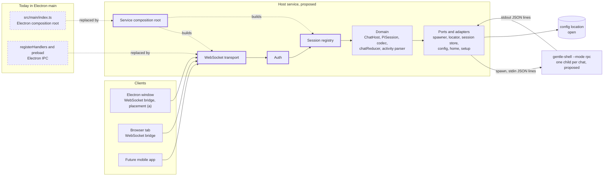

> Traducción al español de `docs/11-host-service.md` (commit `9cad584`). Documento de lectura; la versión de referencia es la inglesa.

# Arquitectura del servicio host

> Estado: borrador, propuesta de la comunidad pendiente de validación del mantenedor (draft (community proposal, awaiting maintainer validation)).

> **Propuesta [community], no es el estado actual.** Esta página detalla la arquitectura del servicio host (host service) local compartido que se propone en la [propuesta 0004](07-proposals/0004-host-service.md). Nada de lo que aquí se describe existe hoy en el repositorio del escritorio, y nada está decidido. La arquitectura actual está en [03-architecture/current.md](03-architecture/current.md).

**En un párrafo.** **[community]** El servicio host es un único proceso local que es dueño de todas las sesiones de chat, lanza un proceso hijo `gentle-shell --mode rpc` por chat, normaliza su salida una sola vez y sirve a Electron, a una pestaña del navegador y a una futura app móvil mediante un único protocolo WebSocket ([propuesta 0004](07-proposals/0004-host-service.md#propuesta)). La mayor parte ya existe en el proceso principal del escritorio: el dominio, los puertos y los adaptadores no importan Electron; solo lo hacen la raíz de composición, los manejadores de IPC y el preload. Lo que falta es un registro de sesiones, un transporte, autenticación y una raíz de composición que funcione sin Electron. Seis requisitos del runtime (B1–B6) van primero; cuatro de ellos son correcciones del escritorio que son útiles sin ningún servicio. Dónde se ejecuta el servicio y dónde guarda su configuración son preguntas abiertas.

## Cómo leer esta página

| Etiqueta | Significado |
|---|---|
| **[maintainer]** | Declarado en los documentos del repositorio del escritorio del mantenedor o en sus mensajes de Discord. |
| **[community]** | Propuesto por la comunidad. No decidido. |
| `Inference:` | Razonamiento a partir de evidencias citadas, no un hecho declarado. "(no ejecutado)" significa que no se construyó ni se ejecutó nada. |
| `UNVERIFIED:` | Comprobado pero no confirmado. |

- **Claves de cita.** Las rutas sin prefijo de repositorio están en `gentle-shell-desktop@5ab4a00` (el código fuente no cambia en esta rama). Los demás repositorios usan `repo@shortsha:path:line`: `gentle-shell@ac67159` (`main` de gentle-shell, versión del paquete 4.0.0), `paseo@485221b` y `t3code@eac52f0`. Las páginas del corpus se enlazan por ruta relativa.
- **ID cualificados.** Los ID de otras páginas llevan su página: `audit A3`, `gap G9`, `vision Q3`, `ADR 0008`, `roadmap F1`, `milestone M5`, `QW-06`. **B1–B6** son los requisitos del runtime de la [propuesta 0004](07-proposals/0004-host-service.md#requisitos-del-runtime) y en esta página se escriben sin cualificar.
- **Método.** Solo lectura estática, como en la [auditoría](03-architecture/audit.md#método-y-alcance). No se prototipó nada.

## De un vistazo

| Pregunta | Respuesta | Evidencia |
|---|---|---|
| ¿Qué es? | **[community]** Un único proceso local entre cada UI de Gentle Shell y `gentle-shell --mode rpc`: registro de sesiones, procesos hijo, un único protocolo WebSocket versionado, autenticación. | [propuesta 0004](07-proposals/0004-host-service.md#propuesta) |
| ¿Cuánto reutiliza del escritorio? | El dominio, los puertos y los adaptadores. Electron solo lo importan 3 archivos fuente, y uno de ellos solo importa tipos. Siete de esos módulos se reutilizan pero cambian por B1, B2, B3, B5 o B6; el resto se reutiliza sin cambios. | [Mapa de componentes](#mapa-de-componentes-de-lo-actual-al-servicio) |
| ¿Qué sustituye? | La raíz de composición de Electron y la capa de IPC (manejadores y preload) como vía por la que los clientes llegan a las sesiones (con la ubicación (a)). | `src/main/index.ts:2`; `src/main/ipc/registerHandlers.ts:27-46`; `src/preload/index.ts:1-4` |
| ¿Qué es nuevo? | Una raíz de composición del servicio, un transporte WebSocket, un registro de sesiones y autenticación. | [Mapa de componentes](#mapa-de-componentes-de-lo-actual-al-servicio) |
| ¿Qué debe cambiar primero? | B1–B6. B1, B2, B5 y B6 son correcciones del escritorio que son útiles de todos modos; B3 y B4 son en parte corrección del escritorio y en parte exclusivas del servicio. | [Qué debe cambiar primero](#qué-debe-cambiar-primero) |
| ¿Cambia el contrato RPC? | No. El servicio lanza el mismo proceso hijo con los mismos argumentos. | [04-rpc-contract.md](04-rpc-contract.md); `src/main/domain/session/PiSession.ts:127-135` |
| ¿Dónde se ejecuta? | Abierto: un proceso separado, o integrado en el proceso principal de Electron. | [Ubicación del proceso (abierta)](#ubicación-del-proceso-abierta) |
| ¿Dónde guarda su configuración? | Abierto. Hoy la elección de home está bajo el `userData` de Electron. | [Ubicación de la configuración y del estado (abierta)](#ubicación-de-la-configuración-y-del-estado-abierta) |

## Responsabilidades

| Responsabilidad | Qué hace el servicio | Dónde está hoy | Evidencia |
|---|---|---|---|
| **Registro de sesiones** | Mantiene cada chat abierto, indexado por chat, con su propio proceso hijo y su estado; cada envío y cada comando nombran su chat (B1). | `ChatHost` mantiene una única sesión `current` y la detiene antes de iniciar la siguiente. | `src/main/domain/session/ChatHost.ts:70`, `:156-157`; [audit A3](03-architecture/audit.md#a3-host-de-sesión-única-con-ids-de-mensaje-posicionales) |
| **Runtime** | Lanza `gentle-shell --mode rpc`, un proceso hijo por chat según la propuesta (pendiente de [vision Q3](00-vision.md#preguntas-abiertas-para-el-mantenedor)). El contrato con gentle-shell es [04-rpc-contract.md](04-rpc-contract.md), sin cambios. | `PiSession` construye `[...launcher.args, ...homeArgs, "--mode", "rpc", "--session", path?]`, añade `GENTLE_SHELL_INTERACTIVE_HOST=1` al entorno y lanza a través del puerto `ProcessSpawner`. | `src/main/domain/session/PiSession.ts:67`, `:127-135`; [ADR 0005](03-architecture/adr/0005-gentle-shell-rpc-child-process.md), [ADR 0012](03-architecture/adr/0012-interactive-host-env-flag.md) |
| **Normalización de eventos** | Decodifica las líneas JSON de cada proceso hijo y las integra en `ChatState`, incluida la actividad de los helpers, una sola vez para todos los clientes. | En el dominio del proceso principal: `decodeLine`, `reduceChat` y el parser de actividad `parseHelpersActivity`, al que `reduceChat` llama para el widget `gentle-agents`. | `src/main/domain/rpc/codec.ts:68`; `src/main/domain/rpc/chatReducer.ts:52`, `:196-207`; `src/main/domain/rpc/helpersActivity.ts:38`; `src/shared/bridge-types.ts:122-129` |
| **Listado de sesiones** | Lista las sesiones de pi para la barra lateral y asocia un id de chat con su archivo de sesión. | `ChatHost.listChats` y `openChat` llaman al puerto `SessionStore`; el adaptador importa pi en el mismo proceso. | `src/main/domain/session/ChatHost.ts:95-108`; `src/main/adapters/piSessionStore.ts:27-42` |
| **Configuración inicial y elección de home** | Responde si hay que mostrar la elección del primer arranque y guarda la elección. | Puerto y adaptador `SetupService`; [ADR 0008](03-architecture/adr/0008-first-run-home-choice.md). | `src/main/ports/index.ts:94-97`; `src/main/adapters/setupService.ts:15-41` |
| **Configuración** | Lee y escribe la elección persistida. | `AppConfigStore` escribe `{home}` en una ruta que recibe. | `src/main/adapters/appConfigStore.ts:11-20`, `:34-39`; `src/main/index.ts:52` |
| **Endpoint del protocolo de clientes** | Expone un único protocolo versionado a muchos clientes a la vez. Las tramas, el versionado y el modelo de envíos se especifican en el documento [Protocolo del host](12-host-protocol.md). | IPC de Electron: 8 canales de petición y 2 canales de envío. | `src/shared/ipc-channels.ts:8-23`; `src/main/ipc/registerHandlers.ts:28-40` |
| **Autenticación** | Escucha en loopback por defecto; escuchar en cualquier otra dirección requiere un token o el emparejamiento del dispositivo, y cada conexión comprueba `Origin` ([propuesta 0004](07-proposals/0004-host-service.md#propuesta)). Los detalles se dejan para el documento [Protocolo del host](12-host-protocol.md). | Ninguna: los manejadores de IPC confían en los argumentos del renderer. | `src/main/ipc/registerHandlers.ts:28-37`; [audit A14](03-architecture/audit.md#a14-endurecimiento-del-preload-y-del-ipc) |

`Inference:` normalizar en el servicio significa que todos los clientes reciben el mismo `ChatState` y ninguno de ellos interpreta el flujo RPC ni el esquema de actividad. Una corrección del parser (B5) llega entonces a todos los clientes a la vez.

## Mapa de componentes, de lo actual al servicio

Las cajas de 'Today in Electron main' y 'Host service, proposed' corresponden a filas de la tabla: continua = reutilizado, discontinua = sustituido, negrita = nuevo. Los clientes, el proceso hijo y el almacén de configuración son contexto.

### Por qué la separación es limpia

- **Electron solo lo importan 3 archivos fuente.** `src/main/index.ts:2` y `src/preload/index.ts:1` lo importan en tiempo de ejecución. `src/main/ipc/registerHandlers.ts:1` solo importa tipos, y su comentario dice que el archivo "never executes `require("electron")` at module load time" (`:11-13`). La única otra coincidencia es una importación de tipo en un test (`src/main/ipc/registerHandlers.test.ts:2`). Método: `git grep` de las importaciones de `electron` y de las llamadas a `require` sobre `src/` en `5ab4a00`.
- **El dominio depende de puertos.** Los puertos existen "so the domain never imports Electron/Node APIs directly" (`src/main/ports/index.ts:3-5`). `ChatHost` y `PiSession` solo importan puertos, tipos compartidos y otros módulos del dominio (`src/main/domain/session/ChatHost.ts:1-6`; `src/main/domain/session/PiSession.ts:1-6`).
- **Los tests ya se ejecutan con Node.** El entorno por defecto de Vitest es `node` (`vitest.config.ts:5-6`, `:21`), y los tests de `ChatHost` usan puertos falsos (`src/main/domain/session/ChatHost.test.ts:3-4`).
- **El localizador del lanzador ya funciona con Node puro.** Una entrada JS de `GENTLE_SHELL_BIN` se ejecuta con `process.execPath` y `ELECTRON_RUN_AS_NODE=1` (`src/main/adapters/launcherLocator.ts:38-41`); el puerto documenta ese indicador como "Harmless (and unread) when this app runs under plain Node" (`src/main/ports/index.ts:43-44`).
- **Un módulo del dominio usa Node directamente.** `home.ts` importa `node:fs`, `node:os` y `node:path` (`src/main/domain/home/home.ts:1-3`; [audit A17](03-architecture/audit.md#a17-desviación-respecto-a-las-reglas-de-estructura-declaradas)). `Inference:` eso rompe la regla de pureza del dominio, pero no la portabilidad: Node es aquello sobre lo que se ejecuta el servicio.

### Clasificación de `src/main`

Las clases suponen la ubicación (a). Con la ubicación (b), `index.ts` se mantiene como la raíz de Electron y llama a la función compartida de Node puro, y `registerHandlers.ts`, `ipc/index.ts`, `ipc-channels.ts` y `src/preload/index.ts` se mantienen como el endpoint de la ventana de Electron junto al transporte WebSocket.

| Módulo | Clase | Acoplamiento a Electron | Cambiado por | Evidencia |
|---|---|---|---|---|
| `domain/rpc/types.ts`, `codec.ts` | reutilizado sin cambios | ninguno | — | `src/main/domain/rpc/types.ts:27`, `:144`; `src/main/domain/rpc/codec.ts:12`, `:22`, `:68` |
| `domain/rpc/chatReducer.ts` | reutilizado, cambiado por B1 | ninguno | B1 (ids de mensaje) | `src/main/domain/rpc/chatReducer.ts:1-11`, `:52`, `:85` |
| `domain/rpc/helpersActivity.ts` | reutilizado, cambiado por B5 | ninguno | B5 | `src/main/domain/rpc/helpersActivity.ts:21`, `:38` |
| `domain/rpc/history.ts` | reutilizado, cambiado por B1 | ninguno | B1 (ids de mensaje) | `src/main/domain/rpc/history.ts:1-2`, `:20-27` |
| `domain/session/PiSession.ts` | reutilizado sin cambios | ninguno; ya acepta un `cwd` | — | `src/main/domain/session/PiSession.ts:1-6`, `:15`, `:135` |
| `domain/session/ChatHost.ts` | reutilizado, cambiado por B1, B6 | ninguno | B1 (su `current` único es lo que sustituye el registro), B6 | `src/main/domain/session/ChatHost.ts:1-6`, `:70`, `:159-166` |
| `domain/session/sessionList.ts` | reutilizado, cambiado por B1 | ninguno | B1 (hoy todos los chats listados están en `idle`) | `src/main/domain/session/sessionList.ts:20-22`, `:35` |
| `domain/home/home.ts` | reutilizado sin cambios | ninguno (solo Node) | — | `src/main/domain/home/home.ts:1-4` |
| `domain/lifecycle/boundedStop.ts`, `domain/index.ts` | reutilizado sin cambios | ninguno | — | `src/main/domain/lifecycle/boundedStop.ts:1-8`; `src/main/domain/index.ts:1-4` |
| `ports/index.ts` | reutilizado sin cambios | ninguno | — | `src/main/ports/index.ts:1-5` |
| `adapters/nodeProcessSpawner.ts` | reutilizado sin cambios | ninguno (`node:child_process`) | — | `src/main/adapters/nodeProcessSpawner.ts:1-7` |
| `adapters/launcherLocator.ts` | reutilizado, cambiado por B3 | ninguno; el indicador de Electron no se lee con Node puro | B3 (lectura de la versión) | `src/main/adapters/launcherLocator.ts:1-3`, `:38-41`; `src/main/ports/index.ts:43-44` |
| `adapters/piSessionStore.ts` | reutilizado, cambiado por B2 | ninguno | B2 | `src/main/adapters/piSessionStore.ts:1`, `:30-39` |
| `adapters/appConfigStore.ts` | reutilizado sin cambios | ninguno; su ruta se inyecta | — (solo la ruta inyectada depende de la ubicación abierta de la configuración) | `src/main/adapters/appConfigStore.ts:11-20` |
| `adapters/homeSettings.ts`, `setupService.ts`, `adapters/index.ts` | reutilizado sin cambios | ninguno | — | `src/main/adapters/homeSettings.ts:1-11`; `src/main/adapters/setupService.ts:1-6`; `src/main/adapters/index.ts:5-10` |
| `index.ts` (raíz de composición) | **sustituido** | `app`, `userData`, `BrowserWindow`, `ipcMain`, `shell` de Electron, ciclo de vida de la app | — | `src/main/index.ts:2`, `:36-37`, `:52`, `:74-114`, `:116-139` |
| `ipc/registerHandlers.ts`, `ipc/index.ts` | **sustituido** | Tipos de IPC de Electron; envíos `webContents.send` por ventana | B4 (validación de argumentos) | `src/main/ipc/registerHandlers.ts:1`, `:27-46`; `src/main/ipc/index.ts:4` |
| Raíz de composición del servicio | **nuevo** | ninguno | — | — |
| Transporte WebSocket | **nuevo** | ninguno | B3 (versión del protocolo), B4 | — |
| Registro de sesiones | **nuevo** | ninguno | B1 | — |
| Autenticación | **nuevo** | ninguno | B4 | — |

Fuera de `src/main`:

| Módulo | Clase | Nota | Evidencia |
|---|---|---|---|
| `src/preload/index.ts` | **sustituido** como endpoint de clientes del servicio | Expone el puente en `window.gentle` sobre IPC de Electron. `Inference:` sobrevive como puente del renderer solo si la ventana de Electron sigue hablando con un host en el mismo proceso (ubicación (b)). | `src/preload/index.ts:1-4` |
| `src/preload/bridge.ts` | reutilizado como patrón | `createBridge` implementa `GentleBridge` sobre un `RendererIpc` inyectado, sin importar Electron. `Inference:` un puente WebSocket puede seguir la misma forma sobre un socket. | `src/preload/bridge.ts:1-2`, `:10-19` |
| `src/shared/bridge-types.ts` | reutilizado, cambiado por B1 y por el protocolo del host | Tipos de datos planos; hoy sin id de chat (B1). El protocolo del host añade `chatId` y un sobre de error ([12, Tabla de correspondencias](12-host-protocol.md#tabla-de-correspondencias)). | `src/shared/bridge-types.ts:122-129`, `:273-295` |
| `src/shared/ipc-channels.ts` | **sustituido** por tramas del protocolo del host | Nombres de los canales de IPC de Electron. Las tramas son el objeto del documento [Protocolo del host](12-host-protocol.md). | `src/shared/ipc-channels.ts:8-23` |

**Lo que sigue siendo exclusivo de Electron en la raíz de composición.** `app.setPath` para el smoke test (`src/main/index.ts:36-37`), `app.getPath("userData")` para el archivo de configuración (`:52`), la `BrowserWindow` y sus preferencias web (`:74-87`), el registro de IPC por ventana (`:89-90`), los enlaces externos mediante `shell.openExternal` (`:97-102`), la carga del renderer (`:106-113`) y el ciclo de vida de la app (`:116-139`). El resto, la construcción de los adaptadores y del `ChatHost` (`:53-67`), solo necesita una ruta de configuración. `Inference:` (no ejecutado) esa parte puede trasladarse a una función de Node puro a la que llamen tanto la raíz de Electron como una raíz del servicio, pasándole la ruta de configuración.

## El lado del renderer

El renderer elige su puente en un solo lugar: `window.gentle ?? mockBridge` (`src/renderer/shared/bridge/useBridge.ts:10-12`). Cuatro contenedores llaman a `useBridge()`: `App`, `ChatsContainer`, `ConversationContainer` y `FirstRunContainer` (`src/renderer/app/App.tsx:33`; `src/renderer/features/chats/ChatsContainer.tsx:25`; `src/renderer/features/conversation/ConversationContainer.tsx:47`; `src/renderer/features/first-run/FirstRunContainer.tsx:24`). `window.gentle` está tipado como un `GentleBridge` opcional (`src/shared/bridge-types.ts:297-301`).

| Puente | Transporte | Lo usa | Estado | Evidencia |
|---|---|---|---|---|
| Preload | IPC de Electron, `window.gentle` | Ventana de Electron | existe | `src/preload/index.ts:4`; `src/preload/bridge.ts:19-43` |
| WebSocket | el protocolo del host | pestaña del navegador, ventana de Electron con la ubicación (a), futura app móvil | **nuevo** | — |
| Simulado | en memoria | `pnpm dev:web` y tests | existe | `src/renderer/shared/bridge/mockBridge.ts:406`; `vite.web.config.ts:5-9` |

**El punto de inyección es el mismo trabajo que audit A15.** [Audit A15](03-architecture/audit.md#a15-recurso-silencioso-al-puente-simulado-en-los-builds-empaquetados) constata que `useBridge()` "returns the mock whenever `window.gentle` is missing, with no environment check", y recomienda: "Use the mock only in the `dev:web` build (for example behind an `import.meta.env` flag). Show an explicit error when the bridge is missing in Electron." La hoja de ruta lo programa como [QW-06](09-roadmap.md#qw-06-puente-simulado-en-compilaciones-empaquetadas-audit-a15). `Inference:` ambos cambios sustituyen el recurso silencioso por una elección explícita en la misma línea; añadir el puente WebSocket suma entonces un caso más a esa elección, seleccionado por la configuración del build o del tiempo de ejecución.

`Inference:` (no ejecutado) con el puente WebSocket llegan dos cambios más en el renderer:

- **Content Security Policy.** La CSP del renderer establece `default-src 'self'` y ningún `connect-src` (`src/renderer/index.html:5-8`). Es probable que un socket hacia la dirección del servicio quede fuera de `'self'`, así que la CSP necesita una entrada `connect-src` para él.
- **Ids de chat.** El puente envía a "whichever chat is currently open" (`src/shared/bridge-types.ts:279-282`). Un puente WebSocket que sirva a varios chats necesita B1 antes.

## Qué debe cambiar primero

Los seis requisitos del runtime de la [propuesta 0004](07-proposals/0004-host-service.md#requisitos-del-runtime), en su orden. "Útil de todos modos" significa que el escritorio gana con el cambio aunque no se construya ningún servicio.

| # | Cambio | Evidencia en el código | Ancla | ¿Útil de todos modos? |
|---|---|---|---|---|
| B1 | Un registro de sesiones indexado por chat; un id de chat en cada envío y cada comando; ids de mensaje tomados de pi. | Una única sesión `current`, detenida antes de que empiece la siguiente (`src/main/domain/session/ChatHost.ts:70`, `:156-157`). `ChatState` y el puente no llevan id de chat (`src/shared/bridge-types.ts:122-129`, `:279-282`). Los ids de mensaje son posicionales, `msg-<length>` (`src/main/domain/session/PiSession.ts:334`; `src/main/domain/rpc/chatReducer.ts:85`; `src/main/domain/rpc/history.ts:20-27`). | [audit A3](03-architecture/audit.md#a3-host-de-sesión-única-con-ids-de-mensaje-posicionales); [gap G9](04-rpc-contract.md#carencias-que-necesita-el-escritorio) | **Corrección del escritorio.** Es el trabajo de [roadmap F1](09-roadmap.md#f1-fundamentos-varios-chats-a-la-vez-community-proposal) (criterios de salida 2–4). |
| B2 | Listar las sesiones sin mutar `PI_CODING_AGENT_DIR`. | El adaptador guarda, establece y restaura la variable de todo el proceso alrededor de `listAll()` (`src/main/adapters/piSessionStore.ts:32-39`), "a real, accepted M1 limitation" (`:22-25`). | [audit A1](03-architecture/audit.md#a1-dos-caminos-de-datos-hacia-pi-y-una-mutación-global-de-pi_coding_agent_dir) | **Corrección del escritorio.** Criterio de salida 5 de roadmap F1. |
| B3 | Un handshake de versión: el servicio lee las versiones de gentle-shell y pi, y el protocolo del host lleva su propia versión. | `src/main` nunca compara versiones; el único texto de versión es un mensaje de error (`src/main/adapters/launcherLocator.ts:25-29`). | [audit A8](03-architecture/audit.md#a8-sin-handshake-de-versión); [gap G10](04-rpc-contract.md#carencias-que-necesita-el-escritorio) | **En parte.** Leer y mostrar las versiones con `gentle-shell --version` es el criterio de salida 7 de roadmap F1. La versión propia del protocolo del host es exclusiva del servicio. |
| B4 | Autenticación y validación de argumentos. | Los manejadores de IPC usan los argumentos del renderer tal cual (`src/main/ipc/registerHandlers.ts:28-37`). | [audit A14](03-architecture/audit.md#a14-endurecimiento-del-preload-y-del-ipc) | **En parte.** La validación de argumentos es una corrección del escritorio ([QW-05](09-roadmap.md#qw-05-endurecimiento-de-la-csp-la-navegación-y-el-ipc-audit-a14-parte)). La autenticación (token o emparejamiento, comprobaciones de `Origin`) es exclusiva del servicio. |
| B5 | Corregir el parser de actividad; se traslada al servicio junto con el dominio. | El conjunto de estados del escritorio tiene `done` pero no `completed` ni `timed_out` de gentle-shell, y los estados desconocidos se descartan (`src/main/domain/rpc/helpersActivity.ts:21`, `:83-85`); además exige un `callId` en los elementos de herramienta (`:107-108`). | [audit A5](03-architecture/audit.md#a5-el-conjunto-de-estados-de-los-helpers-y-los-elementos-de-herramienta-no-coinciden-con-gentle-shell) | **Corrección del escritorio.** [QW-02](09-roadmap.md#qw-02-estados-de-helper-y-elementos-de-herramienta-audit-a5). |
| B6 | Un `cwd` por chat. | `PiSession` acepta `cwd` (`src/main/domain/session/PiSession.ts:15`, `:135`), pero `ChatHost` nunca le pasa uno (`src/main/domain/session/ChatHost.ts:159-166`). | [audit A10](03-architecture/audit.md#a10-los-chats-nuevos-se-ejecutan-en-el-directorio-de-trabajo-de-la-aplicación) | **Corrección del escritorio.** Criterio de salida 6 de roadmap F1. |

`Inference:` B6 importa más para un servicio que para el escritorio. Hoy un chat hereda el directorio de trabajo desde el que se inició la app ([audit A10](03-architecture/audit.md#a10-los-chats-nuevos-se-ejecutan-en-el-directorio-de-trabajo-de-la-aplicación)); un servicio iniciado en segundo plano no tiene uno que tenga sentido ([propuesta 0004](07-proposals/0004-host-service.md#requisitos-del-runtime), B6).

## Ubicación del proceso (abierta)

La [propuesta 0004](07-proposals/0004-host-service.md#preguntas-abiertas) deja esto abierto (pregunta de diseño 1). Esta página expone las ventajas e inconvenientes; no decide.

- **(a) Un proceso de servicio separado.** Electron lo inicia, o se conecta a uno que ya está en ejecución, y pasa a ser un cliente como cualquier otro.
- **(b) Integrado en el proceso principal de Electron.** El host se ejecuta en el proceso principal de Electron, como `ChatHost` hoy, y además escucha en un puerto WebSocket para otros clientes.

**Precedentes de (a).** Los dos precedentes de la [propuesta 0004](07-proposals/0004-host-service.md#precedentes-en-el-ecosistema) ejecutan su servidor como un proceso separado:

- **Paseo.** "Paseo runs a local server called the daemon that manages your coding agents. Clients like the desktop app, mobile app, web app, and CLI connect to it." (`paseo@485221b:README.md:60`). En la app de escritorio, "the daemon starts automatically" (`:76`); `paseo` lo inicia sin la app (`:80-89`). La app de escritorio reutiliza un daemon en ejecución y reinicia un daemon propio si la versión no coincide (`paseo@485221b:packages/desktop/src/daemon/daemon-manager.ts:266-267`, `:291-300`). Lanza el daemon con el binario de Electron y `ELECTRON_RUN_AS_NODE: "1"` (`paseo@485221b:packages/desktop/src/daemon/node-entrypoint-launcher.ts:26-35`, `:47-57`); el ejecutable sale de `resolveNodeExecPath()`, que devuelve `process.execPath`, o el Electron Helper de la app en macOS empaquetado (`paseo@485221b:packages/desktop/src/daemon/runtime-paths.ts:77-99`, `:107-108`). Al salir detiene el daemon que inició salvo que esté activado `keepRunningAfterQuit` (`paseo@485221b:packages/desktop/src/daemon/quit-lifecycle.ts:55-73`), que por defecto es `false` (`paseo@485221b:packages/desktop/src/settings/desktop-settings.ts:37-40`).
- **T3 Code.** "Then run `t3` to start the server and open the local web app. `t3 service install` keeps it running in the background" (`t3code@eac52f0:README.md:37`). Su app de escritorio inicia el backend con `process.execPath` y `ELECTRON_RUN_AS_NODE: "1"` (`t3code@eac52f0:apps/desktop/src/backend/DesktopBackendConfiguration.ts:571`, `:586`), "so this backend process does not become a GUI app instance" (`t3code@eac52f0:apps/desktop/src/backend/DesktopBackendManager.ts:480-481`).

Esta página no cita ningún precedente de (b); no se buscó ninguno.

| Aspecto | (a) Proceso separado | (b) Integrado en el proceso principal de Electron |
|---|---|---|
| **Empaquetado y firma** ([milestone M5](09-roadmap.md#m5-firma-y-actualización-automática); hoy no se firma nada, [plataformas](10-platforms.md#empaquetado-y-firma)) | `Inference:` la copia distribuida dentro de la app puede ejecutarse con el propio binario de Electron de la app en modo Node, como hacen los dos precedentes y como ya hace el escritorio para una entrada JS de `GENTLE_SHELL_BIN` (`src/main/adapters/launcherLocator.ts:38-41`), así que no añade un segundo binario que firmar. Ejecutarlo sin la app (solo navegador) necesita un segundo distribuible, como las instalaciones de `paseo` y `t3` de arriba, que empaquetar, firmar y actualizar. | `Inference:` nada nuevo que empaquetar ni firmar; una biblioteca de servidor WebSocket pasa a ser una dependencia de la app. |
| **Ciclo de vida al salir** | `Inference:` una elección pendiente: detener el servicio con la app, como hace Paseo por defecto, o mantenerlo en ejecución para otros clientes. En ambos casos el servicio necesita su propio apagado, que hoy es el `before-quit` de Electron limitado a 4 s (`src/main/index.ts:28`, `:133-139`). | `Inference:` salir de la app detiene todos los chats y desconecta a todos los demás clientes, igual que hoy `before-quit` detiene `ChatHost` (`src/main/index.ts:133-139`). En todas las plataformas salvo macOS, cerrar la ventana cierra la app (`:124-126`). |
| **Acceso desde el navegador con Electron cerrado** | `Inference:` sí, cuando el servicio se inicia sin la app. | `Inference:` no; los clientes de navegador y móviles solo funcionan mientras la app de escritorio está abierta ([propuesta 0004](07-proposals/0004-host-service.md#preguntas-abiertas)). |
| **Un puerto, un endpoint** | `Inference:` un único puerto de escucha, y la ventana de Electron usa el mismo protocolo que cualquier otro cliente, así que hay un único endpoint de clientes que mantener. | `Inference:` un único puerto de escucha, pero la ventana de Electron puede conservar el puente del preload, así que dos endpoints de clientes (IPC y WebSocket) llegan al mismo host y deben mantenerse sincronizados. |
| **Desfase de versiones** | `Inference:` la app y el servicio pueden ejecutar versiones distintas (un servicio más antiguo que sigue en ejecución), así que B3 es necesario; Paseo reinicia un daemon cuya versión no coincide (`paseo@485221b:packages/desktop/src/daemon/daemon-manager.ts:292-297`). | `Inference:` la ventana de Electron siempre coincide con su host; los clientes de navegador y móviles siguen necesitando B3. |
| **Superficie de seguridad** | `Inference:` el socket de escucha está en un proceso sin ventana y sin APIs de Electron; la ventana de Electron es un cliente sin más alcance que una pestaña del navegador. | `Inference:` el socket de escucha está en el proceso que también es dueño de la ventana, del IPC y de `shell.openExternal` (`src/main/index.ts:97-102`); un error en un manejador expone todo ese proceso. |

En ambas ubicaciones el socket es accesible para otros procesos locales, así que B4 se aplica a las dos ([propuesta 0004](07-proposals/0004-host-service.md#requisitos-del-runtime), B4).

## Ubicación de la configuración y del estado (abierta)

- **Hoy.** La elección de home se guarda como `{home}` en `config.json` bajo el `userData` de Electron (`src/main/index.ts:52`; `src/main/adapters/appConfigStore.ts:34-39`). Guardarla en la configuración del `userData` de la app forma parte de [ADR 0008](03-architecture/adr/0008-first-run-home-choice.md) (paso 3 de la decisión).
- **Qué se traslada con facilidad.** `AppConfigStore` recibe su ruta como parámetro (`src/main/adapters/appConfigStore.ts:11-20`), así que solo la ruta tiene que venir de otro sitio.
- **Qué le falta a un servicio.** `app.getPath` es una API de Electron. `Inference:` a un servicio iniciado por Electron se le podría pasar la ruta; un servicio iniciado por su cuenta no tiene ningún `userData` que encontrar.
- **Precedentes.** Paseo guarda su estado en `PASEO_HOME`, que por defecto es `.paseo` en el directorio home del usuario (`paseo@485221b:packages/server/src/server/paseo-home.ts:14-17`). T3 Code usa `.t3` en el directorio home del usuario cuando no se indica un directorio base (`t3code@eac52f0:apps/server/src/os-jank.ts:105-109`).
- **Una pregunta abierta relacionada.** gentle-shell guarda su propia elección de home en `.gentle-shell/config.json` bajo el directorio home del usuario (`gentle-shell@ac67159:lib/gentle-shell-launcher.ts:241-243`); si el escritorio debe compartirla ya está sin decidir ([audit A19](03-architecture/audit.md#a19-dos-elecciones-de-home-persistidas); [ADR "Undecided / not recorded"](03-architecture/adr/README.md#sin-decidir--no-registrado); [vision Q7](00-vision.md#preguntas-abiertas-para-el-mantenedor)).
- **Estado de los chats.** `Inference:` el servicio no guarda un historial de chats propio: lo contienen los archivos de sesión de pi, y reabrir un chat pasa el archivo al proceso hijo con `--session` (`src/main/domain/session/ChatHost.ts:103-107`; `src/main/domain/session/PiSession.ts:132`). El registro está en memoria.

**Abierto.** Dónde guarda el servicio su configuración necesita una decisión del mantenedor, y modificaría el paso de almacenamiento de ADR 0008. Registrado en [ADR "Undecided / not recorded"](03-architecture/adr/README.md#sin-decidir--no-registrado).

## Ruta de migración

`Inference:` una secuencia en la que cada paso deja una app de escritorio que funciona. La [propuesta 0004](07-proposals/0004-host-service.md#preguntas-abiertas) deja abierto si roadmap F1 va antes o después de la extracción (pregunta de diseño 2); esta secuencia pone primero roadmap F1, de modo que la extracción traslade código que ya gestiona varios chats.

| Paso | Qué | Requisito | ¿Beneficia también al escritorio por sí solo? |
|---|---|---|---|
| 1 | Roadmap F1: registro de sesiones, ids de chat, ids de mensaje tomados de pi, listado de sesiones sin la variable global, un `cwd` por chat. | B1, B2, B6 | **Sí.** Es el propio hito de la hoja de ruta ([roadmap F1](09-roadmap.md#f1-fundamentos-varios-chats-a-la-vez-community-proposal)). |
| 2 | Corregir audit A1: listar las sesiones sin la variable global. | B2 | **Sí.** Parte del paso 1 (criterio de salida 5 de roadmap F1); se lista aparte porque también es una corrección rápida independiente ([auditoría, recomendaciones](03-architecture/audit.md#1-desbloquear-el-uso-de-varios-chats)). |
| 3 | Extraer una raíz de composición de Node puro: el cableado de los adaptadores y del `ChatHost` (`src/main/index.ts:53-67`) detrás de una función que recibe una ruta de configuración. | — | **Sí.** Hoy la raíz de composición no tiene tests ([audit A16](03-architecture/audit.md#a16-carencias-de-cobertura-de-tests-y-de-ci)); una función simple puede probarse con Node. |
| 4 | Transporte WebSocket con un handshake de versión y autenticación. | B3, B4 | **En parte.** Leer las versiones (roadmap F1) y validar los argumentos (QW-05) ayudan al escritorio; el transporte, la versión del protocolo y la autenticación son exclusivos del servicio. |
| 5 | Inyección del puente en el renderer: una elección explícita entre los puentes del preload, WebSocket y simulado. | — | **Sí.** Es la corrección de audit A15 ([QW-06](09-roadmap.md#qw-06-puente-simulado-en-compilaciones-empaquetadas-audit-a15)). |
| 6 | Electron pasa a ser un cliente. | — | **No.** Exclusivo del servicio; su forma depende de la [ubicación del proceso](#ubicación-del-proceso-abierta). |

B5 no depende de esta secuencia. Es un quick win (mejora rápida) ([QW-02](09-roadmap.md#qw-02-estados-de-helper-y-elementos-de-herramienta-audit-a5)) y puede incorporarse en cualquier momento.

## Lo que no cubre esta página

- **Tramas del protocolo**, versionado en la conexión y detalles de autenticación: [Protocolo del host](12-host-protocol.md).
- **Clientes y topologías** (local, LAN, remoto, móvil): [13-clients-and-topologies.md](13-clients-and-topologies.md).
- **Plataformas** (Windows, macOS, Linux, WSL): [10-platforms.md](10-platforms.md).

## Fuentes

**Repositorios fijados** (clones de solo lectura; `repo@sha:path:line`):

| Nombre en las citas | Repositorio | Commit |
|---|---|---|
| `gentle-shell-desktop` (rutas sin prefijo) | `Gentleman-Programming/gentle-shell-desktop` | `5ab4a00` |
| `gentle-shell` | `Gentleman-Programming/gentle-shell` (`main`, versión del paquete 4.0.0) | `ac67159` |
| `paseo` | `getpaseo/paseo` | `485221b` |
| `t3code` | `pingdotgg/t3code` | `eac52f0` |

**Corpus:** [propuesta 0004](07-proposals/0004-host-service.md), [arquitectura actual](03-architecture/current.md), [auditoría](03-architecture/audit.md), [ADR](03-architecture/adr/README.md), [contrato RPC](04-rpc-contract.md), [visión](00-vision.md), [hoja de ruta](09-roadmap.md), [plataformas](10-platforms.md).
