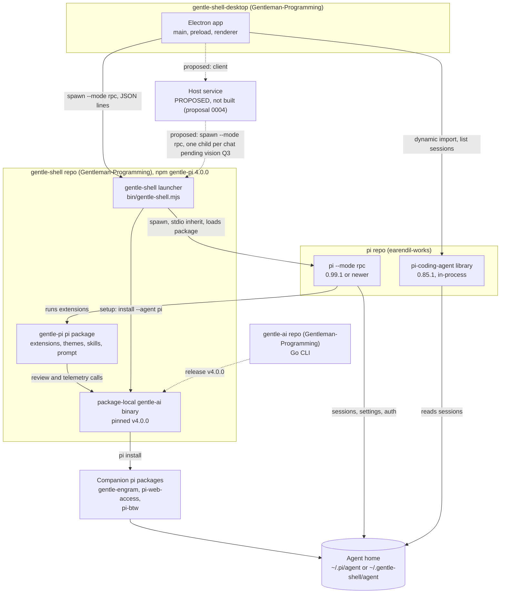

# Ecosystem

> Status: draft.

Gentle Desktop sits on top of four other pieces: **pi**, the agent runtime; **gentle-shell**, the launcher plus the pi package `gentle-pi`; **gentle-ai**, the Go CLI gentle-shell pins; and the **companion packages** gentle-ai installs. This page shows how they connect, who owns each one, which versions fit together, what the desktop takes from each, and which repository a change belongs in. Terms are defined in the [glossary](01-glossary.md).

## At a glance

| Question | Answer | Evidence |
|---|---|---|
| Are gentle-pi and gentle-shell different pieces? | No. They are one repository and one npm package: `gentle-pi` is the package name, `gentle-shell` the binary and the product. | `gentle-shell@ac67159:package.json:2-9` |
| What does the desktop talk to? | The `gentle-shell` launcher over RPC, which runs pi ≥ 0.99.1 (gentle-shell develops against ≥ 1.0.0). It also imports pi 0.85.1 in-process to list sessions. | [current.md §Data paths to pi](03-architecture/current.md#data-paths-to-pi) |
| Does anything negotiate versions? | No. There is no handshake; only the launcher enforces a pi floor. | [04 §Versioning](04-rpc-contract.md#versioning-and-compatibility) |
| Where does a new RPC command go? | pi (`earendil-works/pi`), which owns the `RpcCommand` union. | [Where each change belongs](#where-each-change-belongs) |

**How to read citations.** Same keys as the [glossary](01-glossary.md#how-to-read-citations), refreshed 2026-10-03: `D:` = `gentle-shell-desktop@5ab4a00:src/`, `GS:` = `gentle-shell@ac67159:` (gentle-shell `main`, package version 4.0.0), `GA:` = `gentle-ai@ff77164:` (v4.0.0), `PI:` = `pi@a13d35a:packages/coding-agent/` (1.0.0). `gentle-shell@1162ce9` (3.7.0) and `gentle-ai@6dee8f8` (v3.7.0) appear only in version comparisons. Where platform matters, see [10-platforms.md](10-platforms.md). `Inference:` marks reasoning; `UNVERIFIED:` marks claims checked but not confirmed.

## Map of pieces

| Edge | Evidence |
|---|---|
| Desktop spawns the launcher with `--mode rpc` | `D:main/domain/session/PiSession.ts:127-134` |
| Launcher spawns pi with inherited stdio and loads gentle-pi with `-e <package root>` | `GS:bin/gentle-shell.mjs:1396`; [inventory L8](05-capability-inventory.md#launcher-and-homes) |
| gentle-pi calls its package-local gentle-ai for review and telemetry | `GS:scripts/install-gentle-ai.mjs:12` ("native review operations will fail with package-local-binary-missing"); `GS:docs/readme-reference.md:1038` |
| Setup runs gentle-ai `install --agent pi --scope global` | `GS:bin/gentle-shell.mjs:819-821` |
| The pinned binary is gentle-ai release v4.0.0 (gentle-shell 3.7.0 pinned v3.7.0) | `GS:scripts/gentle-ai-installer.mjs:39-40`, `:48-50`; `gentle-shell@1162ce9:scripts/gentle-ai-installer.mjs:39` |
| gentle-ai runs `pi install <source>` for each managed package | `GA:internal/agents/pi/adapter.go:285-294` |
| Desktop imports pi 0.85.1 to list sessions | `D:main/adapters/piSessionStore.ts:30-35` |

## Pieces

| Piece | What it is | Distribution | Evidence |
|---|---|---|---|
| **pi** | "A minimal, extensible AI agent for the terminal." It owns the runtime, sessions, providers, packages and the RPC protocol. | npm `@earendil-works/pi-coding-agent`, bin `pi` | `PI:README.md:15`; `PI:package.json:2`, `:9-11` |
| **gentle-shell / gentle-pi** | A launcher (homes, setup, package loading) plus a pi package: 18 extension entry points, 3 themes, 12 skills, 1 prompt template (at `ac67159`; 4.0.0 added `extensions/gentle-stats.ts`). | npm `gentle-pi`, bin `gentle-shell` | `GS:package.json:2-9`, `:59-73`; counts in [05 §At a glance](05-capability-inventory.md#at-a-glance-gentle-shell-and-gentle-ai) |
| **gentle-ai** | A Go CLI that configures AI agents, including pi. It owns native review (RDD) and telemetry. gentle-shell installs a package-local copy at postinstall. | GitHub releases; Go module `github.com/gentleman-programming/gentle-ai/v4` since v4.0.0 (`/v3` at v3.7.0) | `GA:README.md:10`; `GA:go.mod:1`; `GS:package.json:46`; `GS:scripts/gentle-ai-installer.mjs:40`, `:45-46`, `:51` |
| **Companion packages** | Pi packages gentle-ai installs into a home. See [Companion packages](#companion-packages). | npm | `GA:internal/agents/pi/adapter.go:65-70` |
| **Bundled dependency** | `@heyhuynhgiabuu/pi-pretty` 0.6.27, a runtime dependency of gentle-pi, loaded through `extensions/pi-pretty.ts`. `UNVERIFIED:` what it registers (the package is not installed in the reference checkout). | npm, installed with gentle-pi | `GS:package.json:74-76`; [inventory V15](05-capability-inventory.md#shell-experience) |
| **Gentle Desktop** | An Electron app: "Desktop chat window for Gentle Shell / pi." | Source only; unsigned local builds | `gentle-shell-desktop@5ab4a00:package.json:7`; `gentle-shell-desktop@5ab4a00:README.md:7` |
| **Host service** (proposed, not built) | **[community]** One local process between every Gentle Shell UI (Electron, browser, a future mobile app) and `gentle-shell --mode rpc`; it would own the sessions now held in Electron main. Dashed in the map above. See [Proposed: host service](#proposed-host-service). | Does not exist | [proposal 0004](07-proposals/0004-host-service.md#proposal) |
### Companion packages

gentle-shell does not keep its own list. Its docs say "the companion list above is not maintained in gentle-shell itself — it is the managed Pi stack of the pinned package-local gentle-ai" (`GS:docs/readme-reference.md:304`). At the pinned gentle-ai v4.0.0:

| Package | What happens during setup | Evidence |
|---|---|---|
| `npm:gentle-pi` | Installed by gentle-ai, then **removed** by gentle-shell right after, because the launcher always loads its own copy. | `GA:internal/agents/pi/adapter.go:66`; `GS:lib/gentle-shell-launcher.ts:551-565` |
| `npm:gentle-engram` | Installed, followed by `npm exec --yes --package gentle-engram@latest -- pi-engram init`. Persistent memory (Engram). | `GA:internal/agents/pi/adapter.go:32`, `:67`, `:289-290`, `:297`; `GA:TRADEMARKS.md:9` |
| `npm:pi-mcp-adapter` | **Retired** by gentle-ai v4.0.0: "Pi >= 0.99.0 ships built-in MCP support … Gentle AI therefore never installs the adapter and removes it wherever it finds it". At v3.7.0 it was installed, and the engram init ran after it. | `GA:internal/agents/pi/adapter.go:22-29`; `gentle-ai@6dee8f8:internal/agents/pi/adapter.go:60`, `:268-269` |
| `npm:pi-web-access` | Installed. | `GA:internal/agents/pi/adapter.go:68` |
| `npm:pi-btw` | Installed. | `GA:internal/agents/pi/adapter.go:69` |
| `npm:@juicesharp/rpiv-ask-user-question` | **Retired** by gentle-ai (v3.7.0 and v4.0.0), and removed by gentle-shell if declared. It conflicts with gentle-pi's own `ask_user_question` tool. | `GA:internal/agents/pi/adapter.go:55-63`; `gentle-ai@6dee8f8:internal/agents/pi/adapter.go:47-55` (entry at `:54`); `GS:lib/gentle-shell-launcher.ts:563` |

**Completeness evidence.** gentle-ai's pi adapter builds its install commands only from `managedPackageSources`: one `pi install <source>` per entry, plus the engram init after `npm:gentle-engram` (`GA:internal/agents/pi/adapter.go:285-294`). That slice has 4 entries at v4.0.0 (`:65-70`; 5 at v3.7.0, `gentle-ai@6dee8f8:internal/agents/pi/adapter.go:57-63`). After gentle-ai finishes, gentle-shell removes the packages in its 2-row removal table (`GS:lib/gentle-shell-launcher.ts:562-565`) and re-applies its default theme if gentle-ai's install wrote a different theme into a home that had none (`GS:docs/readme-reference.md:350`). Besides the package installs, the code read shows these files touched in the home when gentle-ai's Engram component runs:

- `settings.json` (drops `npm:pi-mcp-adapter` and the retired packages from `packages`) and `<agentDir>/npm/package.json` (drops the `pi-mcp-adapter` dependency), both rewritten only when there is something to remove, by gentle-ai's `ProvisionEngramMCP`, called from the Engram component's injector (`GA:internal/agents/pi/adapter.go:435-480`, `:485-521`; `GA:internal/components/engram/inject.go:693-694`). At v3.7.0 the same function added the adapter and `pi-mcp-adapter: ^2.6.0` instead (`gentle-ai@6dee8f8:internal/agents/pi/adapter.go:400-412`);
- `mcp.json`, created by `ProvisionEngramMCP` only to hold servers merged from a legacy `mcp-adapter.json`; it never adds an Engram server of its own, though an `engram` entry the user kept in `mcp-adapter.json` is migrated like any other (`GA:internal/agents/pi/adapter.go:435-449`, `:523-529`, `:525-526`). At `engram@3951380`, `pi-engram init` only declares `gentle-engram` in `settings.json` and does not create or modify `mcp.json` (`engram@3951380:plugin/pi/cli.js:16-23`, `:85-97`); `UNVERIFIED:` that the npm `latest` the init fetches matches that commit.

gentle-ai also writes the shared `~/.pi/gentle-ai/persona.json` and `~/.gentle-ai/state.json`, which gentle-shell snapshots and restores (`GS:docs/readme-reference.md:300`). `UNVERIFIED:` whether other gentle-ai components (for example the system prompt file `APPEND_SYSTEM.md` the pi adapter names at `GA:internal/agents/pi/adapter.go:33`, `:310-311`) write further files during `install --agent pi`; only the pi adapter and the Engram injector entry point were read.

**Known doc drift (gentle-shell).** `GS:docs/readme-reference.md:286` still lists `npm:pi-mcp-adapter` and `npm:@juicesharp/rpiv-ask-user-question` among the packages setup installs, and a launcher comment says "gentle-ai's own managed Pi stack still installs" the latter (`GS:lib/gentle-shell-launcher.ts:542-543`), but gentle-ai v4.0.0 retires both (`GA:internal/agents/pi/adapter.go:22-29`, `:59-63`).

Homes provisioned by gentle-shell 3.7.0 (gentle-ai v3.7.0) received `pi-mcp-adapter`. An isolated or `--home` home re-runs setup on its next launch when the gentle-ai pin changed; a `--link` home is never provisioned automatically (`GS:docs/readme-reference.md:352`). gentle-shell's docs say "gentle-ai prunes the retired package from the home" (`GS:docs/readme-reference.md:304`), but in gentle-ai v4.0.0 only `ProvisionEngramMCP` (Engram component) and uninstall remove the adapter (`GA:internal/components/engram/inject.go:693-694`; `GA:internal/components/uninstall/service.go:800`). `UNVERIFIED:` whether setup's `install --agent pi --scope global`, with no component flags (`GS:bin/gentle-shell.mjs:821`), runs the Engram component ([inventory E8](05-capability-inventory.md#extensions-packages-skills-prompts-themes-and-mcp), [inventory GA1](05-capability-inventory.md#gentle-ai-outside-the-session)).

## Ownership

Names are given only where repository files state them.

| Piece | Repository | Owner or maker per repository files | Evidence |
|---|---|---|---|
| pi | `earendil-works/pi` | Package `author`: Mario Zechner. LICENSE: "Copyright (c) 2025 Mario Zechner". | `PI:package.json:99`, `:103`; `pi@a13d35a:LICENSE:3` |
| gentle-shell / gentle-pi | `Gentleman-Programming/gentle-shell` | README: "built by Alan Buscaglia". TRADEMARKS: Alan Buscaglia owns the gentle-shell and gentle-pi marks. The LICENSE line reads "Copyright (c) 2025 Mario Zechner"; no inference is drawn from this. | `GS:package.json:25`; `GS:README.md:351`; `GS:TRADEMARKS.md:7`; `GS:LICENSE:3` |
| gentle-ai | `Gentleman-Programming/gentle-ai` | README: "Built by Alan Buscaglia (Gentleman Programming)". Listed under "Maintainer" in CONTRIBUTORS. LICENSE: "Copyright (c) 2025 Gentleman Programming". | `GS:scripts/gentle-ai-installer.mjs:40`; `GA:README.md:306`; `GA:CONTRIBUTORS.md:5-9`; `GA:LICENSE:3` |
| Engram (`gentle-engram`) | `Gentleman-Programming/engram`; the npm package `gentle-engram` (bin `pi-engram`) lives under `plugin/pi` | Package `author`: "Gentleman Programming". LICENSE: "Copyright (c) 2026 Alan Buscaglia". TRADEMARKS: Alan Buscaglia owns the Engram mark. | `engram@3951380:plugin/pi/package.json:2`, `:7-12`, `:14-16`; `engram@3951380:LICENSE:3`; `GA:TRADEMARKS.md:9` |
| `pi-mcp-adapter` (retired by gentle-ai v4.0.0), `pi-web-access`, `pi-btw`, `@heyhuynhgiabuu/pi-pretty` | `UNVERIFIED:` third-party npm packages; none is checked out in the references | — | — |
| Gentle Desktop | `Gentleman-Programming/gentle-shell-desktop` | Package `author`: "Gentleman-Programming". LICENSE: "Copyright (c) 2026 Gentleman Programming". No maintainer is named in repository files; see [08-team.md](08-team.md). | `gentle-shell-desktop@5ab4a00:README.md:35`; `gentle-shell-desktop@5ab4a00:package.json:8`; `gentle-shell-desktop@5ab4a00:LICENSE:3` |

## Versions and compatibility

| Relationship | Constraint | Enforced? | Evidence |
|---|---|---|---|
| Desktop → pi library | `^0.85.1`, locked to `0.85.1` | Lockfile only | `gentle-shell-desktop@5ab4a00:package.json:42`; `gentle-shell-desktop@5ab4a00:pnpm-lock.yaml:323` |
| Desktop → gentle-pi | "gentle-pi 3.7.0 or newer" (also needed for the Helpers tab) | No. Documented and shown in an error message only. | `gentle-shell-desktop@5ab4a00:README.md:12`, `:89-91`; `D:main/adapters/launcherLocator.ts:26-28` |
| gentle-pi → pi | Peer `>=0.99.1`; development range `>=1.0.0` (3.7.0 developed against `0.99.1`) | **Yes.** The launcher exits if pi is older than `MIN_PI_VERSION = "0.99.1"`, unchanged in 4.0.0. | `GS:package.json:78`, `:95`; `GS:lib/gentle-shell-launcher.ts:392`; `gentle-shell@1162ce9:package.json:95` |
| gentle-pi → gentle-ai | Pins `INSTALLER_VERSION = "4.0.0"`; tag `v4.0.0` resolves to commit `ff77164`; Go module path `/v4`. gentle-shell 3.7.0 pinned `3.7.0` (commit `6dee8f8`). | Partly. Installed at postinstall. Darwin/Linux release archives are checked against pinned SHA-256 digests; Windows has no signed archive and uses an exact-tag Go source build, also checked for the exact version (`GENTLE_AI_VERSION_MISMATCH`); see [10-platforms.md](10-platforms.md). `GENTLE_PI_SKIP_GENTLE_AI_INSTALL=1` skips the install. | `GS:package.json:46`; `GS:scripts/gentle-ai-installer.mjs:39`, `:45-52`, `:58`, `:68-75`, `:112-116`, `:393-397`; `GS:scripts/install-gentle-ai.mjs:11-12` |
| gentle-pi setup → gentle-ai | Pin must be 3.6.0 or newer | Yes. Setup refuses otherwise. | `GS:lib/gentle-shell-launcher.ts:428`; `GS:bin/gentle-shell.mjs:811` |
| gentle-ai v4.0.0 → companions | Sources have no version (`npm:pi-web-access`); engram init uses `gentle-engram@latest`. The v3.7.0 `pi-mcp-adapter: ^2.6.0` dependency and its `2.6.0` constant are gone; `ProvisionEngramMCP` now removes that dependency. | No version constraint | `GA:internal/agents/pi/adapter.go:65-70`, `:297`, `:504-521`; `GA:internal/components/engram/inject.go:694`; `gentle-ai@6dee8f8:internal/agents/pi/adapter.go:25-26`, `:400-412` |
| Node.js | `>=22.19.0` for gentle-pi; "Node.js 22.19 or newer" for the desktop | Not by gentle-pi code. Declared in gentle-pi's `engines`, which npm reports as a warning by default rather than enforcing (general npm behavior, not a repository fact). No Node version check was found in the launcher (`bin/`, `lib/`). | `GS:package.json:101-103`; `gentle-shell-desktop@5ab4a00:README.md:11`; per-platform install paths in [10-platforms.md](10-platforms.md#how-each-piece-installs-and-runs) |
| Handshake between desktop and runtime | None. The only versioned payload is `gentle-agents.activity/v1`. | — | [04 §Versioning](04-rpc-contract.md#versioning-and-compatibility) |

The consequence that matters to the desktop: the chat list runs on pi 0.85.1 while the chat itself runs on pi ≥ 0.99.1, developed against ≥ 1.0.0 ([audit A2](03-architecture/audit.md#a2-pi-version-skew-between-the-two-paths)). The RPC differences between those two versions are in [04](04-rpc-contract.md#differences-between-pi-0851-and-0991-commands).

## What the desktop consumes from each piece

| Piece | What the desktop uses | How | Evidence |
|---|---|---|---|
| gentle-shell launcher | Launch, home selection, pi resolution and version gate, first-run provisioning | Spawns `gentle-shell [--link\|--isolated\|--home <dir>] --mode rpc [--session <path>]` with `GENTLE_SHELL_INTERACTIVE_HOST=1` | [04 §Process chain](04-rpc-contract.md#process-chain); `D:main/domain/session/PiSession.ts:127-134` |
| pi, over RPC | 3 commands (`prompt`, `abort`, `get_messages`), dialog answers, 13 stdout record types | JSON lines on stdin/stdout | [04 §At a glance](04-rpc-contract.md#at-a-glance) |
| pi, in-process (0.85.1) | `SessionManager.listAll()` for the sidebar | Dynamic import, with `PI_CODING_AGENT_DIR` set temporarily | `D:main/adapters/piSessionStore.ts:30-39`; [audit A1](03-architecture/audit.md#a1-two-data-paths-to-pi-and-a-global-pi_coding_agent_dir-mutation) |
| gentle-pi extensions | `ask_user_question` / `ask_user_choice` dialogs, helper activity (`gentle-agents.activity/v1`), `/gentle:*` commands typed as text | `extension_ui_request` and `prompt` | [04 §gentle-shell additions](04-rpc-contract.md#gentle-shell-additions-over-rpc) |
| gentle-pi theme | A copy of the Gentleman-Cute tokens | Hardcoded in the renderer | `D:renderer/shared/theme/theme.ts:1-8`; [ADR 0009](03-architecture/adr/0009-hardcoded-gentleman-cute-theme.md) |
| Agent home on disk | Whether `~/.pi/agent` (or `PI_CODING_AGENT_DIR`) exists, and whether `auth.json` and `models.json` exist | File checks at first run | `D:main/domain/home/home.ts:84-87` |
| gentle-ai | Nothing directly. It runs inside gentle-shell commands and launcher provisioning. | — | [inventory GA1–GA5](05-capability-inventory.md#gentle-ai-outside-the-session) |
| Companion packages | Nothing directly. `Inference:` their model tools reach the desktop only as `tool_execution_*` events, which it does not render ([inventory C17](05-capability-inventory.md#conversation-and-input)). | — | Search inventory Q33 finds no Engram handling ([05](05-capability-inventory.md#desktop-searches-gentle-shell-part)) |

## Where each change belongs

`Inference:` this table is derived from the layer analysis in [04](04-rpc-contract.md#gaps-the-desktop-needs) (closing paragraph of §Gaps, itself labelled `Inference` there) and from each repository's contribution rules in [04 §How to propose contract changes upstream](04-rpc-contract.md#how-to-propose-contract-changes-upstream).

| If the change… | It belongs in | Why | Evidence | Examples |
|---|---|---|---|---|
| Adds or changes an RPC command, event or response shape | **pi** (`earendil-works/pi`), through a Contribution Proposal issue; PRs need prior maintainer approval | pi owns the `RpcCommand` union; gentle-shell adds no command or event type | `pi@a13d35a:packages/coding-agent/src/modes/rpc/rpc-types.ts:20-74`; `pi@a13d35a:.github/ISSUE_TEMPLATE/contribution.yml:1` (Contribution Proposal); `pi@a13d35a:CONTRIBUTING.md:31-34`, `:58` (`lgtm`) | gap G3 sign-in, gap G4 default model, gap G5 packages, gap G10 version handshake |
| Publishes new data from a gentle-shell feature | **gentle-shell**, as a `setWidget` `string[]` payload with a documented schema, like the activity schema, or as a custom message or session entry ([04 §Host and extension channels](04-rpc-contract.md#host-and-extension-channels)) | Needs no pi change | `GS:docs/gentle-agents-activity.md:13`; [04 §Gaps](04-rpc-contract.md#gaps-the-desktop-needs) | gap G2 ODD state, gap G6 profile, gap G7 status-bar fields, gap G8 helper result |
| Lets the host act on a gentle-shell feature | **gentle-shell**, over an inbound channel. pi already routes host text to extension code, mainly through extension commands and `input` handlers (`prompt`), `input` handlers (`steer`, `follow_up`), `user_bash` (`bash`) and dialog responses. `Inference:` a gentle-shell command or `input` handler needs no pi change; a new RPC command type would need pi. Which channel to use is open ([ADR: Undecided](03-architecture/adr/README.md#undecided--not-recorded)). | No RPC command type is extension-defined; extension handlers are reached through those inputs among others (full list in 04) | [04 §Host and extension channels](04-rpc-contract.md#host-and-extension-channels); [04 §Gaps](04-rpc-contract.md#gaps-the-desktop-needs) | gap G1 stop a helper |
| Makes a gentle-shell command work under RPC | **gentle-shell** | The command uses `ctx.ui.custom()` or a TUI-only gate | [inventory P1, P3, Y4, R3](05-capability-inventory.md#profiles-models-and-persona) | `/gentle:profiles`, `/gentle:models`, YOLO |
| Changes launcher behavior (setup progress, home semantics, version output) | **gentle-shell** launcher | The launcher owns homes, setup and the pi gate | [inventory L5, L12](05-capability-inventory.md#launcher-and-homes) | Machine-readable setup progress |
| Changes which companion packages a home gets | **gentle-ai** managed pi stack, then a gentle-pi pin bump | gentle-shell does not keep its own list | `GS:docs/readme-reference.md:304` | Retiring a plugin (as v4.0.0 did with `pi-mcp-adapter`) |
| Renders or acts on data already on the wire, or changes desktop process, IPC or packaging | **Gentle Desktop** | No upstream dependency | [05](05-capability-inventory.md) rows with upstream "none"; [audit](03-architecture/audit.md) | `notify` toasts (inventory C20), tool cards (inventory C17), steering (inventory C4), multi-chat (audit A3), Windows spawn (audit A4; [10-platforms.md](10-platforms.md#spawning-batch-shims)) |

## Proposed: host service

**[community]** [Proposal 0004](07-proposals/0004-host-service.md) adds one piece to the map: a local host service that owns the session registry, spawns `gentle-shell --mode rpc` children and serves the Electron window, a browser tab and a future mobile app over one versioned WebSocket protocol. The contract with gentle-shell does not change ([04](04-rpc-contract.md)). It is not built and not decided. Details: [architecture](11-host-service.md), [protocol](12-host-protocol.md), [clients and topologies](13-clients-and-topologies.md).

## Community projects outside scope

[gentle-mesh](01-glossary.md#community-terms-outside-scope) (an agent-to-agent protocol proposal) and Herdr-related tools come up in the community thread. They are not part of the pinned ecosystem, and this page does not map them.

Proposal 0004 assessed these projects as prior art, alternatives or counter-examples; none is a dependency. Their commits are pinned in [0004, Sources](07-proposals/0004-host-service.md#sources).

- **T3 Code** (`pingdotgg/t3code`): a server with mobile, web and Electron clients (`t3code@eac52f0:README.md:3`); its Pi provider spawns `pi --mode rpc`, in nightly builds only ([0004, Prior art](07-proposals/0004-host-service.md#prior-art-in-the-ecosystem)). Raised in the thread (Discord, vudumstead, 2026-10-03 00:39).
- **Paseo** (`getpaseo/paseo`): "a local server called the daemon that manages your coding agents" (`paseo@485221b:README.md:60`); prior art in [0004](07-proposals/0004-host-service.md#prior-art-in-the-ecosystem).
- **pi-web-ui** (`xing-shuyin/pi-web-ui`): "the pi SDK runs in-process" (README `:70`, https://github.com/xing-shuyin/pi-web-ui/blob/eb49d432ebd69b83fa2593695f586cfe569e7097/README.md, accessed 2026-10-05); rejected as a base in [0004](07-proposals/0004-host-service.md#alternatives-considered-and-rejected).
- **herdr web clients**: `kcosr/herdr-web`, "not associated with ... the official Herdr project" (`herdr-web@f1312e2:README.md:3`), and `devswha/herdr-web-ui`, a Herdr plugin (`herdr-web-ui@7c5fe4e:README.md:98`) linked in the thread (Discord, Rafael The Hutt, 2026-09-30 09:27); rejected as a base in [0004](07-proposals/0004-host-service.md#alternatives-considered-and-rejected).
- **open-pi-viewer** (`gonzalez962/open-pi-viewer`): suggested as a web connector (Discord, bojack7080, 2026-10-04 09:00); its server binds `0.0.0.0` (`open-pi-viewer@908245a:vite.config.ts:71`), and [0004](07-proposals/0004-host-service.md#alternatives-considered-and-rejected) records it as a security counter-example.

## Open questions

- `UNVERIFIED:` the repositories and owners of `pi-mcp-adapter`, `pi-web-access`, `pi-btw` and `@heyhuynhgiabuu/pi-pretty`.
- `UNVERIFIED:` whether `gentle-ai install --agent pi` writes files beyond the package list, persona, state, `settings.json`, `npm/package.json` and `mcp.json` (see [Companion packages](#companion-packages)), and whether that command, with no component flags, runs the Engram component, the only install-time path that removes `pi-mcp-adapter` from a home provisioned at 3.7.0 (see [Companion packages](#companion-packages)).
