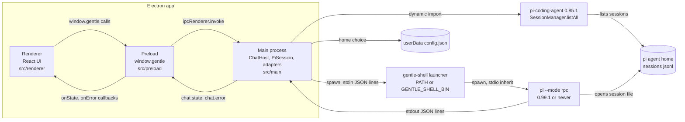
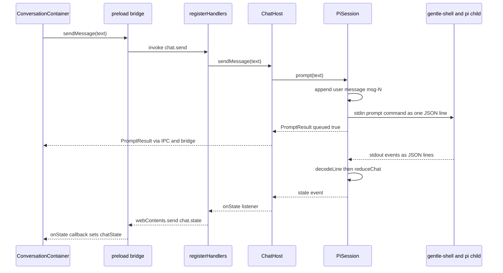

# Architecture: current state

> Status: draft.

Gentle Desktop is an Electron app with one window and one open chat at a time. The main process spawns `gentle-shell --mode rpc` as a child process for the conversation. It also imports pi in-process to list existing chats. This page describes that architecture as it is at `gentle-shell-desktop@5ab4a00`. Findings and risks are in [audit.md](audit.md). Recorded decisions are in [adr/](adr/README.md). The wire protocol is in [04-rpc-contract.md](../04-rpc-contract.md).

**How to read citations.** Paths with no repository prefix are in `gentle-shell-desktop@5ab4a00`. Other repositories use `repo@shortsha:path:line`. The pinned SHAs (refreshed 2026-10-03; the desktop source is unchanged) are `gentle-shell@ac67159` (gentle-shell `main`, npm package `gentle-pi` version 4.0.0), `pi@d981de1` (pi 0.85.1, the desktop's in-process copy) and `pi@a13d35a` (pi 1.0.0). `pi@d86654a` (pi 0.99.1, the launcher's floor) appears only in version comparisons. Lines labelled `Inference:` are reasoning, not verified behavior. Lines labelled `UNVERIFIED:` were checked but could not be confirmed. IDs from other pages are qualified (`audit A3`, `gap G9`); unqualified M1–M6 are the maintainer's milestones, and T-numbers are tasks inside them.

## At a glance

| Question | Answer | Evidence |
|---|---|---|
| What runs where? | Electron main (Node), preload (bridge), renderer (React UI), plus one `gentle-shell --mode rpc` child, which runs pi. | `src/README.md:7-10`; `src/main/domain/session/PiSession.ts:119-151` |
| How many chats can run at once? | One. `ChatHost` holds a single `current` session and stops it before starting the next. | `src/main/domain/session/ChatHost.ts:61-70`, `:156-157` |
| How does the UI talk to main? | 8 `ipcRenderer.invoke` request channels and 2 `webContents.send` push channels, exposed as `window.gentle`. | `src/shared/ipc-channels.ts:8-23`; `src/preload/index.ts:4` |
| How many paths reach pi? | Two. Chat goes over RPC to pi ≥ 0.99.1. The chat list uses pi 0.85.1 imported in-process. | [Data paths to pi](#data-paths-to-pi) |
| What does the chat view show? | User and assistant text, a working flag, dialogs and helper activity. Tool output and thinking only bump a counter. | `src/main/domain/rpc/chatReducer.ts:52-79` |
| How is it tested? | Vitest (Node by default, jsdom per file) and one Playwright Electron smoke script. 39 test files. | [Testing](#testing) |

## Overview and diagram

Each box and arrow below maps to the code cited in [Process model](#process-model) and [Data paths to pi](#data-paths-to-pi).

## Process model

| Process | Role | Key settings | Evidence |
|---|---|---|---|
| Main | Owns child processes, the chat list, the persisted home choice and IPC. Composition root: builds every adapter and the `ChatHost`. | One `BrowserWindow`, 1280×820. Loads the Vite dev URL in dev, `out/renderer/index.html` in builds. | `src/main/index.ts:52-67`, `:74-114` |
| Preload | Exposes the typed `GentleBridge` as `window.gentle` through `contextBridge`. | `contextIsolation: true`, `nodeIntegration: false`, `sandbox: false`. | `src/preload/index.ts:1-4`; `src/main/index.ts:81-86` |
| Renderer | React 19 UI. Falls back to an in-memory mock bridge when `window.gentle` is absent (`pnpm dev:web`). | CSP in `index.html`. External links open in the OS browser; all new windows are denied. | `src/renderer/shared/bridge/useBridge.ts:10-12`; `src/renderer/index.html:5-8`; `src/main/index.ts:97-102` |
| `gentle-shell` child | Launcher that resolves pi, enforces pi ≥ 0.99.1, then spawns `pi --mode rpc` with inherited stdio. | Spawned with `GENTLE_SHELL_INTERACTIVE_HOST=1`. No `cwd` is passed (see [audit](audit.md#a10-new-chats-run-in-the-apps-working-directory)). | `src/main/domain/session/PiSession.ts:67`, `:134-135`; `gentle-shell@ac67159:bin/gentle-shell.mjs:1396` |

**Lifecycle.** `ChatHost` keeps at most one child alive (`src/main/domain/session/ChatHost.ts:61-66`). On quit, `before-quit` calls `chatHost.stop()` bounded to 4 s (`src/main/index.ts:28`, `:133-139`). `PiSession.stop()` closes stdin, waits up to 3 s, then kills the child (`src/main/domain/session/PiSession.ts:213-235`). On every platform except macOS, closing the window quits the app (`src/main/index.ts:124-126`).

## Main process: domain, ports and adapters

`src/README.md:45-51` states the rule: the domain holds pure types and logic, the ports are the interfaces the domain depends on, and the adapters are the Electron/Node implementations. The domain barrel repeats it: "no Electron or Node imports allowed here" (`src/main/domain/index.ts:1-4`). One domain module breaks it (see [audit](audit.md#a17-drift-from-the-stated-structure-rules)).

### Layout

| Folder | Contents | Evidence |
|---|---|---|
| `src/main/domain/rpc/` | Protocol types, line codec, chat reducer, history mapping, helpers-activity parser, recorded fixtures (5 `.jsonl` files). | `types.ts:27-41`, `codec.ts:12`, `:22`, `:68`, `chatReducer.ts:52`, `history.ts:27`, `helpersActivity.ts:38` |
| `src/main/domain/session/` | `PiSession` (one child), `ChatHost` (owns the one current `PiSession`), `sessionList` (maps pi sessions to `ChatSummary`). | `PiSession.ts:82`, `ChatHost.ts:68`, `sessionList.ts:24` |
| `src/main/domain/home/` | Home mode resolution, launcher home flags, pi detection. | `home.ts:17-89` |
| `src/main/domain/lifecycle/` | `boundedStop`, a race between a stop promise and a timeout. | `boundedStop.ts:8-19` |
| `src/main/ports/` | Five ports plus the `SpawnedProcess` handle and `SessionInfoLike` shape. | `ports/index.ts:15-97` |
| `src/main/adapters/` | Node/Electron implementations of the ports, plus `AppConfigStore`. | `adapters/index.ts:5-10` |
| `src/main/ipc/` | `registerHandlers`: thin pass-through from IPC channels to `ChatHost` and `SetupService`. | `ipc/registerHandlers.ts:27-46` |
| `src/shared/` | Types and constants used by two or more processes: `bridge-types.ts`, `ipc-channels.ts`, `chatGrouping.ts`. | `src/README.md:12-16`; `src/shared/ipc-channels.ts:1-7` |

### Ports and adapters

| Port | Purpose | Adapter | Evidence |
|---|---|---|---|
| `ProcessSpawner` → `SpawnedProcess` | Spawn a child; line-oriented stdout/stderr; `exited` promise that also settles on spawn failure. | `createNodeProcessSpawner`: `child_process.spawn` with piped stdio, lines split by the domain `LineSplitter`. | `src/main/ports/index.ts:15-33`; `src/main/adapters/nodeProcessSpawner.ts:7-72` |
| `LauncherLocator` → `ResolvedLauncher` | Find how to run `gentle-shell`. | `createLauncherLocator`: `GENTLE_SHELL_BIN` first (JS entries run under `process.execPath` with `ELECTRON_RUN_AS_NODE=1`), then `gentle-shell` on `PATH`, else throw. | `src/main/ports/index.ts:35-52`; `src/main/adapters/launcherLocator.ts:16-42` |
| `SessionStore` | List pi sessions as `SessionInfoLike`. | `createPiSessionStore` / `createDynamicPiSessionStore`: in-process `SessionManager.listAll()`, re-resolving the home on every call. | `src/main/ports/index.ts:61-75`; `src/main/adapters/piSessionStore.ts:27-58` |
| `HomeSettings` | Launcher home flags for the next spawn. | `createHomeSettings`: `resolveHomeArgs(configStore.read())` on every call. | `src/main/ports/index.ts:85-87`; `src/main/adapters/homeSettings.ts:11-17` |
| `SetupService` | First-run status and persisting the home choice. | `createSetupService`: `detectPi` plus `AppConfigStore`. | `src/main/ports/index.ts:94-97`; `src/main/adapters/setupService.ts:15-41` |
| (no port) `AppConfigStore` | Read/write `{home}` in `userData/config.json`; tolerant of missing or invalid files. | `createAppConfigStore`. Used only by other adapters, so it has no port. | `src/main/adapters/appConfigStore.ts:6-42`; `src/main/index.ts:52` |

## Session and chat flow

### Open or start a chat

1. On mount, `ConversationContainer` calls `bridge.openChat(id)` or `bridge.newChat()`. `App` starts with a new chat selected, so a child is spawned as soon as the chat screen appears (`src/renderer/app/App.tsx:9`, `:35`; `src/renderer/features/conversation/ConversationContainer.tsx:81-95`).
2. `ChatHost.openChat(id)` runs `listAll()` again to find the session file path for that id (`src/main/domain/session/ChatHost.ts:103-108`).
3. `startSession` queues behind any earlier start (`startChain`), stops the current session, then builds a new `PiSession` with fresh home flags (`src/main/domain/session/ChatHost.ts:144-170`).
4. `PiSession.start()` builds the argv `[...launcher.args, ...homeArgs, "--mode", "rpc", "--session", path?]` and the env, then spawns (`src/main/domain/session/PiSession.ts:119-141`).
5. When reopening, it sends `get_messages` with an id. `ChatHost` waits up to 2 s for that response before returning the state (`src/main/domain/session/PiSession.ts:147`, `:156-160`; `src/main/domain/session/ChatHost.ts:19`, `:172-177`). The response replaces `messages` only if no live message arrived first (`src/main/domain/session/PiSession.ts:272-284`).

### Send a message and stream the reply

| Step | What happens | Evidence |
|---|---|---|
| Send | The composer ignores sends while `working`. The bridge invokes `chat.send`. | `src/renderer/features/conversation/ConversationContainer.tsx:97-108`; `src/preload/bridge.ts:24` |
| Route | `registerHandlers` forwards to `ChatHost.sendMessage`, which calls `PiSession.prompt`. | `src/main/ipc/registerHandlers.ts:31`; `src/main/domain/session/ChatHost.ts:119-121` |
| Prompt | If `working`, the prompt is declined with `{queued:false, reason}` and nothing is written. Otherwise a user message `msg-<length>` is appended and `{type:"prompt", message}` is written. | `src/main/domain/session/PiSession.ts:168-186`, `:333-336` |
| Encode | One JSON object plus `\n`. | `src/main/domain/rpc/codec.ts:12-14` |
| Decode | `LineSplitter` splits stdout on `\n`. `decodeLine` turns each line into a typed `RpcEvent` or `{kind:"unknown"}`, which is dropped. | `src/main/adapters/nodeProcessSpawner.ts:74-88`; `src/main/domain/rpc/codec.ts:22`, `:68`; `src/main/domain/session/PiSession.ts:245-263` |
| Reduce | `reduceChat` folds the event into `ChatState`: `agent_start`/`agent_end`/`agent_settled` drive `working`; assistant `message_*` events build the reply; tool and thinking events bump `activity`; dialogs and the `gentle-agents` widget are folded in. | `src/main/domain/rpc/chatReducer.ts:52-79`, `:165-207` |
| Push | Every `state` event goes to all `ChatHost` state listeners, then to the renderer on `chat.state`. | `src/main/domain/session/ChatHost.ts:167`, `:192-194`; `src/main/ipc/registerHandlers.ts:39` |
| Render | `ConversationContainer` stores the pushed state and renders `MessageThread`, `HelpersStrip`, `Composer` and `StatusLine`. Assistant text goes through `marked` and DOMPurify. | `src/renderer/features/conversation/ConversationContainer.tsx:60-67`, `:121-145`; `src/renderer/shared/markdown/renderMarkdown.ts:1-2`, `:67` |

Event semantics and what the desktop ignores are in [04-rpc-contract.md: Events](../04-rpc-contract.md#events-runtime--desktop).

### Dialogs, abort and errors

- **Dialogs.** `select`, `confirm`, `input` and `editor` requests are pushed to `pendingDialogs` (`src/main/domain/rpc/chatReducer.ts:166-179`). `DialogCard` renders all four, including `editor` (`src/renderer/features/conversation/components/DialogCard.tsx:45`). An answer goes renderer → `dialog.answer` → `ChatHost.answerDialog` → `PiSession.answerDialog`, which removes the card and writes `extension_ui_response` (`src/renderer/features/conversation/ConversationContainer.tsx:114-116`; `src/main/domain/session/ChatHost.ts:127-129`; `src/main/domain/session/PiSession.ts:193-207`).
- **Abort.** `chat.abort` → `PiSession.abort()` writes `{type:"abort"}` (`src/main/domain/session/PiSession.ts:188-190`).
- **Errors.** `PiSession` never throws from public methods. Failures set `lastError` and emit `error`, which `ChatHost` forwards on `chat.error` (`src/main/domain/session/PiSession.ts:77-81`, `:326-330`; `src/main/ipc/registerHandlers.ts:40`). Child stderr is logged with a `[pi]` prefix and never parsed (`src/main/domain/session/PiSession.ts:292-295`; `src/main/index.ts:42-44`). Any exit not requested by `stop()` resets `working` and drops pending dialogs (`src/main/domain/session/PiSession.ts:309-324`).

## IPC between main and renderer

All channel names come from one constant shared by main and preload (`src/shared/ipc-channels.ts:8-23`). Handlers are re-registered per window with `removeHandler` first (`src/main/ipc/registerHandlers.ts:50-53`).

| Constant | Channel | Kind | Main handler | Evidence |
|---|---|---|---|---|
| `LIST_CHATS` | `sessions.list` | invoke | `ChatHost.listChats()` | `src/main/ipc/registerHandlers.ts:28` |
| `OPEN_CHAT` | `chat.open` | invoke | `ChatHost.openChat(id)` | `:29` |
| `NEW_CHAT` | `chat.new` | invoke | `ChatHost.newChat()` | `:30` |
| `SEND_MESSAGE` | `chat.send` | invoke | `ChatHost.sendMessage(text)` | `:31` |
| `ABORT` | `chat.abort` | invoke | `ChatHost.abort()` | `:32` |
| `ANSWER_DIALOG` | `dialog.answer` | invoke | `ChatHost.answerDialog(id, answer)` | `:33-35` |
| `SETUP_STATUS` | `setup.status` | invoke | `SetupService.status()` | `:36` |
| `CHOOSE_HOME` | `setup.chooseHome` | invoke | `SetupService.chooseHome(mode)` | `:37` |
| `STATE_PUSH` | `chat.state` | push | from `ChatHost.onState` | `:39` |
| `ERROR_PUSH` | `chat.error` | push | from `ChatHost.onError` | `:40` |

Handler arguments are passed through with no runtime validation, and pushes carry no chat id (`src/main/ipc/registerHandlers.ts:28-40`). See [audit A3](audit.md#a3-single-session-host-with-positional-message-ids) and [audit A14](audit.md#a14-preload-and-ipc-hardening).

## Preload bridge surface

`createBridge(ipc)` implements `GentleBridge` over an injected `RendererIpc`, so it is unit-tested without Electron (`src/preload/bridge.ts:10-19`). `src/preload/index.ts:4` exposes it as `window.gentle`.

| Method | Returns | Channel | Evidence (`src/shared/bridge-types.ts`) |
|---|---|---|---|
| `listChats()` | `ChatSummary[]` | `sessions.list` | `:274` |
| `openChat(id)` | `ChatState` | `chat.open` | `:276` |
| `newChat()` | `ChatState` | `chat.new` | `:278` |
| `sendMessage(text)` | `PromptResult` (`{queued, reason?}`) | `chat.send` | `:282`, `:106-109` |
| `abort()` | `void` | `chat.abort` | `:283` |
| `answerDialog(id, answer)` | `void` | `dialog.answer` | `:284`, `:92` |
| `onState(cb)` | unsubscribe | `chat.state` | `:286` |
| `onError(cb)` | unsubscribe | `chat.error` | `:288` |
| `setupStatus()` | `SetupStatus` | `setup.status` | `:291`, `:261-264` |
| `chooseHome(mode)` | `void` | `setup.chooseHome` | `:294` |

`ChatState` is `{messages, working, pendingDialogs, lastError?, activity, helpers}` (`src/shared/bridge-types.ts:122-129`). It has no session or chat id.

## Renderer structure

The rules come from `src/README.md:21-43` and the maintainer instructions recorded in `odd/tasks/desktop-m1-chat-core.md:29`:

- **Screaming Architecture:** feature folders are named after what the app does.
- **Scope Rule:** code used by one feature stays local; code used by two or more moves to `shared/`.
- **Container/presentational:** a container owns state and the bridge; components only take props.
- **Atomic design:** reusable atoms live under `shared/ui`.

| Folder | Container | Presentational components | Bridge calls | Evidence |
|---|---|---|---|---|
| `app/` | `App` (screen switch: loading, first-run, chat; owns `activeChat`) | `ErrorBoundary` | `setupStatus` | `src/renderer/app/App.tsx:32-75`; `src/renderer/main.tsx:12-18` |
| `features/chats/` | `ChatsContainer` | `ChatList`, `ChatListItem` | `listChats` (once, on mount) | `src/renderer/features/chats/ChatsContainer.tsx:24-60` |
| `features/conversation/` | `ConversationContainer` | `ConversationHeader`, `StatusLine`, `HelpersStrip`, `MessageThread`, `MessageBubble`, `DialogCard`, `Composer` | `onState`, `onError`, `openChat`, `newChat`, `sendMessage`, `abort`, `answerDialog` | `src/renderer/features/conversation/ConversationContainer.tsx:46-146` |
| `features/helpers/` | `HelpersContainer` (props only, no bridge; opened only by `conversation`) | `HelperList`, `HelperListItem`, `HelperThread`, `HelperThreadItem`, `HelpersSummary`, `HelpersFooter`; `format.ts` | none | `src/README.md:28-32`; `src/renderer/features/conversation/ConversationContainer.tsx:131-136` |
| `features/first-run/` | `FirstRunContainer` | `FirstRun` | `setupStatus`, `chooseHome` | `src/renderer/features/first-run/FirstRunContainer.tsx:24`, `:35` |
| `shared/bridge/` | — | `useBridge` (real bridge or mock), `mockBridge` (489 lines) | — | `src/renderer/shared/bridge/useBridge.ts:10-12` |
| `shared/ui/atoms/` | — | `Button`, `Pill`, `TextField` | — | file listing |
| `shared/theme/` | — | `gentleman-cute.json`, `tokens.css`, `theme.ts` (hardcoded theme) | — | `odd/tasks/desktop-m1-chat-core.md:22` |
| `shared/markdown/` | — | `Markdown`, `renderMarkdown` | — | `src/renderer/shared/markdown/Markdown.tsx:8-18` |

There is no global store. `App` holds the selection, and the pushed `ChatState` is the single source of truth for the thread (`src/renderer/app/App.tsx:19-24`; `src/renderer/features/conversation/ConversationContainer.tsx:39-45`).

### Renderer state ownership

| State | Owner | Notes | Evidence |
|---|---|---|---|
| Active-chat selection (`ActiveChat`: new vs existing) | `App` | Local `useState`; `ChatsContainer` only reports selection intent up. | `src/renderer/app/App.tsx:19-24`, `:35`, `:54-60` |
| Conversation `ChatState` (messages, working, dialogs, helpers) | `ConversationContainer` | The pushed state is the thread's single source of truth; opens via `openChat`/`newChat`, subscribes via `onState`/`onError`. | `src/renderer/features/conversation/ConversationContainer.tsx:39-49`, `:60-67`, `:81-95` |
| Conversation pane and `helpersOpenedAt` | `ConversationContainer` | Resets to the chat pane whenever the selected chat changes. | `src/renderer/features/conversation/ConversationContainer.tsx:51-56`, `:76-79` |
| Helper selection and view flags (`selectedTaskId`, `followLive`, `showToolDetails`) | `HelpersContainer` (props only, no bridge calls) | Receives `ChatState.helpers` as the `activity` prop from `ConversationContainer`. | `src/renderer/features/helpers/HelpersContainer.tsx:30-42` |
| Persisted home choice (`{home}`) | Main `SetupService` + `AppConfigStore` | The renderer only reads `setupStatus()` and writes via `chooseHome()` (`FirstRunContainer`) and switches screens (`App`); persistence lives in main. | `src/main/adapters/setupService.ts:21-41`; `src/main/adapters/appConfigStore.ts:20-42`; `src/renderer/features/first-run/FirstRunContainer.tsx:23-49`; `src/renderer/app/App.tsx:32-52` |

Renderer isolation here means `contextIsolation: true` with `nodeIntegration: false` and `sandbox: false`: the renderer is isolated from Node through the preload bridge, not placed in the Chromium OS-level sandbox (`src/main/index.ts:83-85`; `src/preload/index.ts:1-4`).

## Data paths to pi

Two paths reach pi: launcher-mediated chat goes through the spawned `gentle-shell --mode rpc` child (`src/main/domain/session/PiSession.ts:119-141`), and the session list is an in-process `import("@earendil-works/pi-coding-agent")` in the main process (`src/main/adapters/piSessionStore.ts:30`).

| | RPC child (chat) | In-process (chat list) |
|---|---|---|
| **What** | `gentle-shell --mode rpc` → `pi --mode rpc` | `import("@earendil-works/pi-coding-agent")` → `SessionManager.listAll()` |
| **pi version** | ≥ 0.99.1, enforced by the launcher (`gentle-shell@ac67159:lib/gentle-shell-launcher.ts:392`; peer range `gentle-shell@ac67159:package.json:78`); gentle-shell develops against ≥ 1.0.0 (`:95`) | 0.85.1 (`package.json:42`; `pnpm-lock.yaml:323`) |
| **Runtime** | A `PATH` install runs as found. A `GENTLE_SHELL_BIN` JS entry runs under Electron as Node (`process.execPath` with `ELECTRON_RUN_AS_NODE=1`); any other `GENTLE_SHELL_BIN` is executed directly (`src/main/adapters/launcherLocator.ts:19-23`, `:34-41`) | Electron main process |
| **Home selection** | Launcher flags `--link`, `--isolated` or `--home <dir>`; the launcher sets `PI_CODING_AGENT_DIR` for pi, and since 4.0.0 also `GENTLE_SHELL_USER_PI_HOME` (an inherited value, else `PI_CODING_AGENT_DIR`, else `~/.pi/agent`), read by `/gentle:stats` (`src/main/domain/home/home.ts:33-37`; `gentle-shell@ac67159:lib/gentle-shell-launcher.ts:197-205`, `:960-962`) | Temporarily sets the process-global `process.env.PI_CODING_AGENT_DIR`, then restores it (`src/main/adapters/piSessionStore.ts:32-39`) |
| **Used for** | Prompt, abort, dialog answers, history (`get_messages`), helper activity | Sidebar list; mapping a chat id to its session file before `--session` (`src/main/domain/session/ChatHost.ts:95-108`) |
| **Contract** | [04-rpc-contract.md](../04-rpc-contract.md) | None. Depends on pi's library API and session file layout. |

The session file format constant is `CURRENT_SESSION_VERSION = 3` in pi 0.85.1, 0.99.1 and 1.0.0 (`pi@d981de1:packages/coding-agent/src/core/session-manager.ts:30`, `pi@a13d35a:packages/coding-agent/src/core/session-manager.ts:41`; the file is byte-identical in 0.99.1 and 1.0.0). `UNVERIFIED:` whether `SessionInfo` parsing differs in ways that matter was not checked line by line. Risks are in [audit A1 and A2](audit.md#a1-two-data-paths-to-pi-and-a-global-pi_coding_agent_dir-mutation).

## Home modes

| Mode | When | Launcher flags | Directory the desktop lists | Evidence |
|---|---|---|---|---|
| `GENTLE_SHELL_HOME` override | Env var set; overrides the saved mode | `--home <dir>` | `<dir>` | `src/main/domain/home/home.ts:33-35`, `:61-62` |
| `link` | User picked "Use my pi setup" | `--link` | `PI_CODING_AGENT_DIR`, else `~/.pi/agent` | `src/main/domain/home/home.ts:36`, `:45-47`, `:64` |
| `isolated` | User picked "Keep it separate", or nothing saved yet | `--isolated` | `~/.gentle-shell/agent` | `src/main/domain/home/home.ts:17-19`, `:36`, `:66` |

The first-run screen appears only when no choice is saved and a pi agent dir exists (`src/main/adapters/setupService.ts:21-25`). The choice is saved as `{home}` in `userData/config.json` (`src/main/index.ts:52`; `src/main/adapters/appConfigStore.ts:34-39`). Home flags and the listing directory are re-resolved on every spawn and every list call, so a choice applies without a restart (`src/main/ports/index.ts:77-84`; `src/main/adapters/piSessionStore.ts:44-58`). The launcher resolves the same directories: `linkDir` is `PI_CODING_AGENT_DIR || ~/.pi/agent`, `isolatedDir` is `GENTLE_SHELL_HOME || ~/.gentle-shell/agent` (`gentle-shell@ac67159:lib/gentle-shell-launcher.ts:193-195`, `:207-209`).

## Build, packaging and testing

### Scripts

| Script | Command | Evidence |
|---|---|---|
| `dev` | `electron-vite dev` | `package.json:11` |
| `dev:web` | Renderer alone on Vite, port 5173, mock bridge | `package.json:12`; `vite.web.config.ts:5-22` |
| `dev:local-pi` | `dev` with `GENTLE_SHELL_BIN` defaulting to a local gentle-pi worktree (POSIX shell syntax). Open PR #27 (not merged as of 2026-10-03) replaces it with `node scripts/dev-local-pi.mjs` ([audit A18](audit.md#a18-launcher-discovery-and-platform-coverage)) | `package.json:23` |
| `build` / `preview` | `electron-vite build` / `preview` | `package.json:13-14` |
| `test` / `test:watch` | `vitest run` / `vitest` | `package.json:15-16` |
| `typecheck` | `tsc --build --force` | `package.json:17` |
| `package`, `package:mac`, `package:win`, `package:linux` | `electron-vite build && electron-builder [--mac/--win/--linux] --publish never` | `package.json:18-21` |
| `smoke:electron` | Build, then `scripts/smoke-electron.mjs` | `package.json:22` |

### Build and packaging

- **Build.** electron-vite builds three bundles. Main and preload externalize dependencies, so `@earendil-works/pi-coding-agent` stays a real `node_modules` import (`electron.vite.config.ts:5-40`; `electron-builder.yml:11-17`).
- **Path aliases.** `@shared` resolves in all three bundles (`electron.vite.config.ts:13`, `:21`, `:34-35`); `@renderer` resolves in the renderer bundle and in the test config (`vitest.config.ts:15-16`).
- **Packaging.** electron-builder, `appId: dev.gentleman.gentle-shell`, `productName: gentle shell`, output `release/`, `asar: true`. Ships `out/**` and `package.json`. Targets: mac `dmg` + `zip` with `identity: null` (unsigned), win `nsis`, linux `AppImage` (`electron-builder.yml:7-38`).
- **Install scripts.** `pnpm-workspace.yaml` has one `allowBuilds` map: `@google/genai`, `esbuild` and `protobufjs` are `true`, `electron-winstaller` is `false` (`pnpm-workspace.yaml:1-10`). Its comment names only `@google/genai` and `protobufjs`, as transitive dependencies of `@earendil-works/pi-coding-agent` (`pnpm-workspace.yaml:2-6`). `esbuild` and `electron-winstaller` carry no comment. In the lockfile, `esbuild` is reached through pi's `@earendil-works/chord@0.85.1` (`pnpm-lock.yaml:3196-3198`, `:3239`) and also through `vite` and `electron-vite` (`pnpm-lock.yaml:4343`, `:5433`).
- **Platforms.** Tested on macOS Apple silicon only. Windows and Linux builds are configured but untested. No signing, notarization or auto-update (`README.md:7`, `:64`). Per-platform support of the upstream pieces and what the desktop must solve: [10-platforms.md](../10-platforms.md).

### Testing

Counts measured with `fd` and `rg` on the working tree (source unchanged from `5ab4a00`). No tests were run.

| Area | Test files | Non-test `.ts`/`.tsx` files |
|---|---|---|
| `src/main/index.ts` (composition root) | 0 | 1 |
| `src/main/domain` | 9 | 11 |
| `src/main/adapters` | 5 | 7 |
| `src/main/ipc` | 1 | 2 |
| `src/main/ports` | 0 | 1 |
| `src/preload` | 1 | 2 |
| `src/renderer` | 22 | 32 |
| `src/shared` | 1 | 3 |
| **Total** | **39** | **59** |

- **Runner.** Vitest with Node as the default environment. Renderer files opt into jsdom with a `// @vitest-environment jsdom` comment (19 files). `globals: false`. `test/setup.ts` registers Testing Library `cleanup` and stubs `scrollIntoView` (`vitest.config.ts:5-24`; `test/setup.ts:1-27`).
- **Size.** 339 lines match `^\s*(it|test)\(`. This is a text count, not a runner count. The M2 document recorded 348 tests at tracker `2bdd92a` (`odd/tasks/desktop-m2-helpers.md:63`).
- **Fixtures.** Five recorded JSONL fixtures in `src/main/domain/rpc/__fixtures__/`.
- **Real child process.** `PiSession.test.ts` drives the real `createNodeProcessSpawner` against a fake script, so the spawner adapter is covered without its own test file (`src/main/domain/session/PiSession.test.ts:130-140`).
- **Electron smoke.** `scripts/smoke-electron.mjs` launches the built main entry through Playwright, with a throwaway `userData`. It checks the window title and that the body contains "Welcome to gentle shell" or "Chats". It was added in M1 T6 (`scripts/smoke-electron.mjs:19-67`; `odd/tasks/desktop-m1-chat-core.md:61`).
- **CI.** None. `.github/` contains only `ISSUE_TEMPLATE/bug_report.yml` and `feature_request.yml` (file listing).

## Related documents

- [audit.md](audit.md): findings, severity and recommended order.
- [adr/README.md](adr/README.md): recorded decisions and open ones.
- [04-rpc-contract.md](../04-rpc-contract.md): protocol, versions and gaps.
- [05-capability-inventory.md](../05-capability-inventory.md): what gentle-shell and pi can do, and what the desktop exposes.
