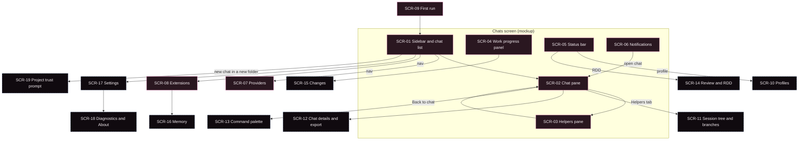

# Screens

> Status: draft.

The desktop needs **19 surfaces**. **9** come from the concept mockup: its four screens (Chats, Providers, Extensions, First run; `gs-mockup.html:462`), with the Chats screen split into six regions. **10** have no mockup and are derived from the [capability inventory](../05-capability-inventory.md). Today the app has three screens: loading, first run and chat (`D:renderer/app/App.tsx:11-15`).

The mockup is **intent, not spec**: its example data (provider names, counts, "212 / 400") never becomes a requirement. Every "Surface" idea below is `Inference:` unless it cites the mockup.

**Citation keys.** `D:` is `gentle-shell-desktop@5ab4a00:src/`. `gs-mockup.html:<line>` is the saved DOM of https://claude.ai/artifact/CCpKaRTkrnDrWoErY27KEL. IDs collide across documents (inventory A1–A12 and U1–U8, audit A1–A21, UX U1–U12), so every ID from another document is qualified: `inventory S1` is a [capability inventory](../05-capability-inventory.md) row, `inventory Q6` one of its [desktop searches](../05-capability-inventory.md#desktop-searches), `gap G1` an [RPC gap](../04-rpc-contract.md#gaps-the-desktop-needs), `audit A5` an [audit finding](../03-architecture/audit.md#findings), `UX U3` a [UX principle](principles.md), `vision Q5` an [open question](../00-vision.md#open-questions-for-the-maintainer). A qualifier covers the IDs listed after it (`audit A3, A11`). The "Inventory rows" line of each screen lists inventory rows only. SCR IDs belong to this page.

## Screen map

Solid border: shown in the mockup. Dashed border: no mockup, derived from the inventory. Edges are `Inference:` navigation, not a decided information architecture.

## At a glance

| ID | Surface | Source | Exists today | Main blockers |
|---|---|---|---|---|
| SCR-01 | Sidebar and chat list | mockup | partial | audit A3, A11, A10, A1 |
| SCR-02 | Chat pane | mockup | partial | audit A7, A6; inventory C17, C20 |
| SCR-03 | Helpers pane | mockup | partial | gap G1, G8; audit A5 |
| SCR-04 | Work progress panel (ODD) | mockup | no | gap G2 |
| SCR-05 | Status bar | mockup | no | gap G6, G7 |
| SCR-06 | Notifications | mockup | no | audit A3; gap G9; inventory C20 |
| SCR-07 | Providers | mockup | no | gap G3, G4 |
| SCR-08 | Extensions | mockup | no | gap G5; inventory E6, E7 |
| SCR-09 | First run | mockup | yes, partly | audit A9, A19, A4 |
| SCR-10 | Profiles | inventory | no | gap G6 |
| SCR-11 | Session tree and branches | inventory | no | inventory S8; gap G1 side effect |
| SCR-12 | Chat details and export | inventory | no | inventory S6, S13 |
| SCR-13 | Command palette | inventory | no | inventory C12 |
| SCR-14 | Review and RDD | inventory | no | inventory R3, R4; audit A6 |
| SCR-15 | Changes | inventory | no | inventory V5 (TUI-only) |
| SCR-16 | Memory | inventory | no | inventory I4 (tools only) |
| SCR-17 | Settings | inventory | no | inventory V8, Y4, C20 |
| SCR-18 | Diagnostics and About | inventory | no | gap G10; audit A8 |
| SCR-19 | Project trust prompt | inventory | no | inventory T1 |

## Screens from the mockup

### SCR-01. Sidebar and chat list

| Aspect | Detail |
|---|---|
| Purpose | Find, start and switch chats; see each chat's state at a glance (UX U3). Reach Providers and Extensions. |
| Inventory rows | S1, S2, S3, S4, S5, S6, S16, S17 |
| States | Empty list. Loading. Chats grouped by day. Per chat: idle, working, needs you. List error. |
| Interactions | New chat; select a chat; (`Inference:`) search, rename, delete, "Continue last chat" per project (inventory S2, S4–S6). |
| Today | Chats grouped by day (`D:renderer/features/chats/components/ChatList.tsx:19-25`); state pill per chat (`D:renderer/features/chats/components/ChatListItem.tsx:5-15`, `:39`), but the main process always sends `idle` (`D:main/domain/session/sessionList.ts:35`). The list comes from in-process pi 0.85.1 (inventory S3; audit A1, A2). New chat spawns a process without `new_session` and without a project folder (inventory S1; audit A10). No search, rename or delete (inventory Q6, Q25). |
| Mockup intent | New chat button (`gs-mockup.html:476`); groups Today and Yesterday (`:478`, `:495`); per chat a title, a state ("working", "needs you", a time) and a one-line preview (`:479-505`); section nav with counts (`:507-511`); account line (`:512`). |
| Blockers | Audit A3 and gap G9 (one session at a time, so no real "working" or "needs you" for other chats); audit A11 (list lifecycle); audit A10 (no folder per chat); inventory S17 (the list reads only the default session directory; `Inference:` sessions kept in a custom directory do not appear); inventory S3 caveat (a stored cwd that no longer exists makes pi exit with code 1); inventory S6 (no delete command over RPC). |

### SCR-02. Chat pane

| Aspect | Detail |
|---|---|
| Purpose | Talk to Gentle, answer its questions, see helpers it started, stop or steer it (UX U1, U4, U5). |
| Inventory rows | C1–C6, C8–C11, C14, C17–C21, S19, K1, A5, A7, A9, R2, V1, V13, V14, V15, V16–V18, I5, I10, Y1, Y2 |
| States | Empty ("Start a conversation"). Idle. Working (streaming). Waiting for a dialog answer. Queued message (inventory C4–C6, not built). Retrying (inventory K5, not built). Compacting (inventory K1, K2, not built). Error. |
| Interactions | Send, new line, stop (Esc); answer select/confirm/input/editor cards; open the Helpers pane. `Inference:` steer or queue while working, attach images, `@` file references, copy a message, expand tool and thinking blocks (tool cards: inventory V15, I5), compact now with optional instructions (inventory K1). |
| Today | Header with title, Working pill and Chat/Helpers tabs (`D:renderer/features/conversation/components/ConversationHeader.tsx:23-37`); error line (`D:renderer/features/conversation/components/StatusLine.tsx:10-17`); helpers strip (`D:renderer/features/conversation/components/HelpersStrip.tsx:17-27`); Markdown thread (inventory C21); dialog cards for four kinds (`D:renderer/features/conversation/components/DialogCard.tsx:39-45`); composer read-only while working, with Enter, Shift+Enter and Esc (`D:renderer/features/conversation/components/Composer.tsx:30-37`, `:53`, `:61`). |
| Mockup intent | Title plus "Working on task 3" pill and tabs (`gs-mockup.html:517-523`); timestamped messages (`:527-544`); helpers under the message that started them (`:545-550`); question card with a primary option and "Let me explain" (`:553-558`); composer and three hints (`:563-568`). |
| Blockers | Audit A7 / inventory C4 (steer and follow-up declined while working; open question [vision Q5](../00-vision.md#open-questions-for-the-maintainer)); audit A6 (non-assistant messages dropped, so inventory A7 results, R2 reminders and V17 cards never show; since gentle-shell 4.0.0 an idle parent is also woken by a user-role message, which `Inference:` (not run) is dropped live too, inventory A7); inventory C17, C18 (tool parts and thinking not rendered, so inventory V15 and I5 tool cards have nothing to show); inventory C20 (`notify` ignored, so most `/gentle:*` output is lost, inventory V18); inventory I10 (option descriptions lost over RPC); inventory K1 (`compact` exists over RPC; no desktop action, inventory Q4); audit A12 (dialog timeouts); audit A13 (previous thread stays visible while switching). Helpers cannot sit under their message: the activity payload has no message linkage (`D:renderer/features/conversation/components/HelpersStrip.tsx:9-16`). |

### SCR-03. Helpers pane

| Aspect | Detail |
|---|---|
| Purpose | See what each helper of this chat is doing, follow one live, and stop it (UX U4, U5). |
| Inventory rows | A1, A2, A3, A4, A5, A6, A12 |
| States | Per helper: queued, running, waiting, done, failed, cancelled (desktop set, `gentle-shell-desktop@5ab4a00:src/shared/bridge-types.ts:131-138`). Earlier finished helpers collapsed. Empty. |
| Interactions | Select a helper; Follow live; Show tool details; Back to chat; Stop (disabled). `Inference:` message box to steer (inventory A6), answer the helper's question in its thread (inventory A5). |
| Today | List, thread and footer (`D:renderer/features/helpers/HelpersContainer.tsx`); "Earlier · N finished" group (`D:renderer/features/helpers/components/HelperList.tsx:23`, `:53`); Stop disabled with a tooltip (`D:renderer/features/helpers/components/HelpersFooter.tsx:36-38`). |
| Mockup intent | Summary counts (`gs-mockup.html:573`); list with elapsed time and steps (`:574-577`); thread header with model and the message it started from (`:581-585`); Task, Plan, Step, Update and Note items (`:587-596`); footer with Follow live, Show tool details, Back to chat, Stop (`:598-604`). |
| Blockers | Gap G1 (no stop command; `Inference:` background helpers cannot be stopped over RPC); audit A5 (gentle-shell publishes `completed` and `timed_out`, which the desktop does not map; gentle-shell tool items carry no `callId`, which the desktop requires, so `Inference:` (not run) every tool item is dropped); gap G8 and inventory A2 (no model, tokens, cost or transcript in the payload); the "All sessions" scope of the inventory A3 overlay conflicts with UX U4. |

### SCR-04. Work progress panel (ODD)

| Aspect | Detail |
|---|---|
| Purpose | Show the feature being worked on, the phase, the tasks with their evidence, and the checks (UX U6). |
| Inventory rows | O2, O3, O4, R5 |
| States | No feature (`Inference:` small work creates no feature document under ODD, per the harness prompt in inventory O1). Feature with phase. Task in progress, done with evidence, pending. Checks pending, passing, warning. |
| Interactions | `Inference:` open the feature document; open a task's commit or test evidence; jump to Changes (SCR-15) or Review (SCR-14). |
| Today | None (inventory Q30, Q32). |
| Mockup intent | "Working on" with the feature document path and branch (`gs-mockup.html:612-613`); five steps Explore, Plan, Build, Verify, Deliver (`:617-624`); tasks with commit and test evidence (`:628-635`); checks Tests, Types, Review, Changed lines (`:639-645`). |
| Blockers | Gap G2 (no structured ODD state; only explicit `gentle_odd_phase` calls reach the host, as tool events the desktop does not render, inventory C17); inventory O2 (`Inference:` the mockup's five steps need a mapping from gentle-shell's eight phases); inventory O3 (feature document format unspecified); inventory O4 (todo state only inside `todo` tool results); audit A3. |

### SCR-05. Status bar

| Aspect | Detail |
|---|---|
| Purpose | Show the context of the current chat at the edge of the window: folder, branch, model, effort, profile, context, cost, workflow state (UX U2). |
| Inventory rows | V2, V3, V4, K3, K4, M1, M3, M5, P1, R1, O2 |
| States | Per chat. Value unknown (data not available yet). Warning (for example high context use). |
| Interactions | `Inference:` click model to pick (inventory M1), effort to change (inventory M5), profile to open Profiles (SCR-10), RDD to open Review (SCR-14). |
| Today | None (inventory Q11, Q27, Q31). |
| Mockup intent | Brand, folder, branch with dirty mark, model, effort, profile, context %, cost, `ODD · RDD on` (`gs-mockup.html:813-823`). |
| Blockers | Gap G7 (model and effort via `get_state`; cost and context pull-only via `get_session_stats`; cwd and branch absent); gap G6 (profile); inventory R1 (RDD state only as `notify`); audit A3 (must follow the selected chat). |

### SCR-06. Notifications

| Aspect | Detail |
|---|---|
| Purpose | Tell the user when another chat needs a decision or a helper finished, without opening every chat (UX U3). |
| Inventory rows | C20, V16, V18, A7 |
| States | None. One or more toasts. Unread count on the bell. |
| Interactions | Dismiss; `Inference:` click to open the chat. |
| Today | None: `notify` and other fire-and-forget requests are ignored (`D:main/domain/rpc/chatReducer.ts:180-184`). |
| Mockup intent | Bell with a dot (`gs-mockup.html:470`); toasts "Helper finished" and "Gentle needs a decision · waiting 4 min" (`:825-836`); dismiss button (`:829`, script `:841-843`). |
| Blockers | Audit A3, gap G9 (other chats are not running); inventory C20. |

### SCR-07. Providers

| Aspect | Detail |
|---|---|
| Purpose | Sign in to subscriptions, add API keys and local models, choose the default model for new chats (UX U7, U8). |
| Inventory rows | M1, M2, M4, M7, M8, M9, M10, M11, M12, I6, V4, V19 |
| States | Connected providers. Providers to add. Signing in (OAuth in progress). Error. Usage per subscription (inventory V4, not in the mockup). `Inference:` usage history across chats, per model (inventory V19, `/gentle:stats`, not in the mockup; it could also sit beside the chat statistics of SCR-12). |
| Interactions | Sign in, sign out, add key, add local server, manage, change default model. `Inference:` mark models for cycling as favorites (inventory M4). |
| Today | None. First run only checks that `auth.json` and `models.json` exist (inventory M7, M9). |
| Mockup intent | Connected list with sign-out and manage (`gs-mockup.html:698-712`); "Add a provider" list (`:714-726`); default model with effort and profile (`:729-731`); "Where this lives" with file paths and "Your vanilla pi untouched" (`:733-739`). |
| Blockers | Gap G3 (no sign-in command; since pi 1.0.0 the interactive `/login` ends with "Sign in with Radius" and then offers to add the Radius MCP server, inventory M7, which is input for this screen, not a requirement); gap G4 (no persisted default); inventory V19 (the `/gentle:stats` panel is TUI-only and under RPC only sends a `notify`; `Inference:` the desktop could aggregate the session files the panel reads); inventory M4 (no RPC command sets the models used for cycling; `cycle_model` only reports `isScoped`); the RPC-only vs in-process choice ([vision Q4](../00-vision.md#open-questions-for-the-maintainer), audit A1, A2). |

### SCR-08. Extensions

| Aspect | Detail |
|---|---|
| Purpose | Install, update, remove, enable and scope packages; see what gentle-pi bundles (UX U8, U7). |
| Inventory rows | E1, E2, E4, E5, E6, E7, E8, E9, I1, I2, I3, A11, L4, L7, V10, H3 |
| States | Installed, update available, disabled, local (git or folder). Installing. Needs reload (`Inference:` "Changes apply to new chats", `gs-mockup.html:748`). |
| Interactions | Install from npm, git or folder; update; update all; remove; toggle; choose theme; scope global or per project. |
| Today | None (inventory Q20). |
| Mockup intent | Add field and buttons (`gs-mockup.html:751-758`); installed list with version badges and switches (`:760-789`); "Inside gentle-pi": commands and helpers, themes, skills, prompts (`:792-799`); scope with global and per-project settings (`:801-807`). |
| Blockers | Gap G5 (no package command); inventory E6 (themes not available over RPC); inventory E7 (no reload command); inventory E8 (MCP state only via `notify`). |

### SCR-09. First run

| Aspect | Detail |
|---|---|
| Purpose | Choose between the user's pi setup and a separate space, before the first chat (UX U7). |
| Inventory rows | L1, L2, L5, U7, M7, M9 |
| States | pi found. pi not found (screen skipped). Choice saving. Error with Retry. Provisioning in progress (inventory L5, not built). |
| Interactions | Use my pi setup; Keep it separate; Retry. |
| Today | Title, lead, detection card, two options, fine print, Retry on error (`D:renderer/features/first-run/components/FirstRun.tsx:29-75`). The app chooses this screen from `setupStatus()` (`D:renderer/app/App.tsx:37-48`). |
| Mockup intent | Same structure (`gs-mockup.html:651-689`). The mockup adds "the app runs its own copy of pi, so nothing else has to be installed" (`:687`), which the desktop omits (`D:renderer/features/first-run/components/FirstRun.tsx:73-75`); this is intent only ([vision Q2](../00-vision.md#open-questions-for-the-maintainer)). |
| Blockers | Audit A9 / inventory L5 (the first chat in a new isolated home waits for provisioning with no progress); audit A19 and inventory L2 (two persisted home choices); inventory L1 caveat (`GENTLE_SHELL_HOME` handling); audit A4 (Windows fails to spawn the launcher, as a tester reports in desktop issue #23; open PR #26, not merged as of 2026-10-03, leaves paths unquoted, PLAT-02 in [10-platforms](../10-platforms.md#risks)). |

## Screens derived from the inventory

None of these has a mockup. They exist because the inventory lists capabilities with no surface. Their content is `Inference:`; a designer should treat them as candidates.

### SCR-10. Profiles

| Aspect | Detail |
|---|---|
| Purpose | See, switch, create and pin agent-model profiles; set model and effort per helper. |
| Inventory rows | P1, P2, P3 |
| States | Active profile; pinned locally or by the repository (`name (local)`, `name (repo)`, inventory P2). No profiles file yet. |
| Interactions | Apply, create, snapshot, duplicate, rename, delete, export, import, pin (from the `/gentle:profiles` panel keys, inventory P1). |
| Today | None (inventory Q27). |
| Mockup intent | **No mockup; derived from inventory.** The mockup shows a profile only in the status bar and the default model (`gs-mockup.html:819`, `:731`). |
| Blockers | Gap G6 (no profile state over RPC); inventory P1, P3: `Inference:` (not run) both panels likely throw a `TypeError` under RPC (`ctx.ui.custom()` returns `undefined`); [vision Q8](../00-vision.md#open-questions-for-the-maintainer). Inventory P2 pin files have a documented JSON shape (`Inference:` readable host-side). |

### SCR-11. Session tree and branches

| Aspect | Detail |
|---|---|
| Purpose | See a chat as a tree, branch from an earlier message, duplicate a chat. |
| Inventory rows | S8, S9, S10, S11, S12 |
| States | Linear chat. Branched chat with an active leaf. |
| Interactions | Branch from here (inventory S11); duplicate (inventory S12); move to another branch (inventory S8); label a message (inventory S9); summarize the branch left behind (inventory S10). |
| Today | None (inventory Q5, Q23). |
| Mockup intent | **No mockup; derived from inventory.** |
| Blockers | Inventory S8 (tree is readable with `get_tree`, but no command moves the active leaf); inventory S9, S10 (no command); inventory S11, S12: `fork` and `clone` cancel all helpers as a side effect (gap G1). |

### SCR-12. Chat details and export

| Aspect | Detail |
|---|---|
| Purpose | Name, inspect, export, share, delete or copy from a chat. |
| Inventory rows | S5, S6, S7, S13, S14, S15, S16, S19, K6 |
| States | Saved chat. Private chat (not saved, inventory S16). |
| Interactions | Rename; delete; export HTML or JSONL; open a session file; share link; copy last message; see loaded instruction files (inventory K6). |
| Today | None (inventory Q6, Q7, Q11, Q17). The sidebar shows a name when one exists (inventory S5). |
| Mockup intent | **No mockup; derived from inventory.** |
| Blockers | Inventory S6 (no delete command); inventory S13 (HTML only over RPC); inventory S14, S15 (no command); inventory S5 (rename loaded session only); inventory K6 (no command lists context files). |

### SCR-13. Command palette

| Aspect | Detail |
|---|---|
| Purpose | Discover and run commands, skills and prompt templates without remembering names. |
| Inventory rows | C11, C12, V7, E4, E5, I2, I3 |
| States | Open with search; grouped results; no match. |
| Interactions | Search, run; `Inference:` reuse gentle-shell's curated groups Configuration, Session, Diagnostics, Skills (inventory V7). |
| Today | None; any text starting with `/` is sent as a prompt (inventory C11). |
| Mockup intent | **No mockup; derived from inventory.** |
| Blockers | Inventory C12 (built-in slash commands do not exist over RPC; `get_commands` lists extension commands, templates and skills only); inventory C20 (results of most commands arrive as `notify`). |

### SCR-14. Review and RDD

| Aspect | Detail |
|---|---|
| Purpose | Show whether receipt-driven development is on, answer review consent, and follow a review. |
| Inventory rows | R1, R2, R3, R4, R5, GA2 |
| States | RDD on or off (with the deciding scope). Review due. Consent asked. Review in progress, approved, correction required. |
| Interactions | Turn RDD on or off; grant or decline consent; `Inference:` read-only `review status` for the status bar (inventory GA2). |
| Today | None (inventory Q29). |
| Mockup intent | **No mockup; derived from inventory.** The mockup shows only `ODD · RDD on` (`gs-mockup.html:822`) and "Review · after task 5" (`:643`). |
| Blockers | Inventory R1 (state only as `notify`); inventory R2 (reminder is a custom message the desktop drops, audit A6); inventory R3 ("Allow for this session" unavailable over RPC; `UNVERIFIED:` host-side consent is skipped); inventory R4 (requires the TUI); inventory R5 (tool cards missing, inventory C17). |

### SCR-15. Changes

| Aspect | Detail |
|---|---|
| Purpose | See what the agent changed, per worktree, with diffs. |
| Inventory rows | V5, V6 |
| States | No changes. Changes per worktree. |
| Interactions | Open a diff; switch worktree. |
| Today | None (inventory Q34). |
| Mockup intent | **No mockup; derived from inventory.** |
| Blockers | Inventory V5 (overlay and widget are TUI-only; `Inference:` raw evidence is readable with `get_entries`, but the entry schema is not documented); inventory V6 (tool events not rendered, inventory C17). |

### SCR-16. Memory

| Aspect | Detail |
|---|---|
| Purpose | Show whether memory is active for a chat and, `Inference:`, what was remembered. |
| Inventory rows | I4, GA1 |
| States | Memory package missing, installed, active. |
| Interactions | `Inference:` open memory status; link to the package in Extensions. |
| Today | None (inventory Q33). |
| Mockup intent | **No mockup; derived from inventory.** The Extensions screen lists `gentle-engram` as "memory that survives between chats" (`gs-mockup.html:770`). |
| Blockers | Inventory I4 (memory is ordinary model tools; Engram status appears only in `/gentle:doctor` output, which is `notify`, inventory I7). `UNVERIFIED:` Engram's own data model; it is not inventoried. |

### SCR-17. Settings

| Aspect | Detail |
|---|---|
| Purpose | One place for preferences that today live in pi settings and gentle-shell config files. |
| Inventory rows | C7, K2, K5, M6, M13, U4, U8, I8, I9, GA3, V8, V9, V12, V13, V14, A8, P4, Y4, E6, V10 |
| States | Per setting: value and the deciding source (global, project, environment), as gentle-shell reports for inventory A8. |
| Interactions | Toggle and pick values: queue mode, auto-compaction, retry, default effort, network, appearance and theme, reduced motion (inventory V9), Vim mode, Esc behavior, prompt history, background helpers, persona, YOLO, telemetry. |
| Today | None (inventory Q21). |
| Mockup intent | **No mockup; derived from inventory.** |
| Blockers | Inventory V8 (`/gentle:customize` refuses outside the TUI); inventory Y4 (YOLO cannot be enabled over RPC); inventory C20 (most toggles report through `notify`); `Inference:` gentle-shell settings live under `GENTLE_PI_CONFIG_HOME` and are shared across homes, unlike pi settings ([inventory, settings gentle-shell owns](../05-capability-inventory.md#settings-gentle-shell-owns)). |

### SCR-18. Diagnostics and About

| Aspect | Detail |
|---|---|
| Purpose | Show versions, runtime and health; report a problem; copy diagnostics; learn about updates. |
| Inventory rows | H1, H2, H3, H4, L3, L9, L12, I7, GA5 |
| States | Healthy. Below minimum version. Update available. Doctor findings. |
| Interactions | Copy diagnostics; report a problem (scope to decide: pi, gentle-shell or desktop, inventory H1); run doctor. |
| Today | None. |
| Mockup intent | **No mockup; derived from inventory.** |
| Blockers | Gap G10 and audit A8 (no version handshake; `gentle-shell --version` out of band only); inventory I7 (`notify` only); inventory L12 (no version source to compare against). |

### SCR-19. Project trust prompt

| Aspect | Detail |
|---|---|
| Purpose | Ask whether to trust a project folder before its project packages and settings load. |
| Inventory rows | T1, Y5 |
| States | Undecided, trusted, untrusted. |
| Interactions | Trust; do not trust; `Inference:` remember the decision. |
| Today | None (inventory Q14). |
| Mockup intent | **No mockup; derived from inventory.** |
| Blockers | Inventory T1 (under RPC an undecided project silently resolves to untrusted unless `--approve`/`--no-approve` overrides it, the project has no trust-requiring resources (then it is trusted outright), an extension answers `project_trust`, a decision is stored, or the default is `always`; no trust command); inventory Y5 (gentle-shell adds no `project_trust` handler). |

## Rows with no screen

Every inventory row is either on a screen above or listed here (checked by diffing the row IDs of the [capability inventory](../05-capability-inventory.md) against this page).

- Terminal mechanics with no GUI meaning, or work that happens inside gentle-shell: inventory C15 (window close covers it), C16, U1, U3, U6, L6, L8 (developer option at most), L10, L11, O1, Y3, Y6 (a prompt instruction, not enforced; `Inference:` shown as guidance at most), E3 (spawn-only `--extension` flags; developer option at most), S18 (spawn-only `--session-id`; deep links at most), V11 (startup banner; splash at most).
- Covered by other rows: inventory GA4 (the gentle-ai skill-registry and CodeGraph CLI; the inventory notes it is covered by inventory I3, on SCR-08 and SCR-13, and inventory I5, on SCR-02).
- Small additions to SCR-02: inventory C13, U2 and U5 (external editor, find in chat, shortcut sheet).
- Folded into other screens: inventory L5 and U7 fold into SCR-09; inventory A10 and the inventory A9 consent fold into SCR-02 as dialog cards.

## Open questions

- Which derived screens are in scope, and in what order? Depends on [vision Q1](../00-vision.md#open-questions-for-the-maintainer) (accessible vs full-featured).
- Is the Work progress panel always visible, or only when a feature document exists?
- Should Settings be one screen, or split between Providers, Extensions and Profiles as the mockup's navigation suggests?
- **[community]** If the maintainer accepts [proposal 0004](../07-proposals/0004-host-service.md) (a shared host service) and brings remote clients into scope ([vision Q9](../00-vision.md#open-questions-for-the-maintainer)), two screens change and a third may be needed. None of these is specified; SCR IDs stay as they are.
  - **SCR-09 First run.** `Inference:` a browser or phone would first be paired with the service, through a link or QR code and a per-device credential (HP-02 in [12, Open questions](../12-host-protocol.md#open-questions); [13, Future mobile app](../13-clients-and-topologies.md#future-mobile-app)).
  - **SCR-18 Diagnostics and About.** `Inference:` it could show the service's own version, its protocol version and the gentle-shell and pi versions the service reports in the `welcome` handshake ([12, Handshake and versions](../12-host-protocol.md#handshake-and-versions)), on top of SCR-18's existing blockers, gap G10 and audit A8.
  - **A connection screen for remote clients?** `Inference:` a browser tab or phone that cannot reach the service, or is not yet paired, has nothing to show today. Whether it needs its own screen (address, pairing, retry) is open and depends on vision Q9 and CT-01 ([13, Open questions](../13-clients-and-topologies.md#open-questions)).

## Authority contracts per screen

> Status: from PR #30 (`pr30:` cites [PR #30](https://github.com/Gentleman-Programming/gentle-shell-desktop/pull/30) at `cd6d72f`). The source document defines renderer/main ownership for the four reviewed screen references (`pr30:docs/frontend-renderer-design.md:3`). `Inference:` these are product and security contracts, not implementation facts; PR #30 itself calls them proposals until confirmed (`pr30:docs/frontend-renderer-design.md:7`).

- **SCR-01 to SCR-06 (Chats screen).** The renderer renders a conversation-scoped projection of messages, progress, dialogs and lifecycle state. It never receives raw RPC records, child handles, process output or a generic IPC channel; actions go through named, validated preload operations (`pr30:docs/frontend-renderer-design.md:56-58`). Streamed content and terminal run completion are different events, so a successful prompt request means accepted/queued, not completed (`pr30:docs/frontend-renderer-design.md:56`). **Today:** chat actions go through preload but are not yet validated (audit A14).
- **SCR-07 Providers.** The renderer receives safe provider display data and operation outcomes only; never API keys, tokens, credential files or child-process environment values. Main owns credential handling and configuration authority. If a provider or model selection affects new RPC children, main applies it at launch with controlled configuration, not renderer-supplied environment variables or CLI arguments (`pr30:docs/frontend-renderer-design.md:71-75`).
- **SCR-08 Extensions.** Extension management operations are explicit, scoped, validated app operations. Package strings (names, Git URLs) and local paths are untrusted input; the renderer gets no generic filesystem access and no arbitrary package execution through preload (`pr30:docs/frontend-renderer-design.md:89`).
- **SCR-09 First run.** The renderer presents the detected state and collects the setup choice; it does not resolve arbitrary filesystem paths, inspect secrets or modify pi configuration. Main resolves the launcher, home, session configuration, working directory and allowlisted child environment, and persists the choice as app configuration applied when sessions launch (`pr30:docs/frontend-renderer-design.md:107-109`). **Today:** the renderer sends only a `HomeMode` and main persists it (`D:main/ipc/registerHandlers.ts:37`, `D:main/adapters/appConfigStore.ts:20-42`).

SCR-10 to SCR-19 have no PR #30 contract; `Inference:` each needs one before implementation. PR #30 also defines extension-dialog routing (`pr30:docs/frontend-renderer-design.md:91`) and a general boundary applicable to every screen (`pr30:docs/frontend-renderer-design.md:111-126`).

## Sources read

`gs-mockup.html` L459–909; `gentle-shell-desktop@5ab4a00:src/renderer/**`, `src/shared/bridge-types.ts`, `src/main/domain/session/sessionList.ts`, `src/main/domain/rpc/chatReducer.ts` (via 04); `docs/04-rpc-contract.md`, `docs/05-capability-inventory.md`, `docs/03-architecture/audit.md`, `docs/00-vision.md`, `docs/10-platforms.md` (refreshed to pi 1.0.0 and gentle-shell `main` at `ac67159`, package version 4.0.0, on 2026-10-03); `pr30:docs/frontend-renderer-design.md` ([PR #30](https://github.com/Gentleman-Programming/gentle-shell-desktop/pull/30) at `cd6d72f`).
