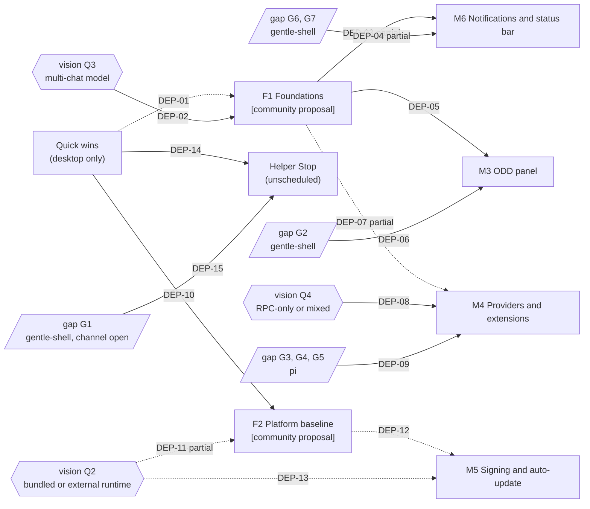

# Roadmap

> Status: draft (community proposal, awaiting maintainer validation).

> **Community proposal derived from the corpus.** The maintainer asked the community to present a roadmap, divide tasks and present PRs **[maintainer]** (Discord, Alan Buscaglia, 2026-09-27). This page is that roadmap, derived from the other corpus pages. The maintainer's milestone names M1 to M6 are kept as he wrote them. Every new milestone, every ordering and every exit criterion here is **[community proposal]**: ordering and scope need maintainer validation.

**In one paragraph.** The maintainer delivered M1 (chat core) and M2 (per-chat helpers) and named four more milestones: M3 ODD panel, M4 providers and extensions screens, M5 signing and auto-update, M6 notifications and status bar (`gentle-shell-desktop@5ab4a00:odd/tasks/desktop-m1-chat-core.md:22`; `gentle-shell-desktop@5ab4a00:README.md:3`, `:63-64`). The corpus adds two prerequisite milestones, **F1 Foundations** (several chats at once) and **F2 Platform baseline** (Windows, Linux and CI). The audit's risk table ties the single-session host (audit A3) to M3 and blocks Windows and Linux releases on audit A4, A16, A18 ([audit §Risks](03-architecture/audit.md#risks-for-scaling-the-ui), `03-architecture/audit.md:383`, `:386`); the M6 toasts about other chats also need several running chats (SCR-06 blockers, `06-ux/screens.md:148`). M4 is tied to audit A2 and A8, not to audit A3 (`03-architecture/audit.md:385`). It also lists **quick wins**: small desktop-only fixes that need no upstream change and no open decision.

## How to read this page

| Label | Meaning |
|---|---|
| **[maintainer]** | Stated in the maintainer's repository documents or Discord messages. |
| **[community proposal]** | Proposed by the corpus. Not decided. |
| `Inference:` | Reasoning from cited evidence, not a stated fact. |
| `UNVERIFIED:` | Checked but not confirmed. |

- **Citation keys.** `gentle-shell-desktop@5ab4a00:` is the desktop repo `main`; `gentle-shell@ac67159:` is gentle-shell `main` at `ac67159` (package version 4.0.0); `pi@a13d35a:` is pi 1.0.0. Refreshed 2026-10-03 from `gentle-shell@1162ce9` (3.7.0) and `pi@d86654a` (0.99.1); desktop issues #23–#25 and open PRs #26 and #27 were read on GitHub that day. `desktop-m1-chat-core.md` and `desktop-m2-helpers.md` are short for `gentle-shell-desktop@5ab4a00:odd/tasks/<file>`. Under [Quick wins](#quick-wins), paths that start with `src/`, `scripts/` or `.github/` are in `gentle-shell-desktop@5ab4a00`. Paths such as `03-architecture/audit.md:384` are corpus pages in `docs/`. `roadmap.txt:<line>` is memoTux's earlier roadmap (saved copy, not in the repository).
- **Qualified IDs.** IDs from other pages carry their page: `audit A4`, `gap G2`, `inventory S1`, `vision Q3`, `UX U3`, `ADR 0007`, `SCR-04`. A qualifier covers the IDs after it (`audit A3, A11`). Unqualified **M1–M6** are the maintainer's milestones, not inventory rows M1–M13. **F1**, **F2**, `QW-##` and `DEP-##` belong to this page; `PLAT-##` are the risks in [10-platforms.md](10-platforms.md#risks).
- **Repo checks.** "The repo checks" means `pnpm test`, `pnpm typecheck`, `pnpm build` and `pnpm smoke:electron`, the checks M2 used as acceptance criteria (`gentle-shell-desktop@5ab4a00:odd/tasks/desktop-m2-helpers.md:43`; scripts at `gentle-shell-desktop@5ab4a00:package.json:13-22`).
- **No dates and no effort estimates.** No corpus source gives any.

## At a glance

| Milestone | Label owner | Status | Gated by upstream | Gated by a decision |
|---|---|---|---|---|
| M1 Chat core | maintainer | delivered | — | — |
| M2 Per-chat helpers | maintainer | delivered | — | — |
| [Quick wins](#quick-wins) | community proposal | proposed | no | no |
| [F1 Foundations](#f1-foundations-several-chats-at-once-community-proposal) | community proposal | proposed | no | vision Q3 |
| [F2 Platform baseline](#f2-platform-baseline-community-proposal) | community proposal | proposed | no (optional gentle-shell signal) | vision Q2 |
| [M3 ODD panel](#m3-odd-progress-panel) | maintainer | planned | gap G2 (gentle-shell, `Inference:`) | — |
| [M4 Providers and extensions](#m4-providers-and-extensions-screens) | maintainer | planned | gap G3, G4, G5 (pi, `Inference:`) | vision Q4 |
| [M5 Signing and auto-update](#m5-signing-and-auto-update) | maintainer | planned | — | vision Q2 |
| [M6 Notifications and status bar](#m6-notifications-and-status-bar) | maintainer | planned | gap G6, G7 for part of it (gentle-shell, `Inference:`) | vision Q3 (through F1, for part of it) |

The suggested order is **quick wins → F1 and F2 in parallel → M6, M3, M4 and M5 as their gates clear** ([critical path](#critical-path)). This order is a **[community proposal]**; it does not renumber M3–M6.

## Milestones

Each milestone lists the same fields. Inventory rows refer to the [capability inventory](05-capability-inventory.md), screens to [06-ux/screens.md](06-ux/screens.md), gaps to [04 §Gaps](04-rpc-contract.md#gaps-the-desktop-needs), areas to [08-team.md](08-team.md#areas-of-responsibility). The upstream owner of each gap follows [02 §Where each change belongs](02-ecosystem.md#where-each-change-belongs), which is itself `Inference:`. Exit criteria are **[community proposal]** unless they cite the maintainer.

### Delivered: M1 and M2

| | M1 Chat core **[maintainer]** | M2 Per-chat helpers **[maintainer]** |
|---|---|---|
| Goal | List pi chats, start one, hold a plain-text conversation through `gentle-shell --mode rpc`, answer dialogs inline (`gentle-shell-desktop@5ab4a00:odd/tasks/desktop-m1-chat-core.md:7`). | A Helpers tab per chat with the subagents that chat started; never a global list (`gentle-shell-desktop@5ab4a00:odd/tasks/desktop-m2-helpers.md:7`). |
| Inventory rows done | inventory S3, C1, C2, C3, C15, C19, L1, Y1 (every row marked done in the [coverage summary](05-capability-inventory.md#coverage-summary)) | inventory A1, A2, A3, A5 (partial) |
| Screens | SCR-01, SCR-02, SCR-09 (partial) | SCR-03 (partial) |
| Evidence of delivery | Closed 2026-09-22 with 218 tests, typecheck, build, `pnpm package:mac` and `pnpm smoke:electron` (`desktop-m1-chat-core.md:61`, `:65`); merged to `main` as `874f30e` (`:71`). | 286 tests, typecheck and build green; end-to-end run against a real pi (`desktop-m2-helpers.md:57-59`); README lists it as done (`gentle-shell-desktop@5ab4a00:README.md:3`). |
| Left open by the maintainer | Advisory follow-ups (`desktop-m1-chat-core.md:67`). | Helper Stop (`desktop-m2-helpers.md:22`); open follow-ups (`:65`). See [quick wins](#quick-wins) and [unscheduled items](#unscheduled-maintainer-items). |

### F1 Foundations: several chats at once [community proposal]

| Field | Content |
|---|---|
| Goal | Run several chats at once, each with its own state, stable message identity and project folder, and tell the user which runtime versions are in use. |
| Why a new milestone | Audit A3 is the only High finding that blocks several surfaces: the mockup's "working" and "needs you" sidebar statuses and toasts about other chats cannot be built ([audit A3](03-architecture/audit.md#a3-single-session-host-with-positional-message-ids)). The audit's risk table ties audit A3 to several chats at once and to M3, and ties audit A8 to M3 and M4 (`03-architecture/audit.md:382-385`). Gap G9 is desktop work, not an upstream change (`04-rpc-contract.md:294`). memoTux's roadmap already called this the "gate" (`roadmap.txt:90`). |
| Inventory rows | inventory S1, S2, S3, S17, L3 |
| Screens | SCR-01, SCR-02, SCR-18 (versions only) |
| Audit findings resolved | audit A3, A11 (the part not in [QW-03](#qw-03-sidebar-refresh-and-new-chat-audit-a11-a1)), audit A1, in the audit's order (`03-architecture/audit.md:394-396`); then, in the audit's correctness order, audit A10 (`:403`), A8 (`:404`; only "read and show versions", since "warn below minimums" needs vision Q6) and A6 (`:406`). The thread reset of audit A13 (`:406`) is [QW-07](#qw-07-thread-stays-visible-while-switching-audit-a13), not F1. |
| Gaps and upstream owner | gap G9: desktop (`04-rpc-contract.md:294`). gap G10 (handshake): pi (`Inference:`, 02); F1 needs only the out-of-band `gentle-shell --version` (`gentle-shell@ac67159:bin/gentle-shell.mjs:1217-1219`). |
| Lead areas | Core and RPC contract (lead); Frontend (per-chat sidebar states and the project-folder prompt; the renderer parts of audit A11 and A13 are QW-03 and QW-07); QA (fixtures). 08 notes the audit A3 → A11 → A1 sequence is serial (`08-team.md:77`). |
| Exit criteria | 1. The repo checks pass. 2. Two chats run at once: chat A keeps working while chat B is opened and sent a prompt, and each sidebar entry shows its own state (SCR-01 states). 3. Every push and command carries a chat id (audit A3 recommendation 2), covered by IPC contract tests. 4. Message ids come from pi, not array positions, and survive a reload (audit A3 recommendation 4). 5. `PI_CODING_AGENT_DIR` is never mutated by the session list (audit A1), covered by a test with overlapping list calls. 6. "New chat" asks for a project folder and passes it as `cwd` (audit A10). 7. The app shows the gentle-shell and pi versions from `gentle-shell --version` (audit A8). 8. A new chat spawns its child on the first send, "instead of on mount" (audit A11 recommendation, `03-architecture/audit.md:243`). |
| Blocking open questions | **vision Q3** (one child per chat or a shared host; [ADR undecided](03-architecture/adr/README.md#undecided--not-recorded)). vision Q6 decides what happens below a minimum version; showing versions does not need it. audit A3 recommends one `PiSession` per open chat (`03-architecture/audit.md:114`); that is a recommendation, not a decision. |

### F2 Platform baseline [community proposal]

| Field | Content |
|---|---|
| Goal | The app starts from a normal launch on macOS, Windows and Linux, and CI proves the repo checks on each platform. |
| Why a new milestone | Windows and Linux releases are blocked by audit A4, A16, A18 (`03-architecture/audit.md:386`). Only macOS Apple silicon is tested (`gentle-shell-desktop@5ab4a00:README.md:7`). Platform risks PLAT-01, PLAT-04, PLAT-05, PLAT-09 and PLAT-10 name F2 as their home ([10-platforms §Risks](10-platforms.md#risks)). `Inference:` M5 signs builds; signing a build that cannot start on a platform has little value. |
| Inventory rows | inventory L5, U7 |
| Screens | SCR-09 |
| Audit findings resolved | audit A4 and A16 start as quick wins ([QW-01](#qw-01-windows-cmd-spawn-audit-a4), [QW-04](#qw-04-ci-workflow-audit-a16)); F2 adds the Windows CI job "once A4 lands", then audit A9 and A18 (`03-architecture/audit.md:408-413`). For the script part of audit A18, open PR #27 (not merged as of 2026-10-03) replaces the POSIX `dev:local-pi` script with `node scripts/dev-local-pi.mjs` (`03-architecture/audit.md:353`). |
| Gaps and upstream owner | None required. Optional: a machine-readable setup progress signal from the launcher, owned by gentle-shell (02 table, `02-ecosystem.md:146`; inventory L5). Without it, the audit's desktop-only option is to surface the launcher's stderr lines (audit A9). |
| Lead areas | Platform and distribution (lead); QA (Windows reproduction, CI); Upstream integration (only for the optional setup signal). |
| Exit criteria | 1. CI runs the repo checks on Linux (with xvfb) and on Windows (audit A16). 2. On Windows with an npm-installed launcher, a chat starts without `spawn EINVAL` or `spawn EFTYPE` (desktop issue #23), reproduced before and after the fix, also with a launcher or session path that contains spaces (audit A4; PLAT-01, PLAT-02). 3. A packaged macOS app finds the launcher when opened from Finder, without `GENTLE_SHELL_BIN` (audit A18; today's workaround at `gentle-shell-desktop@5ab4a00:README.md:52-58`; PLAT-09). 4. A new user without pi sees provisioning progress instead of an idle chat (audit A9). 5. `dev:local-pi` works on Windows (audit A18; open PR #27 proposes it). 6. On Windows, the first run explains a missing Go toolchain for gentle-ai (PLAT-04) and a missing Bash for pi (PLAT-05) instead of failing silently, per the mitigations in [10-platforms §Risks](10-platforms.md#risks). |
| Blocking open questions | **vision Q2** (bundled or external runtime; [ADR undecided](03-architecture/adr/README.md#undecided--not-recorded)). `Inference:` a bundled runtime would change how audit A18 and A9 are solved; 08 gives Platform the task of preparing evidence for that decision (`08-team.md:192`). audit A19 (two home choices, also on SCR-09) waits on vision Q7 and is not part of F2. Which Windows topology is the target (native, or the runtime in WSL) is also open ([10-platforms §Open questions](10-platforms.md#open-questions-for-the-maintainer), question 1). |

### M3 ODD progress panel

| Field | Content |
|---|---|
| Goal | **[maintainer]** "ODD progress" is part of the planned app (`gentle-shell-desktop@5ab4a00:README.md:3`, `:63`); M3 "needs the structured ODD document format" (`desktop-m2-helpers.md:69`). Panel content (feature, phase, tasks with evidence, checks) follows the mockup intent described in SCR-04. |
| Inventory rows | inventory O2, O3, O4, R5 |
| Screens | SCR-04 (links to SCR-14 and SCR-15 are `Inference:` navigation) |
| Audit findings resolved | None directly. Depends on audit A3 and A8 through F1 (`03-architecture/audit.md:383`). |
| Gaps and upstream owner | **gap G2** (structured ODD state): gentle-shell, as a `setWidget` payload, a custom message or a session entry with a documented schema; the channel is part of an open question ([ADR: Undecided](03-architecture/adr/README.md#undecided--not-recorded)) (`Inference:`, `02-ecosystem.md:143`; `04-rpc-contract.md:299`). Today only explicit `gentle_odd_phase` tool calls reach the host (`04-rpc-contract.md:287`). |
| Lead areas | Upstream integration (gap G2); Frontend; UX and design. |
| Exit criteria | 1. The repo checks pass. 2. With a gentle-shell that publishes structured ODD state, the panel of the open chat shows the feature, its phase, tasks with commit and test evidence, and checks, from a recorded real fixture (audit A16 asks for real fixtures). 3. With a gentle-shell that does not publish it, the panel shows an explicit "not available" state instead of staying empty (`Inference:` from audit A8's silent-degradation impact). |
| Blocking open questions | The gap G2 format itself (upstream design). `Inference:` the mockup's five steps need a mapping from gentle-shell's eight phases (inventory O2). Screens open question: is the panel always visible, or only when a feature document exists (`06-ux/screens.md:322`)? |

### M4 Providers and extensions screens

| Field | Content |
|---|---|
| Goal | **[maintainer]** In-app providers and extensions screens; until then users "sign in and manage packages through `gentle-shell` in the terminal" (`gentle-shell-desktop@5ab4a00:README.md:63`). |
| Inventory rows | inventory M1, M2, M4, M7, M8, M9, M10, M11, M12, I6, V4, V19 (SCR-07); inventory E1, E2, E4, E5, E6, E7, E8, E9, I1, I2, I3, A11, L4, L7, V10, H3 (SCR-08) |
| Screens | SCR-07, SCR-08 |
| Audit findings resolved | audit A2, once vision Q4 is decided (remove the in-process pi path, or pin it to gentle-shell's pi floor; audit A2). The risk table also ties M4 to audit A8 (`03-architecture/audit.md:385`); F1 covers only its version display, and the warning below a minimum waits on vision Q6. |
| Gaps and upstream owner | **gap G3** (sign-in), **gap G4** (persisted default model), **gap G5** (packages): pi, through a Contribution Proposal issue (`pi@a13d35a:.github/ISSUE_TEMPLATE/contribution.yml:1`); pi PRs need prior maintainer approval (`Inference:` for ownership, `02-ecosystem.md:142`; `pi@a13d35a:CONTRIBUTING.md:31-34`). Absence of these commands in pi 1.0.0 is verified (`04-rpc-contract.md:288-290`); pi 1.0.0 moves Radius sign-in to the top level of the interactive `/login`, with no RPC counterpart (gap G3; inventory M7). |
| Lead areas | Upstream integration (gap G3–G5); Core (data path per vision Q4); Frontend; UX and design. |
| Exit criteria | 1. The repo checks pass. 2. A user signs in to a provider from the app without opening the terminal (gap G3). 3. A default model chosen in the app applies to the next new chat (gap G4). 4. A package is installed, disabled and removed from the app, and the change shows in the next new chat (gap G5; "Changes apply to new chats" is mockup intent, SCR-08). 5. The user's pi `settings.json` is never edited (vision P3; `00-vision.md:74`). |
| Blocking open questions | **vision Q4** (RPC-only or mixed; "decides version coupling and how providers and extensions screens are built", `00-vision.md:130`; [ADR undecided](03-architecture/adr/README.md#undecided--not-recorded)). vision Q8 (how profiles appear; the mockup shows a profile next to the default model, SCR-07). vision Q1 (how complete these screens should be). |

### M5 Signing and auto-update

| Field | Content |
|---|---|
| Goal | **[maintainer]** "signing and auto-update (M5)" (`desktop-m1-chat-core.md:22`); "No signing, notarization or auto-update yet (M5)" (`gentle-shell-desktop@5ab4a00:README.md:64`). |
| Inventory rows | None. `Inference:` inventory L12 and H3 cover updating gentle-shell and pi, not the app. |
| Screens | SCR-18 (update notice, `Inference:`) |
| Audit findings resolved | The signing part of audit A18 (`gentle-shell-desktop@5ab4a00:electron-builder.yml:30`). `Inference:` depends on F2 for any Windows or Linux build: the risk table blocks "Windows and Linux releases" on audit A4, A16, A18 (`03-architecture/audit.md:386`), but does not name M5, and which platforms M5 covers is `UNVERIFIED` (exit criteria below). |
| Gaps and upstream owner | None. |
| Lead areas | Platform and distribution. |
| Exit criteria | 1. The repo checks pass in CI. 2. A signed and notarized macOS build opens without the right-click workaround (`gentle-shell-desktop@5ab4a00:README.md:58`). 3. An installed build updates itself to a newer release. `UNVERIFIED:` which platforms M5 covers and which update mechanism; no source states either. [10-platforms](10-platforms.md#open-questions-for-the-maintainer) asks the maintainer the platform question (question 4), and its risk PLAT-08 (unsigned builds blocked or flagged) names M5. |
| Blocking open questions | **vision Q2** (what the signed package contains depends on whether it ships its own runtime; `Inference:`). vision Q10 (product name; `Inference:` a signed bundle fixes the app's name). |

### M6 Notifications and status bar

| Field | Content |
|---|---|
| Goal | **[maintainer]** "notifications and status bar (M6)" (`desktop-m1-chat-core.md:22`). No further detail is recorded. Content follows the mockup intent described in SCR-05 and SCR-06. |
| Inventory rows | inventory V2, V3, V4, K3, K4, M1, M3, M5, P1, R1, O2 (SCR-05); inventory C20, V16, V18, A7 (SCR-06) |
| Screens | SCR-05, SCR-06 |
| Audit findings resolved | None directly. Partly depends on audit A3 through F1: toasts about other chats need several running chats (SCR-06 blockers, `06-ux/screens.md:148`), and the status bar "must follow the selected chat" (SCR-05 blockers, `06-ux/screens.md:136`). `Inference:` `notify` toasts (exit criterion 3) come from the open chat and do not need F1. |
| Gaps and upstream owner | gap G9: desktop (F1). **gap G7**: model, thinking level, cost and context are available over RPC today; cwd, branch and `ODD · RDD on` are not (`04-rpc-contract.md:292`); the missing fields are gentle-shell (`Inference:`, `02-ecosystem.md:143`). **gap G6** (profile): gentle-shell (`Inference:`). |
| Lead areas | Frontend; Core; Upstream integration (gap G6, G7); UX and design. |
| Exit criteria | 1. The repo checks pass. 2. When another chat asks a question, a toast names that chat and opens it on click (SCR-06; needs F1). 3. `notify` requests appear as toasts instead of being dropped (inventory C20; `gentle-shell-desktop@5ab4a00:src/main/domain/rpc/chatReducer.ts:180-184`). 4. The status bar follows the selected chat and shows model, effort, context and cost from `get_state` and `get_session_stats` (gap G7, available part). 5. Profile and RDD state appear once gentle-shell publishes them (gap G6, G7); until then they are absent, not guessed. |
| Blocking open questions | vision Q3 (through F1, for exit criteria 2 and 4). vision Q8 (profiles). |

### Unscheduled maintainer items

Items the maintainer recorded with no milestone number.

| Item | Source | Dependency | Owner of the dependency |
|---|---|---|---|
| **Helper Stop** (inventory A4, SCR-03) | Stop "is a no-op until gentle-agents exposes a stop command over RPC" (`desktop-m2-helpers.md:18`, `:22`; `gentle-shell-desktop@5ab4a00:README.md:62`) | gap G1; audit A5 first ("The desktop parser must be correct first", `03-architecture/audit.md:384`) | gentle-shell; the channel (pi's existing extension inputs, a new pi command type, or a gentle-shell channel of its own) is open (`Inference:`, `02-ecosystem.md:144`; [ADR: Undecided](03-architecture/adr/README.md#undecided--not-recorded)) |
| **Read the active pi theme** (inventory E6, V10) | Out of scope for M1: "reading the active pi theme (hardcode Gentleman-Cute tokens now)" (`desktop-m1-chat-core.md:22`; ADR 0009) | Theme data over RPC (inventory E6: pi), or reading the theme JSON files directly (`Inference:`, inventory V10) | pi, or none |

### Not scheduled [community proposal]

These need a maintainer decision before they can enter the roadmap.

| Item | Gate | Evidence |
|---|---|---|
| Steering and follow-up while the agent works (inventory C4, C5, C6, C7; audit A7) | vision Q5 (queue, steer or decline) | [ADR undecided: prompt while working](03-architecture/adr/README.md#undecided--not-recorded) |
| Inventory-derived screens SCR-10 to SCR-19 | vision Q1 (accessible or full-featured); screens open question on scope and order | `06-ux/screens.md:321` |
| Proposals 0001 to 0003 (graph view, interacting with a running node, post-hoc audit of finished helpers) | Status `proposed`; only the maintainer moves a proposal to `accepted` (`07-proposals/README.md:22`) | Need gap G8, G1 and inventory C4, A6, A12 (`07-proposals/README.md:11-13`) |
| Host service (proposal 0004): one local service for the Electron window, a browser tab and a future mobile app | vision Q9 (mobile or remote access in scope; its evidence carries the maintainer's web suggestion, `00-vision.md:135`), and the maintainer accepting [proposal 0004](07-proposals/0004-host-service.md) (status `proposed`, `07-proposals/README.md:14`, `:22`) | Depends on [F1](#f1-foundations-several-chats-at-once-community-proposal): runtime requirement B1 is F1's work ([0004, Runtime requirements](07-proposals/0004-host-service.md#runtime-requirements)); process placement and config location are [ADR undecided](03-architecture/adr/README.md#undecided--not-recorded) ([DEP-16](#dependencies-and-critical-path)) |
## Dependencies and critical path

Hexagons are maintainer decisions, slanted boxes are upstream gaps (owners per 02, `Inference:`). Solid edges rest on cited evidence; dashed edges are `Inference:`. Edges labelled "partial" gate only part of the target milestone; the table says which part. The Windows topology question (native, or the runtime in WSL; [10-platforms §Open questions](10-platforms.md#open-questions-for-the-maintainer), question 1) also gates F2 but has no node or edge here; see the [F2 blocking questions](#f2-platform-baseline-community-proposal). DEP-16 (host service, not scheduled) has no node or edge here.

| Edge | From → to | Evidence |
|---|---|---|
| DEP-01 | Quick wins → F1 | `Inference:` F1 rewrites the session host; CI ([QW-04](#qw-04-ci-workflow-audit-a16)) protects that refactor, since today "Regressions reach `main` unchecked" (audit A16). [QW-03](#qw-03-sidebar-refresh-and-new-chat-audit-a11-a1) delivers the renderer part of audit A11 early. |
| DEP-02 | vision Q3 → F1 | "Several chats at once: one child process per chat, or a shared host?" (`00-vision.md:129`); no document decides it ([ADR undecided](03-architecture/adr/README.md#undecided--not-recorded)). |
| DEP-03 | F1 → M6 (partial: exit criteria 2 and 4) | Toasts about other chats cannot be built with one session (audit A3 impact); SCR-06 blockers are audit A3 and gap G9 (`06-ux/screens.md:148`); the status bar "must follow the selected chat" (SCR-05 blockers, `06-ux/screens.md:136`). Exit criterion 3 (`notify` toasts) does not need F1 (`Inference:`, see M6). |
| DEP-04 | gap G6, G7 → M6 (partial: exit criterion 5) | Model, effort, cost and context are available; cwd, branch, profile and RDD state are not (`04-rpc-contract.md:291-292`). |
| DEP-05 | F1 → M3 | Risk table: "ODD panel (M3) \| A3, A8" (`03-architecture/audit.md:383`); SCR-04 blockers include audit A3. |
| DEP-06 | gap G2 → M3 | "plan M3 (ODD panel, needs the structured ODD document format)" (`desktop-m2-helpers.md:69`); gap G2 (`04-rpc-contract.md:287`). |
| DEP-07 | F1 → M4 (partial: version display) | Risk table: "Providers and extensions screens (M4) \| A2, A8" (`03-architecture/audit.md:385`). `Inference:` F1 covers only the "read and show versions" half of audit A8 (F1 exit criterion 7); "warn below minimums" (`03-architecture/audit.md:404`) needs vision Q6 (`00-vision.md:132`), and nothing in M4 needs several chats at once. |
| DEP-08 | vision Q4 → M4 | M4 needs "either more in-process pi (which makes A1 and A2 worse) or new RPC commands" (`03-architecture/audit.md:385`); vision Q4 (`00-vision.md:130`). |
| DEP-09 | gap G3, G4, G5 → M4 | No auth, default-model or package command in pi's RPC (`04-rpc-contract.md:288-290`); SCR-07 and SCR-08 blockers. |
| DEP-10 | Quick wins → F2 | The audit's platform order starts with audit A4, then A16, and adds a Windows CI job "once A4 lands" (`03-architecture/audit.md:410-411`). |
| DEP-11 | vision Q2 → F2 (partial: audit A18 and A9) | `Inference:` launcher discovery (audit A18) and provisioning (audit A9) change if the app ships its own runtime (`00-vision.md:128`; `08-team.md:192`). |
| DEP-12 | F2 → M5 | `Inference:` the risk table blocks "Windows and Linux releases \| A4, A16, A18" (`03-architecture/audit.md:386`) but does not name M5; which platforms M5 covers is `UNVERIFIED` (M5 exit criteria). |
| DEP-13 | vision Q2 → M5 | `Inference:` what a signed package contains depends on bundled or external runtime ([ADR undecided](03-architecture/adr/README.md#undecided--not-recorded)). |
| DEP-14 | Quick wins → Helper Stop | "The desktop parser must be correct first" (`03-architecture/audit.md:384`), which [QW-02](#qw-02-helper-statuses-and-tool-items-audit-a5) fixes. |
| DEP-15 | gap G1 → Helper Stop | No RPC command targets subagents (`04-rpc-contract.md:286`); Stop is disabled until one exists (`gentle-shell-desktop@5ab4a00:README.md:62`). |
| DEP-16 | F1, vision Q9, acceptance of proposal 0004 → host service (proposal 0004, not scheduled) | Proposal 0004 says its runtime requirement B1 "is the same work as" roadmap F1 (`07-proposals/0004-host-service.md:57`) and keeps open whether F1 comes before or after the extraction (design question 2, `:130`); [11, Migration path](11-host-service.md#migration-path) puts F1 first (`Inference:` there). Remote and mobile clients wait on vision Q9 (`00-vision.md:135`). |
### Critical path

`Inference:` with no durations in any source, this ranks paths by their gates, not by time.

1. **F1 is the hub for M3.** M3 depends on F1 in full (DEP-05); M6 depends on it for part of its exit criteria (DEP-03), and M4 only through the version display (DEP-07, `Inference:`). F1's only gate is one maintainer decision, vision Q3 (DEP-02). **Critical path: vision Q3 → F1 → M3, with gap G2 as M3's second gate (DEP-06).** Everything after the decision is in the desktop repository, except gap G2.
2. **M3 waits on gap G2** in gentle-shell, which the desktop's maintainer also builds (`gentle-shell@ac67159:README.md:351`; `08-team.md:283`). Proposing the gap G2 format can start now, in parallel with F1.
3. **M4 has the most external gates:** vision Q4 and three pi gaps (DEP-08, DEP-09); its F1 edge is partial and `Inference:`. pi auto-closes issues and PRs from new contributors by default and requires approval before a PR (`pi@a13d35a:CONTRIBUTING.md:23`, `:31-34`). Filing the Contribution Proposals (`pi@a13d35a:.github/ISSUE_TEMPLATE/contribution.yml:1`) early lets that review run in parallel with F1.
4. **M6 can start before F1.** `Inference:` its partial edges (DEP-03, DEP-04) leave exit criterion 3 free of both F1 and upstream work; the toasts about other chats and the selected-chat status bar wait on F1.
5. **M5 is off the critical path.** Its only edges, F2 and vision Q2 (DEP-12, DEP-13), are both `Inference:`; memoTux's roadmap also called it orthogonal ("M5 is orthogonal", `roadmap.txt:89`).

## Quick wins

A quick win here is a change that is **desktop-only** (no upstream change), **needs no open decision**, is **small** (one finding, a few files), and **fixes a cited audit finding or a maintainer follow-up**. All of them are **[community proposal]**.

**Test-first.** The maintainer's milestones ran strict TDD: "RED observed before implementation, GREEN, REFACTOR", with vitest (`desktop-m1-chat-core.md:27`; `desktop-m2-helpers.md:26`). Each quick win below names its RED test. Whether strict TDD is a rule for contributors is still open (`08-team.md:318`).

| # | Fix | Finding | Lead area |
|---|---|---|---|
| QW-01 | Route the Windows `.cmd` launcher through `cmd.exe` | audit A4 (High) | Platform, QA |
| QW-02 | Accept gentle-shell's helper statuses and tool items | audit A5 | Core, QA |
| QW-03 | Refresh the sidebar; make "New chat" always start a chat | audit A11, A1 (minimum) | Core, Frontend |
| QW-04 | CI workflow for the repo checks | audit A16 | Platform, QA |
| QW-05 | Harden CSP, navigation and IPC arguments | audit A14 (part) | Core, Frontend |
| QW-06 | Mock bridge only in `dev:web`; smoke asserts the real bridge | audit A15 | Frontend, Platform |
| QW-07 | Clear the thread when switching chats | audit A13 | Frontend, Core |
| QW-08 | Remove a dialog card when its timeout expires | audit A12 | Core, Frontend |
| QW-09 | Close the maintainer's open follow-ups | M1 and M2 follow-ups | Core, Frontend |
| QW-10 | Fix structure drift | audit A17 | Core, Frontend |
| QW-11 | Issue forms and CONTRIBUTING | [issue #28, "Author's framing: facts checked before writing"](https://github.com/Gentleman-Programming/gentle-shell-desktop/issues/28); `08-team.md:214` | Docs and community |

### QW-01. Windows `.cmd` spawn (audit A4)

- **Files.** `gentle-shell-desktop@5ab4a00:src/main/adapters/nodeProcessSpawner.ts:10` (spawn without `shell`); `gentle-shell-desktop@5ab4a00:src/main/adapters/launcherLocator.ts:48` (picks `gentle-shell.cmd` first on win32).
- **Prior art.** gentle-shell solved the same failure: `planSpawn` routes `.cmd`/`.bat` on win32 through the shell as one quoted command line (`gentle-shell@ac67159:lib/gentle-shell-launcher.ts:969-1019`), with tests (`gentle-shell@ac67159:tests/gentle-shell-launcher.test.ts:1583-1631`); `planSpawn` is unchanged from 3.7.0 (`1162ce9`) through the 4.0.0 release (`1f35ab1`) and `main` (`ac67159`) (audit A4). Open PR #26 (head `615dd87`, not merged as of 2026-10-03) sets `shell: true` for a win32 `.cmd`/`.bat` command and always `windowsHide: true`, but passes the command and arguments unquoted. No PR #26 test checks quoting: one test passes a pre-quoted `.cmd` path and checks only `shell`; the others check `shell`, the spawn options (`windowsHide`, `env`, `cwd`, `stdio`), stdout line splitting, the exit code and a spawn error (PR diff read on GitHub, 2026-10-03; audit A4; PLAT-02).
- **Why no upstream or decision.** The bug and the fix are in the desktop's spawner (02 lists "Windows spawn (audit A4)" as desktop work, `02-ecosystem.md:148`).
- **Test-first.** RED: a unit test that a win32 `.cmd` command yields a shell plan with quoted tokens, with `platform` injected (audit A4 recommendation). Reproduce on Windows before and after; desktop issue #23 reports the failure with reproduction steps, but the corpus authors have not reproduced it (audit A4; a tester reported `spawn EINVAL`, `08-team.md:249`). `Inference:` (not run) PR #26 does not meet this quoted-token criterion, so QW-01 stays open; the PR can satisfy it by adding the quoting and the test.

### QW-02. Helper statuses and tool items (audit A5)

- **Files.** `gentle-shell-desktop@5ab4a00:src/main/domain/rpc/helpersActivity.ts:21` (status set), `:107-108` (requires `callId`), `:139-141` (drops unknown statuses); `src/renderer/features/helpers/components/HelperThread.tsx:24` (`callId` as key); `src/shared/bridge-types.ts:131-138`; fixture `src/main/domain/rpc/__fixtures__/helpers-activity.jsonl`; `src/renderer/shared/bridge/mockBridge.ts:359`.
- **Why no upstream or decision.** gentle-shell already publishes `completed` and `timed_out` and tool items without `callId` (`gentle-shell@ac67159:lib/agents-protocol.ts:9-17`, `lib/agents-rpc-publisher.ts:96-105`; both files unchanged from 3.7.0 (`1162ce9`) through the 4.0.0 release (`1f35ab1`) and `main` (`ac67159`)). The desktop must accept what is on the wire. The audit gives the mapping: `completed` to done, `timed_out` kept distinct, `callId` optional, key by index.
- **Test-first.** RED: parser tests with a frame whose task is `completed`, one `timed_out`, and a tool item without `callId`; today all three are dropped (audit A5). Replace the fixture with recorded real `gentle-agents.activity/v1` output (audit A5, A16).

### QW-03. Sidebar refresh and new chat (audit A11, A1)

- **Files.** `gentle-shell-desktop@5ab4a00:src/renderer/features/chats/ChatsContainer.tsx:29-44` (lists once on mount); `src/renderer/app/App.tsx:9`, `:58-60` (one shared `NEW_CHAT` object); `src/renderer/features/conversation/ConversationContainer.tsx:81-95` (open effect keyed on that object); `src/main/adapters/piSessionStore.ts:32-39` (env mutation).
- **Scope.** Refresh the list after a new chat and after each completed turn; create a fresh selection per "New chat" click (audit A11). First serialize `listAll()` calls, the audit's minimum for audit A1. `Inference:` more refreshes mean more overlapping `listAll()` calls, which is the audit A1 race trigger (`03-architecture/audit.md:63`, `:67`).
- **Deviation from the audit's order.** The audit orders audit A3 before A11 (`03-architecture/audit.md:394-395`). `Inference:` these parts of audit A11 touch only the renderer and the list adapter, not the session host, so they need not wait for audit A3. "Spawn on first send" stays in F1, because it changes the host.
- **Test-first.** RED: a `ChatsContainer` test that a new chat appears without remounting once its first turn completes (pi 1.0.0 writes a session file only when it holds a user or assistant message, `pi@a13d35a:packages/coding-agent/src/core/session-manager.ts:1161`, so a refresh right after "New chat" finds nothing new); an `App` test that two "New chat" clicks start two chats; a `piSessionStore` test that two overlapping calls never leave `PI_CODING_AGENT_DIR` set.

### QW-04. CI workflow (audit A16)

- **Files.** A new workflow under `.github/`, which today holds only issue templates (audit A16).
- **Scope.** Run `pnpm test`, `pnpm typecheck`, `pnpm build` and `smoke:electron` under xvfb on Linux; add Windows once QW-01 lands (audit A16).
- **Why no upstream or decision.** No source records a decision against CI. `Inference:` GitHub Actions is the natural host for a GitHub repository; the corpus notes no CI provider is chosen yet (`08-team.md:207`), so the PR itself is where the maintainer accepts or changes it.
- **Test-first.** Not applicable: this is configuration. The proof is a green run on the PR that adds it, and a red run on a branch with a deliberately failing test.

### QW-05. CSP, navigation and IPC hardening (audit A14, part)

- **Files.** `gentle-shell-desktop@5ab4a00:src/renderer/index.html:7` (`'unsafe-eval'` in the production CSP), `:11-16` (fonts from Google at runtime); `src/main/index.ts:97-102` (window-open handler; no `will-navigate` guard exists); `src/main/ipc/registerHandlers.ts:28-37` (arguments used as-is).
- **Scope.** Drop `'unsafe-eval'`, bundle the fonts, add a `will-navigate` deny handler, validate IPC arguments (audit A14). **Not included:** enabling the sandbox, because whether the ESM preload allows it is `UNVERIFIED` (audit A14).
- **Why no upstream or decision.** All four are desktop configuration with an audit recommendation and no product trade-off.
- **Test-first.** RED: `registerHandlers` tests that reject malformed arguments; a test for the navigation handler. `UNVERIFIED:` whether any dependency needs `eval`; `pnpm smoke:electron` would show a failure at runtime.

### QW-06. Mock bridge in packaged builds (audit A15)

- **Files.** `gentle-shell-desktop@5ab4a00:src/renderer/shared/bridge/useBridge.ts:10-12` (falls back to the mock whenever `window.gentle` is missing); `scripts/smoke-electron.mjs:39-56` (passes on text the mock also renders).
- **Test-first.** RED: a `useBridge` test that, outside the `dev:web` build, a missing bridge yields an explicit error instead of the mock; the smoke check asserts `window.gentle` exists (audit A15).

### QW-07. Thread stays visible while switching (audit A13)

- **Files.** `gentle-shell-desktop@5ab4a00:src/renderer/features/conversation/ConversationContainer.tsx:81-95` (clears only the error on a switch).
- **Test-first.** RED: a `ConversationContainer` test that, after selecting another chat and before the open call resolves, the previous chat's messages are not shown (audit A13).

### QW-08. Dialog timeouts (audit A12)

- **Files.** `gentle-shell-desktop@5ab4a00:src/main/domain/rpc/codec.ts:161` (decodes `timeout`); `src/main/domain/rpc/chatReducer.ts:167-179` and `src/shared/bridge-types.ts:70-82` (drop it).
- **Test-first.** RED: a reducer test that a dialog with `timeout` carries it into `Dialog`, and a component test that the card is removed when it expires (audit A12). A countdown is the audit's suggestion; its look belongs to UX.

### QW-09. The maintainer's open follow-ups

- **Source.** **[maintainer]** M2 lists open follow-ups: history-response correlation with no pending request; the history wait resolving on error or exit; the Earlier group auto-expanding when the selection moves into it; tests for unparseable timestamps and `openedAt` wiring (`desktop-m2-helpers.md:65`). M1 lists two for M2: `ChatHost.stop()` must swallow a rejected start chain; strip Electron's "Error invoking remote method" prefix from the first-run error text (`desktop-m1-chat-core.md:67`).
- **Status.** A search of `src/` at `5ab4a00` for "Error invoking remote method" finds nothing, so `Inference:` the prefix is not stripped yet. `Inference:` the `ChatHost.stop()` follow-up appears done (code read, not run): `startChain` starts resolved and is reassigned after each start to a promise that never rejects (`src/main/domain/session/ChatHost.ts:79`, `:149-152`), and `stop()` awaits it before stopping the session (`:137-140`).
- **Test-first.** Each item is a behavior with a clear expected result, so each starts with a RED test, as the M1 and M2 tasks did.

### QW-10. Structure drift (audit A17)

- **Files.** `gentle-shell-desktop@5ab4a00:src/main/domain/home/home.ts:1-3` (Node imports in the domain); `src/renderer/app/App.tsx:21-23` (cites a "Selected chat" note that does not exist); `src/main/domain/index.ts:8-9`, `:16-18` (stale placeholder); `src/renderer/shared/markdown/Markdown.tsx:11-14` (shared module with one consumer).
- **Test-first.** Refactoring under green tests; the `home.ts` port gets a unit test with a fake file system. For the Markdown module the audit allows either moving it or recording the exception (audit A17).

### QW-11. Issue forms and CONTRIBUTING

- **Files.** `gentle-shell-desktop@5ab4a00:.github/ISSUE_TEMPLATE/bug_report.yml:2`, `:30`, `:57` and `feature_request.yml:2` still name gentle-pi. `CONTRIBUTING.md` does not exist on `main`; a skeleton was added on the corpus branch (commit `3ba60c0`) and is corpus task C10 (`odd/tasks/docs-corpus.md:36`).
- **Why no decision.** The forms' names and descriptions call the product gentle-pi; the "gentle-pi version" field (`.github/ISSUE_TEMPLATE/bug_report.yml:57`) stays useful, because the launcher ships with gentle-pi 3.7.0 or newer (`gentle-shell-desktop@5ab4a00:README.md:12`). `Inference:` the forms also need a field for the desktop app's version, which they lack today. CONTRIBUTING can record the practice the maintainer's documents already record ([08 §Contribution flow](08-team.md#contribution-flow)) and the dev commands in the README (`gentle-shell-desktop@5ab4a00:README.md:95-116`). The open governance questions (who merges, strict TDD for contributors, RDD for community PRs; `08-team.md:316-318`) stay listed as open, not answered.
- **Test-first.** Not applicable (documentation). Structural readback; the forms render in GitHub's issue chooser.

### Considered, not quick wins

| Finding | Why not | Where it goes |
|---|---|---|
| audit A6 (non-assistant messages dropped) | The audit's fix reconciles messages "by message identity (A3)" (audit A6), so it needs stable ids first. Low today; rises to Medium once steering lands. | F1 |
| audit A14, sandbox part | `UNVERIFIED:` whether the ESM preload allows the sandbox (audit A14). | Investigate first; then hygiene |
| audit A8 (versions) | Showing versions is small, but warning "below a minimum" needs a compatibility policy (vision Q6). | F1 |
| audit A10 (project folder per chat) | Changes "New chat" and the spawn in the session host, which F1 rewrites. | F1 |
| audit A9, A18 | Each changes first-run or launcher discovery, which vision Q2 may reshape. | F2 |
| audit A7, A19, A2 | Each waits on a decision: vision Q5, Q7, Q4. | Not scheduled, F2 note, M4 |

## Relation to the earlier community roadmap (roadmap.txt)

memoTux wrote the first community roadmap, deduced from the README and the M1 and M2 documents (`roadmap.txt:3-7`). `roadmap.txt` is the file memoTux attached to the Discord thread "Gentle Desktop" (Gentleman Programming Discord) on 2026-09-29; every `roadmap.txt:<line>` citation in this page refers to that file. This page builds on it. Its claims were checked against the code and the maintainer's documents ([issue #28, "Author's framing: facts checked before writing"](https://github.com/Gentleman-Programming/gentle-shell-desktop/issues/28)).

| | What | Evidence |
|---|---|---|
| **Kept** | The maintainer's milestone names and order, M1 to M6 (`roadmap.txt:16-58`), except that memoTux's roadmap renames M5 "Serious distribution" (`roadmap.txt:46`); this page uses the maintainer's "signing and auto-update". | `desktop-m1-chat-core.md:22` |
| **Kept** | The two-data-paths debt and the single-session host as the gate to any multi-chat work (`roadmap.txt:64-70`, `:90`). They are audit A1 and A3, and F1 here. | [audit A1](03-architecture/audit.md#a1-two-data-paths-to-pi-and-a-global-pi_coding_agent_dir-mutation), [audit A3](03-architecture/audit.md#a3-single-session-host-with-positional-message-ids) |
| **Kept** | Helper Stop as an external dependency (`roadmap.txt:71-72`); M5 as orthogonal (`:89`); the small M2 follow-ups (`:73-75`). Its fourth follow-up, "surface old-gentle-pi detection in the UI" (`:75-76`), is not among the M2 follow-ups (`desktop-m2-helpers.md:65`); here it is audit A8, in F1. | `desktop-m2-helpers.md:22`, `:65`; QW-09; F1 |
| **Corrected** | "never to pi's module graph" and "a versioned contract" (`roadmap.txt:13-14`). The desktop imports pi in-process to list sessions, and the protocol has no version handshake. | `gentle-shell-desktop@5ab4a00:src/main/adapters/piSessionStore.ts:30`; [04 §Versioning](04-rpc-contract.md#is-there-a-version-handshake) |
| **Corrected** | The follow-ups cite "`system-design.md` §13" (`roadmap.txt:97`). That file does not exist; they come from the M2 document. | `desktop-m2-helpers.md:57`, `:65` |
| **Corrected** | The Playwright smoke is listed under M2 (`roadmap.txt:25-27`). It was added in M1 T6. | `desktop-m1-chat-core.md:61` |
| **Corrected** | "gentle-pi must first publish that structured format" for M3 and "no RPC commands for this exist yet" for M4 (`roadmap.txt:37-38`, `:44`) are stated as facts; the repository states neither. The corpus now verifies that pi 1.0.0 has no auth, default-model or package command over RPC. That such commands belong to pi, not the launcher, and that gap G2 belongs to gentle-shell, remain `Inference:`. | `04-rpc-contract.md:287-290`, `:299`; `02-ecosystem.md:142-143` |
| **Corrected** | M5 "resolves" the empty `PATH` from Finder (`roadmap.txt:51-52`). `Inference:` signing does not change `PATH`; the audit fixes it separately, by resolving the login-shell `PATH` or saving a launcher path. | audit A18 recommendation; F2 |
| **Corrected** | The active pi theme sits under M6 (`roadmap.txt:57-58`). The M1 document lists it as a separate deferral with no number. | `desktop-m1-chat-core.md:22`; [unscheduled items](#unscheduled-maintainer-items) |
| **Added** | F1 and F2 as prerequisite milestones; per-milestone gaps with upstream owners, decisions, areas and exit criteria; the dependency graph; quick wins, including the Windows spawn failure (audit A4). | This page |

## Open questions for the maintainer

- Do you accept F1 and F2 as milestones ahead of M3–M6, or should their work fold into M3 and M6?
- Which decisions can be taken first? vision Q3 gates F1, and F1 gates M3 and part of M6.
- Should the group file the pi Contribution Proposals for gap G3–G5 and the gentle-shell issue for gap G2 now, in parallel with F1?
- Are quick wins welcome as small standalone PRs, outside a milestone chain?

## Sources read

[issue #28](https://github.com/Gentleman-Programming/gentle-shell-desktop/issues/28) ("Author's framing" sections); `roadmap.txt` (memoTux's attachment in the Discord thread "Gentle Desktop", 2026-09-29); `docs/README.md`, `docs/00-vision.md`, `docs/02-ecosystem.md`, `docs/03-architecture/audit.md`, `docs/03-architecture/adr/README.md`, `docs/04-rpc-contract.md` (gaps, upstream process), `docs/05-capability-inventory.md` (coverage summary, columns, row IDs and status cells), `docs/06-ux/screens.md`, `docs/06-ux/principles.md` and `design-system.md` (headings), `docs/07-proposals/` (index and headings), `docs/08-team.md`; `gentle-shell-desktop@5ab4a00:README.md`, `odd/tasks/desktop-m1-chat-core.md`, `odd/tasks/desktop-m2-helpers.md`, `package.json`, `.github/ISSUE_TEMPLATE/*.yml`, and the source files cited under [Quick wins](#quick-wins); `odd/tasks/docs-corpus.md` on `docs/corpus`; `gentle-shell@ac67159:lib/gentle-shell-launcher.ts:969-1019`, `tests/gentle-shell-launcher.test.ts` (search for `planSpawn`). Refresh of 2026-10-03: `docs/10-platforms.md` (risks, open questions), the refreshed `docs/00-vision.md`, `docs/02-ecosystem.md`, `docs/03-architecture/audit.md`, `docs/04-rpc-contract.md` and `docs/05-capability-inventory.md`; desktop PRs #26 and #27 and issues #23–#25 on GitHub; `pi@a13d35a:CONTRIBUTING.md`, `packages/coding-agent/src/core/session-manager.ts`.
