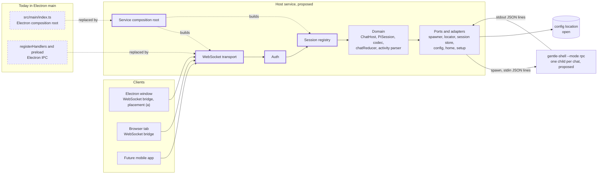

# Host service architecture

> Status: draft (community proposal, awaiting maintainer validation).

> **[community] proposal, not current state.** This page details the architecture of the shared local host service proposed in [proposal 0004](07-proposals/0004-host-service.md). Nothing here exists in the desktop repository today, and nothing here is decided. The current architecture is in [03-architecture/current.md](03-architecture/current.md).

**In one paragraph.** **[community]** The host service is one local process that owns every chat session, spawns one `gentle-shell --mode rpc` child per chat, normalizes their output once, and serves Electron, a browser tab and a future mobile app over one WebSocket protocol ([proposal 0004](07-proposals/0004-host-service.md#proposal)). Most of it already exists in the desktop's main process: the domain, ports and adapters do not import Electron, and only the composition root, the IPC handlers and the preload do. What is missing is a session registry, a transport, authentication and a composition root that runs without Electron. Six runtime requirements (B1–B6) come first; four of them are desktop fixes that are useful without any service. Where the service runs and where it keeps its configuration are open questions.

## How to read this page

| Label | Meaning |
|---|---|
| **[maintainer]** | Stated in the maintainer's desktop repo documents or Discord messages. |
| **[community]** | Proposed by the community. Not decided. |
| `Inference:` | Reasoning from cited evidence, not a stated fact. "(not run)" means nothing was built or executed. |
| `UNVERIFIED:` | Checked but not confirmed. |

- **Citation keys.** Paths with no repository prefix are in `gentle-shell-desktop@5ab4a00` (the source is unchanged on this branch). Other repositories use `repo@shortsha:path:line`: `gentle-shell@ac67159` (gentle-shell `main`, package version 4.0.0), `paseo@485221b` and `t3code@eac52f0`. Corpus pages are linked by relative path.
- **Qualified IDs.** IDs from other pages carry their page: `audit A3`, `gap G9`, `vision Q3`, `ADR 0008`, `roadmap F1`, `milestone M5`, `QW-06`. **B1–B6** are the runtime requirements of [proposal 0004](07-proposals/0004-host-service.md#runtime-requirements) and are written bare on this page.
- **Method.** Static reading only, as in the [audit](03-architecture/audit.md#method-and-scope). Nothing was prototyped.

## At a glance

| Question | Answer | Evidence |
|---|---|---|
| What is it? | **[community]** One local process between every Gentle Shell UI and `gentle-shell --mode rpc`: session registry, children, one versioned WebSocket protocol, authentication. | [proposal 0004](07-proposals/0004-host-service.md#proposal) |
| How much of the desktop does it reuse? | The domain, the ports and the adapters. Electron is imported by 3 source files only, and one of them imports types only. Seven of those modules are reused but changed by B1, B2, B3, B5 or B6; the rest are reused unchanged. | [Component map](#component-map-current-to-service) |
| What does it replace? | The Electron composition root and the IPC layer (handlers and preload) as the way clients reach sessions (under placement (a)). | `src/main/index.ts:2`; `src/main/ipc/registerHandlers.ts:27-46`; `src/preload/index.ts:1-4` |
| What is new? | A service composition root, a WebSocket transport, a session registry and authentication. | [Component map](#component-map-current-to-service) |
| What must change first? | B1–B6. B1, B2, B5 and B6 are desktop fixes that are useful anyway; B3 and B4 are part desktop fix, part service-only. | [What must change first](#what-must-change-first) |
| Does the RPC contract change? | No. The service spawns the same child with the same arguments. | [04-rpc-contract.md](04-rpc-contract.md); `src/main/domain/session/PiSession.ts:127-135` |
| Where does it run? | Open: a separate process, or embedded in Electron main. | [Process placement (open)](#process-placement-open) |
| Where does it keep its configuration? | Open. Today the home choice is under Electron's `userData`. | [Config and state location (open)](#config-and-state-location-open) |

## Responsibilities

| Responsibility | What the service does | Where it lives today | Evidence |
|---|---|---|---|
| **Session registry** | Keeps every open chat, keyed by chat, with its own child and state; every push and command names its chat (B1). | `ChatHost` holds one `current` session and stops it before starting the next one. | `src/main/domain/session/ChatHost.ts:70`, `:156-157`; [audit A3](03-architecture/audit.md#a3-single-session-host-with-positional-message-ids) |
| **Runtime** | Spawns `gentle-shell --mode rpc`, one child per chat as proposed (pending [vision Q3](00-vision.md#open-questions-for-the-maintainer)). The contract with gentle-shell is [04-rpc-contract.md](04-rpc-contract.md), unchanged. | `PiSession` builds `[...launcher.args, ...homeArgs, "--mode", "rpc", "--session", path?]`, merges `GENTLE_SHELL_INTERACTIVE_HOST=1` into the environment, and spawns through the `ProcessSpawner` port. | `src/main/domain/session/PiSession.ts:67`, `:127-135`; [ADR 0005](03-architecture/adr/0005-gentle-shell-rpc-child-process.md), [ADR 0012](03-architecture/adr/0012-interactive-host-env-flag.md) |
| **Event normalization** | Decodes each child's JSON lines and folds them into `ChatState`, including the helpers feed, once for every client. | In main's domain: `decodeLine`, `reduceChat`, and the activity parser `parseHelpersActivity`, which `reduceChat` calls for the `gentle-agents` widget. | `src/main/domain/rpc/codec.ts:68`; `src/main/domain/rpc/chatReducer.ts:52`, `:196-207`; `src/main/domain/rpc/helpersActivity.ts:38`; `src/shared/bridge-types.ts:122-129` |
| **Session listing** | Lists pi sessions for the sidebar and maps a chat id to its session file. | `ChatHost.listChats` and `openChat` call the `SessionStore` port; the adapter imports pi in-process. | `src/main/domain/session/ChatHost.ts:95-108`; `src/main/adapters/piSessionStore.ts:27-42` |
| **Setup and home choice** | Answers whether to show the first-run choice and stores the choice. | `SetupService` port and adapter; [ADR 0008](03-architecture/adr/0008-first-run-home-choice.md). | `src/main/ports/index.ts:94-97`; `src/main/adapters/setupService.ts:15-41` |
| **Config** | Reads and writes the persisted choice. | `AppConfigStore` writes `{home}` to a path it is given. | `src/main/adapters/appConfigStore.ts:11-20`, `:34-39`; `src/main/index.ts:52` |
| **Client protocol endpoint** | Exposes one versioned protocol to many clients at once. Frames, versioning and the push model are specified in the [Host protocol](12-host-protocol.md) document. | Electron IPC: 8 request channels and 2 push channels. | `src/shared/ipc-channels.ts:8-23`; `src/main/ipc/registerHandlers.ts:28-40` |
| **Authentication** | Binds to loopback by default; any other bind requires a token or device pairing, and every connection checks `Origin` ([proposal 0004](07-proposals/0004-host-service.md#proposal)). Details are deferred to the [Host protocol](12-host-protocol.md) document. | None: IPC handlers trust the renderer's arguments. | `src/main/ipc/registerHandlers.ts:28-37`; [audit A14](03-architecture/audit.md#a14-preload-and-ipc-hardening) |

`Inference:` normalizing in the service means every client receives the same `ChatState` and none of them parses the RPC stream or the activity schema. A fix to the parser (B5) then reaches every client at once.

## Component map, current to service

Boxes in 'Today in Electron main' and 'Host service, proposed' map to table rows: solid = reused, dashed = replaced, bold = new. Clients, the child and the config store are context.

### Why the split is clean

- **Electron is imported by 3 source files.** `src/main/index.ts:2` and `src/preload/index.ts:1` import it at runtime. `src/main/ipc/registerHandlers.ts:1` imports types only, and its comment says the file "never executes `require("electron")` at module load time" (`:11-13`). The only other match is a type import in a test (`src/main/ipc/registerHandlers.test.ts:2`). Method: `git grep` for `electron` imports and `require` calls over `src/` at `5ab4a00`.
- **The domain depends on ports.** The ports exist "so the domain never imports Electron/Node APIs directly" (`src/main/ports/index.ts:3-5`). `ChatHost` and `PiSession` import only ports, shared types and other domain modules (`src/main/domain/session/ChatHost.ts:1-6`; `src/main/domain/session/PiSession.ts:1-6`).
- **The tests already run under Node.** Vitest's default environment is `node` (`vitest.config.ts:5-6`, `:21`), and the `ChatHost` tests use fake ports (`src/main/domain/session/ChatHost.test.ts:3-4`).
- **The launcher locator already works under plain Node.** A `GENTLE_SHELL_BIN` JS entry runs under `process.execPath` with `ELECTRON_RUN_AS_NODE=1` (`src/main/adapters/launcherLocator.ts:38-41`); the port documents that flag as "Harmless (and unread) when this app runs under plain Node" (`src/main/ports/index.ts:43-44`).
- **One domain module uses Node directly.** `home.ts` imports `node:fs`, `node:os` and `node:path` (`src/main/domain/home/home.ts:1-3`; [audit A17](03-architecture/audit.md#a17-drift-from-the-stated-structure-rules)). `Inference:` that breaks the domain's purity rule, but not portability: Node is what the service runs on.

### Classification of `src/main`

Classes assume placement (a). Under placement (b), `index.ts` stays as the Electron root and calls the shared plain-Node function, and `registerHandlers.ts`, `ipc/index.ts`, `ipc-channels.ts` and `src/preload/index.ts` stay as the Electron window's endpoint beside the WebSocket transport.

| Module | Class | Electron coupling | Changed by | Evidence |
|---|---|---|---|---|
| `domain/rpc/types.ts`, `codec.ts` | reused unchanged | none | — | `src/main/domain/rpc/types.ts:27`, `:144`; `src/main/domain/rpc/codec.ts:12`, `:22`, `:68` |
| `domain/rpc/chatReducer.ts` | reused, changed by B1 | none | B1 (message ids) | `src/main/domain/rpc/chatReducer.ts:1-11`, `:52`, `:85` |
| `domain/rpc/helpersActivity.ts` | reused, changed by B5 | none | B5 | `src/main/domain/rpc/helpersActivity.ts:21`, `:38` |
| `domain/rpc/history.ts` | reused, changed by B1 | none | B1 (message ids) | `src/main/domain/rpc/history.ts:1-2`, `:20-27` |
| `domain/session/PiSession.ts` | reused unchanged | none; it already accepts a `cwd` | — | `src/main/domain/session/PiSession.ts:1-6`, `:15`, `:135` |
| `domain/session/ChatHost.ts` | reused, changed by B1, B6 | none | B1 (its single `current` is what the registry replaces), B6 | `src/main/domain/session/ChatHost.ts:1-6`, `:70`, `:159-166` |
| `domain/session/sessionList.ts` | reused, changed by B1 | none | B1 (every listed chat is `idle` today) | `src/main/domain/session/sessionList.ts:20-22`, `:35` |
| `domain/home/home.ts` | reused unchanged | none (Node only) | — | `src/main/domain/home/home.ts:1-4` |
| `domain/lifecycle/boundedStop.ts`, `domain/index.ts` | reused unchanged | none | — | `src/main/domain/lifecycle/boundedStop.ts:1-8`; `src/main/domain/index.ts:1-4` |
| `ports/index.ts` | reused unchanged | none | — | `src/main/ports/index.ts:1-5` |
| `adapters/nodeProcessSpawner.ts` | reused unchanged | none (`node:child_process`) | — | `src/main/adapters/nodeProcessSpawner.ts:1-7` |
| `adapters/launcherLocator.ts` | reused, changed by B3 | none; the Electron flag is unread under plain Node | B3 (version read) | `src/main/adapters/launcherLocator.ts:1-3`, `:38-41`; `src/main/ports/index.ts:43-44` |
| `adapters/piSessionStore.ts` | reused, changed by B2 | none | B2 | `src/main/adapters/piSessionStore.ts:1`, `:30-39` |
| `adapters/appConfigStore.ts` | reused unchanged | none; its path is injected | — (only the injected path depends on the open config location) | `src/main/adapters/appConfigStore.ts:11-20` |
| `adapters/homeSettings.ts`, `setupService.ts`, `adapters/index.ts` | reused unchanged | none | — | `src/main/adapters/homeSettings.ts:1-11`; `src/main/adapters/setupService.ts:1-6`; `src/main/adapters/index.ts:5-10` |
| `index.ts` (composition root) | **replaced** | Electron `app`, `userData`, `BrowserWindow`, `ipcMain`, `shell`, app lifecycle | — | `src/main/index.ts:2`, `:36-37`, `:52`, `:74-114`, `:116-139` |
| `ipc/registerHandlers.ts`, `ipc/index.ts` | **replaced** | Electron IPC types; per-window `webContents.send` pushes | B4 (argument validation) | `src/main/ipc/registerHandlers.ts:1`, `:27-46`; `src/main/ipc/index.ts:4` |
| Service composition root | **new** | none | — | — |
| WebSocket transport | **new** | none | B3 (protocol version), B4 | — |
| Session registry | **new** | none | B1 | — |
| Auth | **new** | none | B4 | — |

Outside `src/main`:

| Module | Class | Note | Evidence |
|---|---|---|---|
| `src/preload/index.ts` | **replaced** as the service's client endpoint | Exposes the bridge on `window.gentle` over Electron IPC. `Inference:` it survives as a renderer bridge only if the Electron window keeps talking to an in-process host (placement (b)). | `src/preload/index.ts:1-4` |
| `src/preload/bridge.ts` | reused as a pattern | `createBridge` implements `GentleBridge` over an injected `RendererIpc`, without importing Electron. `Inference:` a WebSocket bridge can follow the same shape over a socket. | `src/preload/bridge.ts:1-2`, `:10-19` |
| `src/shared/bridge-types.ts` | reused, changed by B1 and the host protocol | Plain data types; no chat id today (B1). The host protocol adds `chatId` and an error envelope ([12, Mapping table](12-host-protocol.md#mapping-table)). | `src/shared/bridge-types.ts:122-129`, `:273-295` |
| `src/shared/ipc-channels.ts` | **replaced** by host protocol frames | Electron IPC channel names. The frames are the [Host protocol](12-host-protocol.md) document's subject. | `src/shared/ipc-channels.ts:8-23` |

**What stays Electron-only in the composition root.** `app.setPath` for the smoke test (`src/main/index.ts:36-37`), `app.getPath("userData")` for the config file (`:52`), the `BrowserWindow` and its web preferences (`:74-87`), the IPC registration per window (`:89-90`), external links through `shell.openExternal` (`:97-102`), loading the renderer (`:106-113`) and the app lifecycle (`:116-139`). The rest, building the adapters and the `ChatHost` (`:53-67`), only needs a config path. `Inference:` (not run) that part can move into a plain-Node function that both the Electron root and a service root call, given the config path.

## The renderer side

The renderer picks its bridge in one place: `window.gentle ?? mockBridge` (`src/renderer/shared/bridge/useBridge.ts:10-12`). Four containers call `useBridge()`: `App`, `ChatsContainer`, `ConversationContainer` and `FirstRunContainer` (`src/renderer/app/App.tsx:33`; `src/renderer/features/chats/ChatsContainer.tsx:25`; `src/renderer/features/conversation/ConversationContainer.tsx:47`; `src/renderer/features/first-run/FirstRunContainer.tsx:24`). `window.gentle` is typed as an optional `GentleBridge` (`src/shared/bridge-types.ts:297-301`).

| Bridge | Transport | Used by | Status | Evidence |
|---|---|---|---|---|
| Preload | Electron IPC, `window.gentle` | Electron window | exists | `src/preload/index.ts:4`; `src/preload/bridge.ts:19-43` |
| WebSocket | the host protocol | browser tab, Electron window under placement (a), future mobile app | **new** | — |
| Mock | in memory | `pnpm dev:web` and tests | exists | `src/renderer/shared/bridge/mockBridge.ts:406`; `vite.web.config.ts:5-9` |

**The injection point is the same work as audit A15.** [Audit A15](03-architecture/audit.md#a15-silent-mock-bridge-fallback-in-packaged-builds) finds that `useBridge()` "returns the mock whenever `window.gentle` is missing, with no environment check", and recommends: "Use the mock only in the `dev:web` build (for example behind an `import.meta.env` flag). Show an explicit error when the bridge is missing in Electron." The roadmap schedules it as [QW-06](09-roadmap.md#qw-06-mock-bridge-in-packaged-builds-audit-a15). `Inference:` both changes replace the silent fallback with an explicit choice at the same line; adding the WebSocket bridge then adds one more case to that choice, selected by build or runtime configuration.

`Inference:` (not run) two more renderer changes come with the WebSocket bridge:

- **Content Security Policy.** The renderer's CSP sets `default-src 'self'` and no `connect-src` (`src/renderer/index.html:5-8`). A socket to the service's address is likely outside `'self'`, so the CSP needs a `connect-src` entry for it.
- **Chat ids.** The bridge sends to "whichever chat is currently open" (`src/shared/bridge-types.ts:279-282`). A WebSocket bridge that serves several chats needs B1 first.

## What must change first

The six runtime requirements of [proposal 0004](07-proposals/0004-host-service.md#runtime-requirements), in its order. "Useful anyway" means the desktop gains from the change even if no service is built.

| # | Change | Code evidence | Anchor | Useful anyway? |
|---|---|---|---|---|
| B1 | A session registry keyed by chat; a chat id on every push and command; message ids taken from pi. | One `current` session, stopped before the next starts (`src/main/domain/session/ChatHost.ts:70`, `:156-157`). `ChatState` and the bridge carry no chat id (`src/shared/bridge-types.ts:122-129`, `:279-282`). Message ids are positional `msg-<length>` (`src/main/domain/session/PiSession.ts:334`; `src/main/domain/rpc/chatReducer.ts:85`; `src/main/domain/rpc/history.ts:20-27`). | [audit A3](03-architecture/audit.md#a3-single-session-host-with-positional-message-ids); [gap G9](04-rpc-contract.md#gaps-the-desktop-needs) | **Desktop fix.** It is the work of [roadmap F1](09-roadmap.md#f1-foundations-several-chats-at-once-community-proposal) (exit criteria 2–4). |
| B2 | List sessions without mutating `PI_CODING_AGENT_DIR`. | The adapter saves, sets and restores the process-wide variable around `listAll()` (`src/main/adapters/piSessionStore.ts:32-39`), "a real, accepted M1 limitation" (`:22-25`). | [audit A1](03-architecture/audit.md#a1-two-data-paths-to-pi-and-a-global-pi_coding_agent_dir-mutation) | **Desktop fix.** Roadmap F1 exit criterion 5. |
| B3 | A version handshake: the service reads the gentle-shell and pi versions, and the host protocol carries its own version. | `src/main` never compares versions; the only version text is an error message (`src/main/adapters/launcherLocator.ts:25-29`). | [audit A8](03-architecture/audit.md#a8-no-version-handshake); [gap G10](04-rpc-contract.md#gaps-the-desktop-needs) | **Partly.** Reading and showing the versions with `gentle-shell --version` is roadmap F1 exit criterion 7. The host protocol's own version is service-only. |
| B4 | Authentication and argument validation. | IPC handlers use the renderer's arguments as-is (`src/main/ipc/registerHandlers.ts:28-37`). | [audit A14](03-architecture/audit.md#a14-preload-and-ipc-hardening) | **Partly.** Argument validation is a desktop fix ([QW-05](09-roadmap.md#qw-05-csp-navigation-and-ipc-hardening-audit-a14-part)). Authentication (token or pairing, `Origin` checks) is service-only. |
| B5 | Fix the activity parser; it moves into the service with the domain. | The desktop's status set has `done` but not gentle-shell's `completed` or `timed_out`, and unknown statuses are dropped (`src/main/domain/rpc/helpersActivity.ts:21`, `:83-85`); it also requires a `callId` on tool items (`:107-108`). | [audit A5](03-architecture/audit.md#a5-helper-status-set-and-tool-items-do-not-match-gentle-shell) | **Desktop fix.** [QW-02](09-roadmap.md#qw-02-helper-statuses-and-tool-items-audit-a5). |
| B6 | A `cwd` per chat. | `PiSession` accepts `cwd` (`src/main/domain/session/PiSession.ts:15`, `:135`), but `ChatHost` never passes one (`src/main/domain/session/ChatHost.ts:159-166`). | [audit A10](03-architecture/audit.md#a10-new-chats-run-in-the-apps-working-directory) | **Desktop fix.** Roadmap F1 exit criterion 6. |

`Inference:` B6 matters more for a service than for the desktop. Today a chat inherits the working directory the app was started from ([audit A10](03-architecture/audit.md#a10-new-chats-run-in-the-apps-working-directory)); a service started in the background has no meaningful one ([proposal 0004](07-proposals/0004-host-service.md#runtime-requirements), B6).

## Process placement (open)

[Proposal 0004](07-proposals/0004-host-service.md#open-questions) keeps this open (design question 1). This page lays out the tradeoffs; it does not decide.

- **(a) A separate service process.** Electron starts it, or connects to one that is already running, and becomes a client like any other.
- **(b) Embedded in Electron main.** The host runs in the Electron main process, as `ChatHost` does today, and also listens on a WebSocket port for other clients.

**Precedents for (a).** Both precedents in [proposal 0004](07-proposals/0004-host-service.md#prior-art-in-the-ecosystem) run their server as a separate process:

- **Paseo.** "Paseo runs a local server called the daemon that manages your coding agents. Clients like the desktop app, mobile app, web app, and CLI connect to it." (`paseo@485221b:README.md:60`). In the desktop app, "the daemon starts automatically" (`:76`); `paseo` starts it without the app (`:80-89`). The desktop reuses a running daemon, restarting it on a version mismatch (`paseo@485221b:packages/desktop/src/daemon/daemon-manager.ts:291-300`). It launches the daemon with the Electron binary and `ELECTRON_RUN_AS_NODE: "1"` (`paseo@485221b:packages/desktop/src/daemon/node-entrypoint-launcher.ts:26-35`, `:47-57`); the executable comes from `resolveNodeExecPath()`, which returns `process.execPath`, or the app's Electron Helper on packaged macOS (`paseo@485221b:packages/desktop/src/daemon/runtime-paths.ts:77-99`, `:107-108`). On quit it stops the daemon it started unless `keepRunningAfterQuit` is set (`paseo@485221b:packages/desktop/src/daemon/quit-lifecycle.ts:55-73`), which defaults to `false` (`paseo@485221b:packages/desktop/src/settings/desktop-settings.ts:37-40`).
- **T3 Code.** "Then run `t3` to start the server and open the local web app. `t3 service install` keeps it running in the background" (`t3code@eac52f0:README.md:37`). Its desktop app starts the backend with `process.execPath` and `ELECTRON_RUN_AS_NODE: "1"` (`t3code@eac52f0:apps/desktop/src/backend/DesktopBackendConfiguration.ts:571`, `:586`), "so this backend process does not become a GUI app instance" (`t3code@eac52f0:apps/desktop/src/backend/DesktopBackendManager.ts:480-481`).

This page cites no precedent for (b); none was searched for.

| Concern | (a) Separate process | (b) Embedded in Electron main |
|---|---|---|
| **Packaging and signing** ([milestone M5](09-roadmap.md#m5-signing-and-auto-update); today nothing is signed, [platforms](10-platforms.md#packaging-and-signing)) | `Inference:` the copy shipped inside the app can run under the app's own Electron binary in Node mode, as both precedents do and as the desktop already does for a `GENTLE_SHELL_BIN` JS entry (`src/main/adapters/launcherLocator.ts:38-41`), so it adds no second binary to sign. Running it without the app (browser only) needs a second distributable, such as the `paseo` and `t3` installs above, to package, sign and update. | `Inference:` nothing new to package or sign; a WebSocket server library becomes a dependency of the app. |
| **Lifecycle on quit** | `Inference:` a choice to make: stop the service with the app, as Paseo does by default, or keep it running for other clients. Either way the service needs its own shutdown, which today is Electron's `before-quit` bounded to 4 s (`src/main/index.ts:28`, `:133-139`). | `Inference:` quitting the app stops every chat and disconnects every other client, as `before-quit` stops `ChatHost` today (`src/main/index.ts:133-139`). On every platform except macOS, closing the window quits the app (`:124-126`). |
| **Browser access when Electron is closed** | `Inference:` yes, when the service is started without the app. | `Inference:` no; browser and mobile clients work only while the desktop app is open ([proposal 0004](07-proposals/0004-host-service.md#open-questions)). |
| **One port, one endpoint** | `Inference:` one listening port, and the Electron window uses the same protocol as every other client, so there is one client endpoint to maintain. | `Inference:` one listening port, but the Electron window can keep the preload bridge, so two client endpoints (IPC and WebSocket) reach the same host and must stay in step. |
| **Version skew** | `Inference:` the app and the service can run different versions (an older service still running), so B3 is required; Paseo restarts a mismatched daemon (`paseo@485221b:packages/desktop/src/daemon/daemon-manager.ts:292-297`). | `Inference:` the Electron window always matches its host; browser and mobile clients still need B3. |
| **Security surface** | `Inference:` the listening socket sits in a process with no window and no Electron APIs; the Electron window is a client with no more reach than a browser tab. | `Inference:` the listening socket sits in the process that also owns the window, IPC and `shell.openExternal` (`src/main/index.ts:97-102`); a handler mistake exposes that whole process. |

In both placements the socket is reachable by other local processes, so B4 applies to both ([proposal 0004](07-proposals/0004-host-service.md#runtime-requirements), B4).

## Config and state location (open)

- **Today.** The home choice is saved as `{home}` in `config.json` under Electron's `userData` (`src/main/index.ts:52`; `src/main/adapters/appConfigStore.ts:34-39`). Saving it in the app's `userData` config is part of [ADR 0008](03-architecture/adr/0008-first-run-home-choice.md) (decision step 3).
- **What moves easily.** `AppConfigStore` takes its path as a parameter (`src/main/adapters/appConfigStore.ts:11-20`), so only the path has to come from somewhere else.
- **What a service lacks.** `app.getPath` is an Electron API. `Inference:` a service started by Electron could be handed the path; a service started on its own has no `userData` to find.
- **Precedents.** Paseo keeps its state under `PASEO_HOME`, which defaults to `.paseo` in the user's home directory (`paseo@485221b:packages/server/src/server/paseo-home.ts:14-17`). T3 Code uses `.t3` in the user's home directory when no base directory is given (`t3code@eac52f0:apps/server/src/os-jank.ts:105-109`).
- **A related open question.** gentle-shell saves its own home choice in `.gentle-shell/config.json` under the user's home directory (`gentle-shell@ac67159:lib/gentle-shell-launcher.ts:241-243`); whether the desktop should share it is already undecided ([audit A19](03-architecture/audit.md#a19-two-persisted-home-choices); [ADR "Undecided / not recorded"](03-architecture/adr/README.md#undecided--not-recorded); [vision Q7](00-vision.md#open-questions-for-the-maintainer)).
- **Chat state.** `Inference:` the service keeps no chat history of its own: pi's session files hold it, and reopening a chat passes the file to the child with `--session` (`src/main/domain/session/ChatHost.ts:103-107`; `src/main/domain/session/PiSession.ts:132`). The registry is in memory.

**Open.** Where the service keeps its configuration needs a maintainer decision, and it would amend ADR 0008's storage step. Recorded in [ADR "Undecided / not recorded"](03-architecture/adr/README.md#undecided--not-recorded).

## Migration path

`Inference:` a sequence in which each step leaves a working desktop app. [Proposal 0004](07-proposals/0004-host-service.md#open-questions) keeps open whether roadmap F1 comes before or after the extraction (design question 2); this sequence puts roadmap F1 first, so the extraction moves code that already handles several chats.

| Step | What | Requirement | Also benefits the desktop alone? |
|---|---|---|---|
| 1 | Roadmap F1: session registry, chat ids, message ids from pi, session listing without the global variable, a `cwd` per chat. | B1, B2, B6 | **Yes.** It is the roadmap's own milestone ([roadmap F1](09-roadmap.md#f1-foundations-several-chats-at-once-community-proposal)). |
| 2 | Fix audit A1: list sessions without the global variable. | B2 | **Yes.** Part of step 1 (roadmap F1 exit criterion 5); listed apart because it is also a quick standalone fix ([audit, recommendations](03-architecture/audit.md#1-unblock-multi-chat)). |
| 3 | Extract a plain-Node composition root: the adapter and `ChatHost` wiring (`src/main/index.ts:53-67`) behind a function that takes a config path. | — | **Yes.** The composition root has no tests today ([audit A16](03-architecture/audit.md#a16-test-coverage-and-ci-gaps)); a plain function can be tested under Node. |
| 4 | WebSocket transport with a version handshake and authentication. | B3, B4 | **Partly.** Reading versions (roadmap F1) and validating arguments (QW-05) help the desktop; the transport, the protocol version and authentication are service-only. |
| 5 | Renderer bridge injection: an explicit choice between the preload, WebSocket and mock bridges. | — | **Yes.** It is the fix for audit A15 ([QW-06](09-roadmap.md#qw-06-mock-bridge-in-packaged-builds-audit-a15)). |
| 6 | Electron becomes a client. | — | **No.** Service-only; its shape depends on [process placement](#process-placement-open). |

B5 does not depend on this sequence. It is a quick win ([QW-02](09-roadmap.md#qw-02-helper-statuses-and-tool-items-audit-a5)) and can land at any point.

## Not covered here

- **Protocol frames**, versioning on the wire and authentication details: [Host protocol](12-host-protocol.md).
- **Clients and topologies** (local, LAN, remote, mobile): the coming "Clients and topologies" document.
- **Platforms** (Windows, macOS, Linux, WSL): [10-platforms.md](10-platforms.md).

## Sources

**Pinned repositories** (read-only clones; `repo@sha:path:line`):

| Name in citations | Repository | Commit |
|---|---|---|
| `gentle-shell-desktop` (paths with no prefix) | `Gentleman-Programming/gentle-shell-desktop` | `5ab4a00` |
| `gentle-shell` | `Gentleman-Programming/gentle-shell` (`main`, package version 4.0.0) | `ac67159` |
| `paseo` | `getpaseo/paseo` | `485221b` |
| `t3code` | `pingdotgg/t3code` | `eac52f0` |

**Corpus:** [proposal 0004](07-proposals/0004-host-service.md), [current architecture](03-architecture/current.md), [audit](03-architecture/audit.md), [ADRs](03-architecture/adr/README.md), [RPC contract](04-rpc-contract.md), [vision](00-vision.md), [roadmap](09-roadmap.md), [platforms](10-platforms.md).
